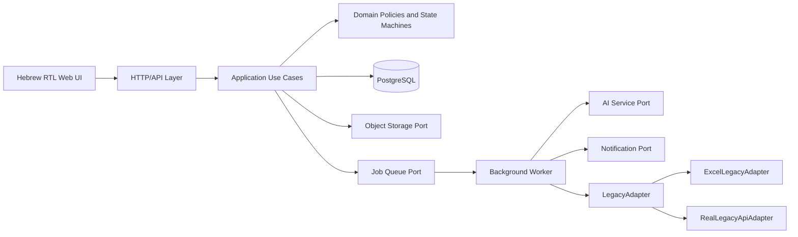
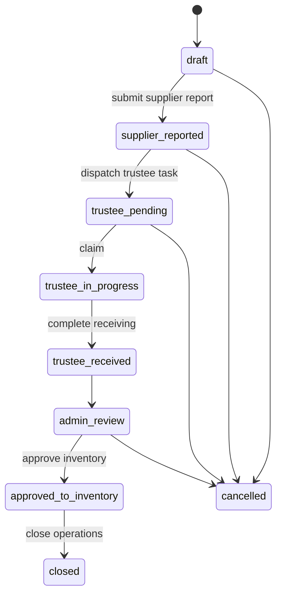
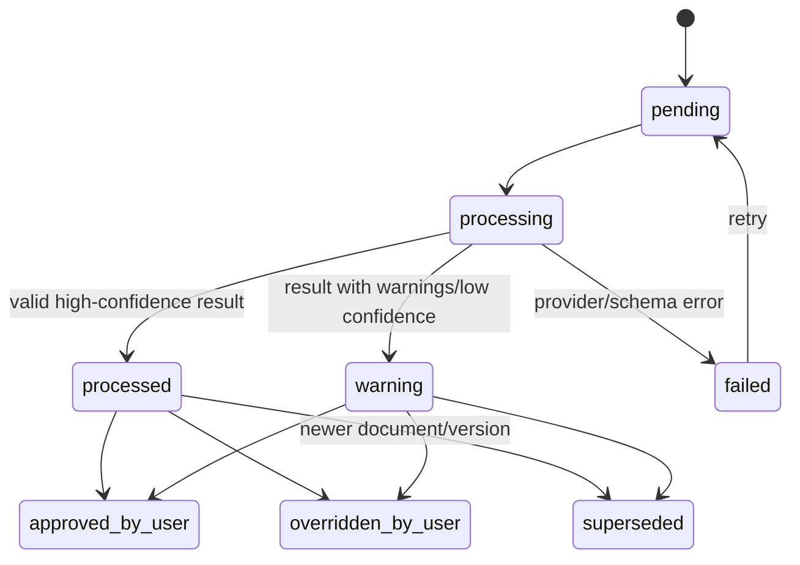

# INSHOP / CYB-ORG — אפיון מלא ל-Claude Code

מסמך מאוחד זה מיועד להזנה ל-Claude Code לצד הקבצים המודולריים בחבילה. במקרה של סתירה, סדר העדיפויות המוגדר ב-`CLAUDE.md` הוא הקובע.

## תוכן

1. [חוזה עבודה ל-Claude Code](#חוזה-עבודה-ל-Claude-Code)
2. [אפיון מוצר ופונקציונליות](#אפיון-מוצר-ופונקציונליות)
3. [אפיון UI/UX ומסכים](#אפיון-UI/UX-ומסכים)
4. [ארכיטקטורה טכנית](#ארכיטקטורה-טכנית)
5. [מכונות מצבים](#מכונות-מצבים)
6. [חוזה API](#חוזה-API)
7. [סכמת מסד נתונים](#סכמת-מסד-נתונים)
8. [תכנית בדיקות](#תכנית-בדיקות)
9. [תכנית מימוש](#תכנית-מימוש)
10. [החלטות והנחות](#החלטות-והנחות)
11. [מטריצת עקיבות](#מטריצת-עקיבות)

---


# חלק 1: חוזה עבודה ל-Claude Code

# CLAUDE.md - INSHOP Supplier, Inventory, Delivery, Credit and Payment System

## Mission

Build a production-grade, responsive, Hebrew RTL web application that manages the full lifecycle of supplier deliveries, trustee receiving, operational inventory, inventory counts, order rules, supplier credits, supplier payments, trustee rewards and the supplier accountant portal.

The product must work manually and deterministically before any AI automation is introduced.

## Read these files before coding

1. `docs/01_PRODUCT_SPEC_HE.md`
2. `docs/02_UI_UX_SPEC_HE.md`
3. `docs/03_TECHNICAL_ARCHITECTURE.md`
4. `docs/04_STATE_MACHINES.md`
5. `docs/05_API_CONTRACT.yaml`
6. `docs/06_DATABASE_SCHEMA.sql`
7. `docs/07_TEST_PLAN_HE.md`
8. `docs/08_IMPLEMENTATION_PLAN_HE.md`
9. `docs/09_DECISIONS_AND_ASSUMPTIONS_HE.md`

When documents conflict, use this priority:

1. Non-negotiable rules in this file.
2. State-machine guards and financial/inventory invariants.
3. Product specification.
4. API and data-model details.
5. UI text and visual examples.

Do not silently resolve a contradiction. Record it in `docs/09_DECISIONS_AND_ASSUMPTIONS_HE.md` and choose the safest reversible implementation.

## Non-negotiable architecture rules

### Legacy integration

- Every read or write to the old INSHOP system goes through the `LegacyAdapter` interface.
- Screens, route handlers, domain services and repositories must never read Excel/CSV files directly.
- First implement `ExcelLegacyAdapter` for mock files.
- Later implement `RealLegacyApiAdapter` without changing domain services or UI behavior.
- Log every adapter call in `LegacySyncLog` with request, response, duration, status and error.
- All side-effecting adapter operations must be idempotent.

### AI safety

- AI is an assistive service only.
- AI may extract, match, compare, score confidence and propose actions.
- AI must never finalize inventory, approve a credit, post a payment or send a trustee reward without an explicit authorized user action.
- Every AI suggestion shown to a user must include confidence, source and warnings.
- A complete manual fallback must exist for every AI capability.

### Inventory integrity

- Inventory is changed only through immutable `InventoryMovement` records.
- Never update a balance without creating the corresponding movement in the same database transaction.
- Delivery approval, legacy sales deltas and inventory-count completion must be idempotent.
- One active inventory count per branch.
- A completed count is locked; corrections use an audited admin action or a new correction count.

### Financial integrity

- Use fixed-precision decimal types for money. Never use floating point.
- Supplier balances are derived from immutable ledger entries.
- A credit is offset only after its document is approved.
- A payment is posted only after an authorized user confirms the recognized or manually entered amount.
- Posted payments are immutable; corrections use a reversal entry.

### Security and tenancy

- Supplier portal users can access only their own supplier data.
- Trustee links and supplier links are signed, hashed at rest, time-limited and scoped to the exact action.
- Uploads are validated by type, size and content; original files are private.
- All privileged changes require authentication, role checks and audit logs.
- Never expose internal storage paths, secrets, prompts, raw provider tokens or adapter credentials to the browser.

### UX

- All user-facing screens are Hebrew and `dir="rtl"`.
- Supplier, trustee and inventory-count flows are mobile-first.
- Admin delivery review, order rules and payments are desktop-first.
- Supplier portal is fully responsive.
- Every asynchronous operation needs loading, success, retry and failure states.
- Color must not be the only status indicator.
- Minimum interactive target: 44x44 px.

## Reference implementation defaults

Use the existing repository stack if one already exists. For a greenfield implementation, the preferred default is:

- TypeScript full-stack web application.
- React-based UI with server-side route handling.
- PostgreSQL.
- ORM with migrations and transactions.
- Schema validation at every API boundary.
- S3-compatible private object storage for images and documents.
- Background job abstraction for OCR, notifications, retries and legacy synchronization.
- Unit tests, integration tests and browser end-to-end tests.

Do not hard-code provider-specific services into domain logic. Use interfaces for object storage, notifications, AI and legacy integration.

## Suggested repository structure

```text
apps/
  web/
packages/
  domain/              # entities, value objects, state machines, policies
  application/         # use cases and transaction orchestration
  persistence/         # repositories and migrations
  integrations/
    legacy/
    ai/
    notifications/
    storage/
  ui/                  # reusable RTL components and tokens
docs/
mock-data/
tests/
  unit/
  integration/
  e2e/
```

A single application repository is acceptable, but preserve the same dependency direction:

`UI/API -> application use cases -> domain -> ports/interfaces <- infrastructure adapters`

## Required domain modules

1. Master data: suppliers, branches, items, trustees and supplier item aliases.
2. Supplier delivery reporting wizard.
3. Trustee receiving wizard.
4. Admin delivery review and inventory approval.
5. Inventory balances, movements and counts.
6. Supplier order rules.
7. Credit requests and credit documents.
8. Supplier payments, allocations and ledger.
9. Supplier accountant portal.
10. Trustee rewards.
11. AI analysis abstraction.
12. Legacy adapter and mock-data management.
13. Notifications and access links.
14. Audit, observability and retry jobs.

## Coding rules

- Centralize statuses and transition guards; do not scatter string comparisons across screens.
- Use explicit use cases, for example:
  - `SubmitSupplierDeliveryReport`
  - `CompleteTrusteeReceiving`
  - `ApproveDeliveryToInventory`
  - `StartInventoryCount`
  - `SaveInventoryCountLine`
  - `CompleteInventoryCount`
  - `CreateCreditRequest`
  - `ApproveCreditDocument`
  - `PostSupplierPayment`
- Use database transactions for every use case that writes more than one business record.
- Every side-effecting endpoint accepts an idempotency key.
- Return machine-readable error codes plus Hebrew display messages.
- Store timestamps in UTC; render in the configured Israel timezone.
- Store quantities in units as integers unless a future item explicitly supports fractional units.
- Preserve original OCR text and user-corrected values separately.
- Never overwrite an uploaded document; create a new version and retain the audit trail.

## Required test behavior

Before marking a feature complete:

- Unit tests cover all calculations and transition guards.
- Integration tests cover transactions, idempotency and adapter failure.
- E2E tests cover the happy path and at least one failure path.
- The exact acceptance cases in `docs/07_TEST_PLAN_HE.md` pass.
- There is no route that can bypass the domain use case and mutate inventory or money directly.

## Definition of done for each vertical slice

A slice is done only when it includes:

- Data migration.
- Domain rules and use case.
- API endpoint.
- Authorized UI.
- Loading, empty, validation and error states.
- Audit log.
- Unit/integration/E2E tests.
- Updated documentation.
- Seed/mock data.

## Build order

Follow `docs/08_IMPLEMENTATION_PLAN_HE.md`. The mandatory order is:

1. Foundation, auth, RTL design system and audit.
2. Master data and `ExcelLegacyAdapter`.
3. Supplier delivery report.
4. Trustee receiving.
5. Admin delivery approval and inventory ledger.
6. Inventory count and legacy close gate.
7. Order rules.
8. Credits and supplier portal.
9. Payments and supplier ledger.
10. AI services.
11. `RealLegacyApiAdapter`.

Do not begin real AI integration before the manual end-to-end delivery, credit and payment flows pass their acceptance tests.


---


# חלק 2: אפיון מוצר ופונקציונליות

# אפיון מוצר מלא - מערכת מלאי, ספקים, אספקות, זיכויים ותשלומים

**מוצר:** INSHOP / CYB-ORG  
**קהל יעד למסמך:** Claude Code, צוות פיתוח, QA, מוצר ואינטגרציה  
**שפת ממשק:** עברית, RTL  
**סטטוס:** אפיון יישומי לפיתוח  
**מקור:** מסמך אפיון ויזואלי גרסה 1.0 מתאריך 17.06.2026, מורחב כאן לרמת התנהגות, נתונים, חריגים וקריטריוני קבלה.

---

## 1. מטרת המערכת

המערכת החדשה מנהלת את מחזור החיים המלא של:

1. דיווח ספק על אספקה שהושארה בנקודת מכירה.
2. קליטת הסחורה בפועל על ידי נאמן הסניף.
3. אימות אדמין, תיקון פריטים ועדכון המלאי.
4. ספירות מלאי מבוקרות.
5. חוקי הזמנה וקישורי פריטים לספקים.
6. דרישות זיכוי בגין חוסרים.
7. תשלומים, קיזוז זיכויים ויתרות ספק.
8. תגמול נאמן בשיעור 2% מסכום החשבונית המאושר.
9. פורטל למנהל חשבונות ספק.
10. אינטגרציה מבוקרת עם מערכת INSHOP הישנה.
11. שכבת AI מסייעת ל-OCR, התאמות, השוואות וזיהוי חריגים.

המערכת החדשה פועלת לצד המערכת הישנה. היא אינה קוראת ישירות בסיסי נתונים, קבצים או API של המערכת הישנה, אלא רק דרך ממשק `LegacyAdapter`.

---

## 2. יעדים עסקיים

- להפוך קליטת סחורה לתהליך מתועד, מדיד, מאושר וניתן לתחקור.
- לצמצם טעויות בין ספק, סניף, חשבונית, פריטים וכמויות שהתקבלו.
- למנוע עדכון מלאי על בסיס OCR בלבד.
- לנהל חוסרים וזיכויים עד לסגירה מלאה מול הספק.
- לנהל תשלומים ויתרות ספק באופן שקוף וחשבונאי.
- לייצר מלאי תפעולי אמין על בסיס קליטות, דלתות מכירה וספירות.
- להכין תשתית להצעות הזמנה חכמות, בלי להכניס מנוע הזמנות מלא ל-MVP.
- לאפשר פיתוח ובדיקות מקצה לקצה לפני חיבור אמת באמצעות `ExcelLegacyAdapter`.

### מדדי הצלחה מוצעים

- לפחות 95% מהאספקות כוללות את כל התמונות והשדות הנדרשים.
- 100% מעדכוני המלאי ניתנים לשחזור מתוך תנועות מלאי ו-Audit.
- 100% מהתשלומים ניתנים לשחזור מתוך מסמכי תשלום, הקצאות ותנועות ledger.
- ירידה בכמות החוסרים שאינם מטופלים בתוך 7 ימי עסקים.
- אפס עדכוני מלאי או כסף שבוצעו אוטומטית רק על סמך AI.

---

## 3. גבולות המערכת

### 3.1 באחריות המערכת החדשה

- מלאי תפעולי וספור לפי סניף ופריט.
- קליטות אספקה ותמונות תומכות.
- התאמת שורות חשבונית לפריטי INSHOP.
- שמירת כמויות חשבונית, התקבל בפועל ונכנס למלאי.
- ספירות מלאי ונעילתן.
- חוקי הזמנה וקודי ספק מרובים לפריט.
- דרישות זיכוי ומסמכי זיכוי.
- תשלומים, הקצאות, קיזוזים ויתרות ספק.
- תגמול נאמן וחיווי על דחיפתו למערכת הישנה.
- פורטל ספק.
- AI מסייע.
- Audit, התראות, retries ותחקור.

### 3.2 באחריות המערכת הישנה או שירות חיצוני

- מקור מאסטר לספקים, סניפים, פריטי מגוון ונאמנים.
- ניסיון סגירת חשבוניות לקוח פתוחות לפני ספירת מלאי.
- אספקת דלתות מלאי ממכירות/גריעות תקינות בלבד.
- אי-שליחת דלתות לחשבוניות שסורבו בתחילה ונסגרו באיחור, לפי הכלל העסקי הקיים.
- קליטת תגמול הנאמן במערכת הישנה.
- שירות הודעות, אם יוחלט שהוא נשאר במערכת הישנה.

### 3.3 מחוץ ל-MVP

- יצירה ושליחה אוטומטית של הזמנות רכש לספקים.
- הנהלת חשבונות מלאה או התאמת בנק.
- ניהול מחירי מחירון והסכמי סחר מורכבים.
- עדכון מלאי בחזרה למערכת הישנה, אלא אם יתווסף endpoint ייעודי בשלב עתידי.
- החלטה אוטונומית של AI על מלאי, זיכוי או תשלום.

---

## 4. משתמשים והרשאות

| תפקיד | זיהוי | פלטפורמה | הרשאות עיקריות |
|---|---|---|---|
| ספק / נהג ספק | קישור דיווח, session מאובטח, שם וטלפון | מובייל | צילום חשבונית וסחורה, בחירת סניף, מסירת פרטי קשר ושליחה |
| נאמן סניף | קישור אישי חתום, קשור לנאמן ולאספקה | מובייל | קליטת אספקה, אימות שורות, שינוי כמויות, תמונות מזווה, צפייה בתגמול |
| סופר מלאי | לוגאין, הרשאה לסניף | מובייל | פתיחת ספירה, המתנה לאישור legacy, ספירת כל הפריטים ושמירה |
| אדמין INSHOP | לוגאין מלא + RBAC | דסקטופ בעיקר | כל פעולות התפעול, אישור מלאי, זיכויים, תשלומים, הגדרות ואינטגרציה |
| מנהל חשבונות ספק | magic link/OTP או לוגאין ספק | רספונסיבי | טיפול בדרישות זיכוי וצפייה באספקות, תשלומים ויתרה של הספק שלו בלבד |
| שירות אינטגרציה | credentials טכניים | Backend/API | סנכרון מאסטר, דלתות, סגירת חשבוניות, תגמולים והודעות |

### 4.1 הרשאות אדמין מפורטות

מומלץ לפצל לפחות ליכולות הבאות:

- `delivery.review`
- `delivery.approve_inventory`
- `delivery.override_ai`
- `inventory.count.start`
- `inventory.count.complete`
- `inventory.count.unlock`
- `order_rules.manage`
- `credit.create`
- `credit.approve`
- `payment.create`
- `payment.post`
- `payment.reverse`
- `integration.manage_mock_data`
- `integration.retry`
- `audit.view`

---

## 5. עקרונות עסקיים רוחביים

1. **Human approval first:** AI לעולם אינו מקור סמכות סופי.
2. **Auditability:** כל שינוי בכמות, התאמה, סטטוס, כסף או מסמך נשמר עם מי, מתי, ערך קודם, ערך חדש וסיבה.
3. **Idempotency:** שליחה כפולה, retry או רענון דפדפן אינם יוצרים מלאי, תגמול או תשלום כפול.
4. **No partial business writes:** פעולה עסקית שנכשלה אינה משאירה מצב חצי-מעודכן.
5. **Immutable documents:** מסמך שהועלה אינו מוחלף; העלאה חדשה יוצרת גרסה חדשה.
6. **One source per responsibility:** מאסטר מהישנה; מלאי תפעולי ו-financial ledger מהחדשה.
7. **Separation of states:** סטטוס אספקה, זיכוי ותשלום אינם נדחסים לשדה אחד.
8. **Private media:** תמונות חשבונית, סחורה, מזווה ותשלום הן פרטיות ונמסרות ב-URL זמני בלבד.
9. **RTL and mobile usability:** הזרימות בשטח חייבות לעבוד ביד אחת, גם בחיבור חלש.
10. **Explicit exceptions:** חריג אינו “נעלם”; הוא מופיע ברשימת חריגים עד אישור או פתרון.

---

## 6. מסע מקצה לקצה

1. ספק פותח ויזארד, מצלם חשבונית וסחורה, בוחר סניף ומוסר איש קשר.
2. המערכת יוצרת אספקה, מפעילה OCR ומזהה ספק/סניף/מספר/סכום.
3. אם בחירת הסניף אינה תואמת לזיהוי, התהליך נעצר עד תיקון או אישור חריג מורשה.
4. לאחר שליחה, נאמן מתאים מקבל הודעה עם קישור אישי.
5. הנאמן מצלם חשבונית וסחורה, מאשר התאמות ושורות, משנה כמויות לפי מה שהתקבל ומצלם מזווה לפני/אחרי.
6. המערכת מחשבת תגמול 2% באופן זמני ומעבירה את האספקה לבדיקת אדמין.
7. האדמין משווה מסמכים ותמונות, מתקן התאמות וכמויות ומאשר את הכמות הנכנסת.
8. באותה transaction נוצרות תנועות מלאי, יתרות מתעדכנות ונרשמת התחייבות לספק.
9. אם קיים חוסר, האדמין יוצר דרישת זיכוי ושולח אותה לספק.
10. הספק מעלה מסמך זיכוי; האדמין מאשר אותו; נרשמת תנועת ledger שלילית.
11. אדמין בוחר אספקות לתשלום, מעלה אמצעי תשלום, מאשר סכום והקצאות ומפרסם תשלום.
12. תשלום, זיכויים ויתרות מוצגים בפורטל הספק.
13. תגמול נאמן מאושר ונשלח למערכת הישנה באופן idempotent.
14. דלתות מכירה מהמערכת הישנה ממשיכות לעדכן את המלאי התפעולי.
15. בספירת מלאי, המערכת הישנה נדרשת תחילה לסגור/לנסות לסגור חשבוניות פתוחות; רק לאחר אישור ניתן לספור.

---

# 7. מודול ספק - דיווח אספקה במובייל

## 7.1 טריגר ותנאי פתיחה

הספק או הנהג פותח קישור דיווח. הקישור יכול להיות כללי או חתום לספק, לפי ההחלטה בפרק ההחלטות. המערכת יוצרת session זמני וטוקן idempotency.

## 7.2 שלבי הוויזארד

### שלב 1 - העלאת חשבונית

שדות ופעולות:

- צילום במצלמה או בחירה מהגלריה.
- תמונה אחת נדרשת; ניתן להחליף לפני שליחה.
- בדיקת סוג קובץ, גודל, חדות בסיסית וכיוון.
- OCR מתחיל ברקע מיד לאחר upload.
- המשתמש יכול להמשיך גם אם OCR עדיין עובד.

תוצאה:

- נוצרת רשומת `Invoice` מקור `supplier`.
- נוצרת `AIAnalysis` מסוג `invoice_ocr`.
- מוצג מצב: מעבד / הושלם / דורש בדיקה / נכשל.

### שלב 2 - בחירת סניף ואימות

מוצג:

- ספק שזוהה, אם קיים.
- סניף שזוהה, אם קיים.
- מספר חשבונית, תאריך וסכום.
- רמת ודאות לכל זיהוי.
- בחירת סניף ידנית מתוך רשימת סניפים פעילים.

כללים:

- הבחירה הידנית היא מקור הפעולה העיקרי.
- זיהוי AI הוא שכבת בקרה.
- אם `recognized_branch != selected_branch` ומעל סף ודאות, מוצג דיסוננס חוסם.
- משתמש ציבורי יכול לתקן את הבחירה; רק אדמין מורשה יכול לאשר חריג מאוחר יותר.
- אם ספק לא זוהה, המשתמש בוחר ספק או מזין שם חופשי ל-review, בהתאם לסוג הקישור.
- יש בדיקת כפילות לפי ספק + מספר חשבונית + סניף. כפילות אפשרית מוצגת ואינה יוצרת אספקה שנייה בלי אישור.

### שלב 3 - צילום סחורה

- לפחות תמונה אחת.
- אפשר עד 10 תמונות.
- מוצגת הנחיה לצילום כלל הארגזים/קרטונים.
- ניתן למחוק, להחליף ולסדר תמונות לפני שליחה.
- כל תמונה נשמרת כ-`supplier_goods`.

### שלב 4 - פרטי איש קשר ושליחה

שדות:

- שם מלא - חובה, 2-80 תווים.
- טלפון ישראלי או בינלאומי תקין - חובה.
- הערה - אופציונלי, עד 500 תווים.
- אישור שהסחורה הושארה בסניף שנבחר.

כפתור ראשי: `שלח ושלח לנאמן`.

## 7.3 שליחה

בפעולה אטומית:

1. מבוצעת ולידציה מלאה.
2. סטטוס האספקה עובר ל-`supplier_reported`.
3. נשמר snapshot של זיהוי ה-AI והבחירה הידנית.
4. נבחרים נאמנים פעילים המשויכים לסניף.
5. נוצרת הודעה עם קישור חתום.
6. סטטוס האספקה עובר ל-`trustee_pending` לאחר יצירת ההודעה.

אם אין נאמן פעיל:

- האספקה נשמרת.
- נוצרת התראת אדמין `no_active_trustee`.
- מוצג לספק אישור שהדיווח התקבל, בלי להבטיח שהודעה נשלחה.

## 7.4 נוסח הודעה לנאמן

```text
היי {trustee_name},
סחורה מספק {supplier_name} מחכה לך למילוי בסניף {branch_name}.
איש קשר מטעם הספק: {contact_name}
טלפון: {contact_phone}
לצפייה וקליטת הסחורה: {receiving_link}
```

## 7.5 מצבי שגיאה

- upload נכשל: retry ללא איבוד שדות.
- OCR נכשל: אפשר להמשיך ידנית; נפתח warning.
- session פג: המשתמש מקבל אפשרות להתחיל מחדש.
- כפילות: הצגת פרטי הדיווח הקיים והנחיה לפנות לאדמין.
- סניף לא פעיל: לא ניתן לבחור.
- שליחה כפולה: מוחזר אותו `delivery_id`.

## 7.6 קריטריוני קבלה

- לא ניתן לשלוח ללא חשבונית, תמונת סחורה, סניף, שם וטלפון.
- דיסוננס סניף חוסם שליחה רגילה.
- שליחה מוצלחת יוצרת אספקה אחת בלבד ושולחת הודעה אחת לכל יעד idempotent.
- רענון לאחר שליחה מציג מסך הצלחה ואינו שולח שוב.

---

# 8. מודול נאמן - קליטת סחורה

## 8.1 כניסה

הנאמן פותח קישור אישי חתום הקשור ל-`trustee_id`, `delivery_id`, scope ותוקף. לאחר פתיחה מוצגים שם הנאמן, תמונה, סניף ואספקה. אם יש מספר נאמנים, הראשון שמתחיל יכול לתבוע את הטיפול; אדמין יכול להעביר בעלות.

## 8.2 שלבי הוויזארד

1. סריקת חשבונית הנאמן.
2. אימות סניף.
3. צילום הסחורה שהגיעה.
4. זיהוי והתאמת פריטים.
5. אישור/שינוי כמויות.
6. צילום מזווה לפני מילוי.
7. צילום מזווה אחרי מילוי.
8. סיכום ותגמול.

### שלב 1 - חשבונית נאמן

- צילום/גלריה.
- נשמר כחשבונית מקור `trustee`.
- מתחילים OCR והשוואה לחשבונית הספק.

### שלב 2 - סניף

- ברירת המחדל היא סניף האספקה.
- אם הנאמן מורשה למספר סניפים, ניתן לבחור.
- שינוי מסניף האספקה יוצר חריג חוסם עד אימות.

### שלב 3 - צילום סחורה

- לפחות תמונה אחת.
- התמונות מסומנות `trustee_goods`.

### שלב 4 - זיהוי פריטים

סדר התאמה מחייב:

1. קוד פריט ספק ייחודי לחשבונית ולספק.
2. התאמה מול שם/alias של פריט אצל הספק.
3. התאמת טקסט לשם פריט INSHOP.
4. התאמת AI טקסטואלית/חזותית.
5. לא זוהה - שורה חריגה.

לכל שורה נשמרים:

- הטקסט הגולמי.
- קוד הספק הגולמי.
- הפריט המוצע.
- מקור ההתאמה.
- confidence.
- מי אישר או החליף את ההתאמה.

### שלב 5 - אישור כמויות

לכל שורה מוצגים:

- תמונת פריט.
- קוד ושם INSHOP.
- שם וקוד כפי שהופיעו בחשבונית.
- כמות לפי חשבונית.
- כמות שהגיעה בפועל.
- הפרש.
- מחיר יחידה וסכום חוסר, אם קיימים.

כללים:

- ברירת המחדל ל-`qty_received` היא `qty_invoice`.
- הנאמן יכול לשנות ל-0 ומעלה במספרים שלמים.
- כל שינוי נשמר ב-Audit.
- שורה לא מזוהה יכולה להישאר כחריג, אך אינה נכנסת למלאי עד אדמין.
- לא ניתן לסיים כאשר שורה חסרה ערך `qty_received`.

### שלבים 6-7 - מזווה

- תמונה אחת לפחות לכל מצב: לפני ואחרי.
- קיימת הנחיית צילום ושדה הערה אופציונלי.
- ניתן לדלג רק באישור אדמין או חריג מוגדר; ברירת המחדל חוסמת.

### שלב 8 - סיכום

מוצגים:

- ספק, סניף, מספר חשבונית ותאריך.
- סכום חשבונית.
- מספר שורות, חוסרים ושורות לא מזוהות.
- תגמול מחושב: `round(invoice_total * 0.02, 2)`.
- הבהרה שהתגמול סופי רק לאחר אישור אדמין.

## 8.3 השלמה

בפעולה אטומית:

- סטטוס עובר ל-`trustee_received`.
- נוצרת `TrusteeReward` בסטטוס `calculated_pending_approval`.
- נוצרות/מתעדכנות `DeliveryLine` לצורך reconciliation.
- נפתחת משימת אדמין.
- סטטוס עובר ל-`admin_review`.

## 8.4 חריגים

- חשבוניות ספק ונאמן אינן זהות.
- ספק/סניף שונים.
- סכום חשבונית שונה.
- שורות/כמויות שונות.
- תמונות חסרות.
- קישור פג או כבר נוצל.
- נאמן אחר כבר תבע את האספקה.

## 8.5 קריטריוני קבלה

- נאמן מזוהה ללא הקלדה חוזרת של פרטיו.
- כל שינוי כמות נשמר עם ערך קודם/חדש.
- לא ניתן להשלים ללא התמונות והשדות הנדרשים.
- הסיכום מציג תגמול 2% אך אינו דוחף אותו עדיין ל-legacy.

---

# 9. מודול אדמין - אישור קליטה ועדכון מלאי

## 9.1 רשימת עבודה

מסך רשימה כולל:

- חיפוש לפי מזהה אספקה/חשבונית.
- סינון לפי תאריך, ספק, סניף, סטטוס, חומרת חריגים וזיכוי.
- מיון לפי זמן המתנה או חומרה.
- אינדיקציה לתמונות חסרות, OCR נכשל, חשבוניות שונות, חוסר כספי ושורה לא מזוהה.
- bulk actions אינן מאשרות מלאי; אישור הוא ברמת אספקה.

## 9.2 מסך פרטי אספקה

### אזור עליון

- מזהה אספקה.
- תאריך/שעה.
- ספק וסניף.
- איש קשר ספק.
- סטטוסים: אספקה, AI, זיכוי, תשלום.
- סכומי חשבונית ספק, חשבונית נאמן והפרש.

### גלריית ראיות

- סחורה ספק.
- חשבונית ספק.
- חשבונית נאמן.
- סחורה נאמן.
- מזווה לפני.
- מזווה אחרי.
- הגדלה, מעבר בין תמונות, metadata והורדה לפי הרשאה.

### בדיקות AI

- האם החשבוניות זהות.
- התאמת ספק.
- התאמת סניף.
- התאמת מספר ותאריך חשבונית.
- התאמת סכום.
- רשימת שורות לא ודאיות.
- חוסרים והצעת זיכוי.

### טבלת reconciliation

עמודות:

- מספר שורה.
- קוד פריט.
- שם ותמונה.
- יחידה.
- כמות חשבונית.
- כמות שהתקבלה לפי נאמן.
- כמות שתיכנס למלאי.
- הפרש לזיכוי.
- מחיר יחידה.
- סכום זיכוי.
- מקור התאמה ו-confidence.
- פעולות.

פעולות:

- חיפוש והחלפת פריט.
- הוספת פריט שה-OCR פספס.
- שינוי כמות נכנסת.
- מחיקת שורה שזוהתה בטעות.
- איחוד או פיצול שורות עם Audit.
- סימון “לא לזיכוי” עם סיבה.
- סימון חריג כאושר.

## 9.3 חישובי חוסר

לכל שורה:

```text
shortage_qty = max(qty_invoice - qty_inventory, 0)
credit_line_amount = shortage_qty * unit_price
```

סכום דרישת הזיכוי הוא סכום השורות שאושרו לזיכוי. מדיניות מע"מ מוגדרת בפרק ההחלטות; ברירת המחדל היא שימוש במחיר ברוטו כפי שמופיע בחשבונית.

## 9.4 אישור למלאי

כפתור: `שמור ועדכן מלאי`.

Guard conditions:

- יש supplier, branch וחשבונית תקפים.
- כל שורה שנכנסת למלאי מותאמת לפריט פעיל.
- `qty_inventory >= 0` ומספר שלם.
- כל חריג חוסם אושר או תוקן.
- אין כבר approval idempotent לאותה אספקה.

Side effects באותה transaction:

1. סטטוס `approved_to_inventory`.
2. יצירת `InventoryMovement` לכל שורה בכמות `qty_inventory` מסוג `delivery_receipt`.
3. עדכון `InventoryBalance`.
4. יצירת ledger entry בגין החשבונית המאושרת.
5. אישור תגמול נאמן לפי הסכום המאושר.
6. יצירת job לדחיפת התגמול ל-legacy.
7. אם יש חוסר, `credit_state=identified`.

לא ניתן לערוך את הכמות המאושרת לאחר מכן בלי reversal מתועד.

## 9.5 יצירת דרישת זיכוי

- האדמין בוחר שורות וסכומים.
- ניתן להוסיף הערה ומועד יעד.
- נשמר draft.
- לאחר לחיצה `שמור דרישת זיכוי ושלח לספק`:
  - סטטוס `sent_to_supplier` ואז `waiting_for_credit_invoice`.
  - נוצרת הודעה עם קישור לפורטל.
  - `delivery.credit_state=request_created/awaiting_supplier`.

## 9.6 קריטריוני קבלה

- לא ניתן לאשר שורה לא מזוהה למלאי.
- approval כפול אינו יוצר תנועה כפולה.
- סכום החוסר מחושב מחדש בשרת ולא נסמך על הדפדפן.
- ניתן לראות מי שינה כל שורה ולמה.

---

# 10. מודול מלאי תפעולי

## 10.1 מקורות תנועה

- `delivery_receipt` - קליטת אספקה מאושרת.
- `legacy_sale` - דלתא ממכירה/גריעה מהמערכת הישנה.
- `count_adjustment` - התאמה לספירה סופית.
- `admin_correction` - תיקון מורשה עם סיבה.
- `reversal` - היפוך תנועה קודמת.

## 10.2 יתרת מלאי

לכל `branch + item` קיימת יתרה נוכחית. היתרה היא cache מחושב של סכום התנועות וניתנת לבנייה מחדש.

כל תנועה כוללת:

- quantity_delta.
- balance_after.
- source_type/source_id.
- idempotency_key.
- occurred_at.
- actor.

## 10.3 קליטת דלתות legacy

- job מתוזמן קורא `getInventoryDeltas(fromDate,toDate)`.
- כל תנועה מזוהה לפי מזהה חיצוני ייחודי או צירוף מוסכם.
- רק `should_update_inventory=true` נקלט.
- duplicate אינו משפיע שוב.
- שגיאת פריט/סניף נפתחת לחריג ואינה נזרקת בשקט.

---

# 11. מודול ספירת מלאי

## 11.1 פתיחת ספירה

- משתמש בוחר סניף מורשה.
- לא ניתן לפתוח אם קיימת ספירה פעילה לאותו סניף.
- נוצרת ספירה `waiting_for_legacy_close`.
- המערכת קוראת `requestCloseOpenInvoices(branchCode)`.

## 11.2 Gate של חשבוניות פתוחות

מוצגים:

- סך פתוחות.
- נסגרו בהצלחה.
- מסורבות.
- עדיין פתוחות.
- `can_start_count`.

כללים:

- מסורבות אינן חוסמות.
- `still_open > 0` או `can_start_count=false` חוסמים.
- ניתן לבצע retry מבוקר.
- אם legacy אינו זמין, אין התחלת ספירה offline.

## 11.3 הכנת שורות

בעת מעבר ל-`ready_to_count`:

- נוצר snapshot של כל פריטי המגוון הפעילים לסניף.
- ברירת המחדל לכמות היא מלאי היעד שהוגדר בחוקי ההזמנה, בהתאם למקור.
- מומלץ להציג את ברירת המחדל כערך “טרם אושר”, כדי למנוע ספירה אוטומטית בטעות.

## 11.4 מסך ספירה

- כל הפריטים ברשימה אחת.
- תמונה, שם, קוד, תיאור, יחידה.
- כפתורי +/- ושדה מספרי.
- חיפוש וסינון “לא נשמר”.
- כל שורה נשמרת באמצעות swipe או אישור מפורש עם tap target גדול.
- שמירה יוצרת timestamp ומי ספר.
- ניתן לשנות שורה שנשמרה כל עוד הספירה לא הושלמה.

## 11.5 השלמה

Guard:

- כל השורות נשמרו.
- הסטטוס `in_progress`.
- אין job pending קריטי.

Side effects transaction:

- לכל שורה מחושב delta מול היתרה הקיימת.
- נוצרת `count_adjustment` אם delta שונה מ-0.
- הסטטוס עובר ל-`completed` ואז `locked`.
- נשמר summary של שינויים.

## 11.6 תיקון לאחר נעילה

ברירת המחדל:

- אין עריכת שורות ישנה.
- אדמין עם `inventory.count.unlock` יכול ליצור “ספירת תיקון” או reversal מתועד.
- כל שינוי דורש סיבה.

## 11.7 קריטריוני קבלה

- legacy gate נבדק בצד שרת.
- לא ניתן לסיים עם שורה לא שמורה.
- רענון דפדפן אינו מאבד שורות שכבר נשמרו.
- השלמה כפולה אינה יוצרת תנועות כפולות.

---

# 12. מודול חוקי הזמנה

## 12.1 מטרת המודול

הגדרת נתונים שישמשו לספירה ולהצעות הזמנה עתידיות:

- ספק.
- סניף או scope ברירת מחדל.
- ימי אספקה.
- זמן אספקה ממוצע.
- מינימום להזמנה.
- יעדי WhatsApp להזמנות ולזיכויים.
- מלאי יעד לכל פריט.
- כמות יחידות באריזה.
- קודי ושמות פריט אצל ספק.

## 12.2 כותרת כלל

שדות:

- סניף - חובה במימוש המומלץ.
- ספק - חובה.
- ימי אספקה - multi-select של ימי שבוע.
- זמן אספקה ממוצע - 0-365 ימים.
- מינימום הזמנה - סכום לא שלילי.
- רשימת יעדי הודעה להזמנות: מספר, שם, ראשי/גיבוי, פעיל.
- רשימת יעדי הודעה לזיכויים.

## 12.3 טבלת פריטים

לכל פריט:

- item code.
- שם ותמונה.
- מלאי יעד ביחידות.
- packaging qty.
- קוד ספק ראשי.
- שם אצל ספק.
- aliases נוספים.
- סטטוס פעיל.
- סטטוס שמירה.

כללים:

- פריט INSHOP יכול להיות קשור למספר ספקים.
- לספק יכולים להיות מספר aliases לאותו פריט.
- `supplier_item_code` ייחודי לפחות בתוך הספק, אלא אם מסומן חריג מפורש.
- שמירה ברמת שורה אפשרית, אך “שמור הכל” חייב להיות transaction בטוח או לדווח הצלחה/כשל לכל שורה.

## 12.4 שימוש במלאי יעד

- ערך ברירת מחדל בספירת מלאי, לפי מסמך המקור.
- קלט עתידי למנוע הצעת הזמנה.
- אינו משנה מלאי בפועל.

---

# 13. מודול דרישות זיכוי

## 13.1 יצירה

דרישת זיכוי נוצרת רק מאספקה מאושרת או בתהליך אישור, עם שורות מפורטות. לכל שורה:

- item.
- qty_invoice.
- qty_received/qty_inventory.
- shortage_qty.
- unit_price.
- requested_amount.
- reason.

## 13.2 שליחה

- בחירת ערוצי שליחה לפי הגדרת הספק.
- קישור חתום לפורטל.
- תיעוד משלוח, retries ו-delivery status.

## 13.3 העלאת מסמך ספק

הספק מעלה צילום/PDF של חשבונית זיכוי. נשמר:

- מסמך מקורי.
- מספר מסמך, תאריך וסכום שהוזנו או זוהו.
- AI analysis אופציונלי.
- סטטוס `credit_uploaded` ואז `waiting_admin_approval`.

## 13.4 אישור אדמין

Guard:

- מסמך קיים.
- סכום מאושר > 0.
- הספק תואם.
- כל דיסוננס אושר.

Side effects:

- סטטוס `approved`.
- ledger entry שלילי בגובה הסכום המאושר.
- delivery credit state מתעדכן.
- אם כל הסכום כוסה, הבקשה `closed`.
- אם אושר סכום חלקי, הבקשה נשארת פתוחה עם יתרה.

## 13.5 דחייה/בקשת תיקון

- אדמין יכול לדחות מסמך עם סיבה.
- הספק מקבל הודעה ויכול להעלות גרסה חדשה.
- המסמך הישן נשמר.

---

# 14. מודול תשלומים לספקים

## 14.1 עקרון ledger

המערכת אינה מחזיקה “יתרה ידנית” בלבד. כל חיוב, זיכוי, תשלום או התאמה הוא ledger entry חתום בזמן. היתרה היא סכום התנועות.

ברירת סימן:

- חיוב בגין חשבונית: חיובי, INSHOP חייב לספק.
- זיכוי מאושר: שלילי.
- תשלום לספק: שלילי.
- יתרה חיובית: נותר לשלם לספק.
- יתרה שלילית: קיימת יתרת זכות ל-INSHOP/תשלום יתר.

## 14.2 מסך בחירת אספקות

- ספק וטווח תאריכים.
- רשימת אספקות מאושרות שלא שולמו במלואן.
- תמונת חשבונית.
- תאריך ויום.
- סכום חשבונית.
- זיכוי נדרש/מאושר/חסר.
- יתרה פתוחה.
- checkbox לבחירה.

## 14.3 סיכום צפוי

```text
gross_selected_invoices
- approved_credits_applied
+ opening_positive_balance
- opening_negative_balance
= expected_payment
```

החישוב בשרת מתוך ledger בלבד.

## 14.4 אמצעי תשלום

- צילום צ'ק או אישור העברה.
- הזנה ידנית של סוג, סכום, תאריך ואסמכתא.
- AI יכול לזהות ולהציע.
- המשתמש מאשר את הערכים.

## 14.5 התאמה והקצאות

- תשלום אחד יכול להיות מוקצה למספר חיובים.
- ניתן לבחור הקצאה אוטומטית FIFO או ידנית.
- לא מקזזים credit pending.
- אם סכום התשלום גדול מהצפוי, נוצרת יתרה שלילית/credit balance.
- אם נמוך, החיובים נשארים פתוחים חלקית.
- אם קיים דיסוננס בין סכום מזוהה לסכום מאושר, לא ניתן לפרסם בלי override מורשה.

## 14.6 פרסום תשלום

ב-transaction:

1. payment status `posted`.
2. payment ledger entry.
3. allocations.
4. עדכון סטטוסים מחושבים של אספקות.
5. שמירת מסמך ואסמכתא.
6. הודעה לפורטל, אם נדרש.

## 14.7 תיקון

- אין edit לתשלום posted.
- אדמין מורשה מבצע reversal מלא או חלקי עם סיבה.
- לאחר reversal ניתן לפרסם תשלום חדש.

## 14.8 קריטריוני קבלה

- סכום צפוי מחושב מחדש בשרת.
- תשלום חלקי משאיר יתרה נכונה.
- תשלום יתר יוצר יתרה גלויה.
- refresh/retry אינו מפרסם פעמיים.

---

# 15. פורטל ספק / מנהל חשבונות ספק

## 15.1 בידוד מידע

כל שאילתה מסוננת בשרת לפי `supplier_id` של המשתמש/הטוקן. אין להסתמך על supplier id מה-URL או מה-client.

## 15.2 דשבורד

כרטיסים:

- דרישות זיכוי פתוחות.
- זיכויים שהועלו וממתינים לאישור.
- אספקות בתקופה.
- תשלומים בתקופה.
- יתרה נוכחית.

## 15.3 רשימת דרישות זיכוי

- סטטוס.
- מספר בקשה.
- תאריך אספקה.
- חשבונית.
- סכום נדרש, אושר ונותר.
- CTA להעלאת מסמך.

## 15.4 פרטי דרישת זיכוי

- חשבונית אספקה.
- תמונת סחורה מהנאמן.
- טבלת שורות חוסר.
- סכום כולל.
- היסטוריית הודעות ומסמכים.
- upload מסמך זיכוי.
- מסך הצלחה עם מספר פנייה.

## 15.5 אספקות

- סינון תאריכים.
- מספר חשבונית, סניף, תאריך, סכום, סטטוס קליטה ותשלום.
- קישור למסמכים.
- סטטוס זיכוי חסר.

## 15.6 תשלומים

- תאריך, סכום, אמצעי, אסמכתא.
- אספקות ששויכו.
- מסמך תשלום.
- השפעה על היתרה.

## 15.7 רספונסיביות

- דסקטופ: sidebar, כרטיסי KPI, טבלאות ופאנל פרטים.
- מובייל: כרטיסים אנכיים, bottom CTA, טבלאות הופכות לרשימות key/value.

---

# 16. תגמול נאמן

## 16.1 חישוב

ברירת מחדל:

```text
reward_amount = round(approved_invoice_total * 0.02, 2)
```

אם סכום החשבונית תוקן באדמין, החישוב מתעדכן לפני אישור.

## 16.2 סטטוסים

- `calculated_pending_approval`
- `approved`
- `push_pending`
- `pushed`
- `push_failed`
- `cancelled`

## 16.3 דחיפה ל-legacy

- רק לאחר אישור מלאי.
- idempotency key לפי reward id.
- retry עם backoff.
- כשל אינו מבטל את אישור המלאי; הוא יוצר משימת תפעול.

---

# 17. שכבת AI

## 17.1 יכולות

| יכולת | שימוש | פלט |
|---|---|---|
| OCR חשבונית | ספק, נאמן, אדמין | ספק, סניף, מספר, תאריך, סכום ושורות |
| זיהוי סניף | ספק/נאמן | branch + confidence |
| זיהוי ספק | ספק/נאמן/אדמין | supplier + confidence |
| התאמת פריט | נאמן/אדמין | item/alias + confidence + מקור |
| השוואת חשבוניות | אדמין | זהות/שונות ופירוט |
| זיהוי חוסר | אדמין | פער כמותי וסכום מוצע |
| זיהוי אמצעי תשלום | תשלומים | סכום, תאריך, אסמכתא וסוג |
| בדיקת חריגים | רוחבי | קוד, חומרה, הסבר וראיות |

## 17.2 חוזה תוצאה

כל תוצאה כוללת:

- `analysis_type`
- `status`
- `provider/model/version`
- `input_document_ids`
- `structured_result`
- `confidence`
- `warnings[]`
- `created_at`
- `approved_by_user_id` אם אושר

## 17.3 ספי ודאות מוצעים

- 0.90 ומעלה: prefill עם סימון “זוהה”.
- 0.60-0.89: review חובה.
- מתחת ל-0.60: לא מזוהה.

הספים configurable לפי capability ואינם משנים את דרישת האישור האנושי.

## 17.4 כשל AI

- המסך נשאר שמיש ידנית.
- status `failed` עם retry.
- אין חסימת תהליך אלא אם הנתון עצמו חובה ואין חלופה ידנית.

---

# 18. אינטגרציה למערכת הישנה

## 18.1 ממשק מחייב

```ts
interface LegacyAdapter {
  getSuppliers(): Promise<Supplier[]>;
  getBranches(): Promise<Branch[]>;
  getItems(params: { assortmentActiveOnly: boolean }): Promise<Item[]>;
  getTrustees(): Promise<Trustee[]>;
  getInventoryDeltas(params: { fromDate: string; toDate?: string }): Promise<InventoryDelta[]>;
  requestCloseOpenInvoices(branchCode: string): Promise<CloseInvoicesResult>;
  pushTrusteeReward(payload: TrusteeRewardPayload): Promise<PushResult>;
  sendTrusteeWhatsApp(payload: TrusteeWhatsAppPayload): Promise<PushResult>;
}
```

## 18.2 מימושים

- `ExcelLegacyAdapter`: קורא קבצי mock דרך שכבת repository ייעודית.
- `RealLegacyApiAdapter`: מממש אותו interface מול API אמיתי.
- `FakeLegacyAdapter`: לבדיקות יחידה בלבד.

## 18.3 שגיאות ותחקור

- כל קריאה נרשמת ב-`LegacySyncLog`.
- error codes נורמליים: timeout, unavailable, invalid_payload, unauthorized, business_rejected.
- פעולות write יוצרות retry job.
- UI אינו מציג stack trace; הוא מציג הודעה בעברית ומזהה תחקור.

---

# 19. סביבת Mock ונתוני טסט

## 19.1 קבצים

- suppliers.csv/xlsx
- branches.csv/xlsx
- items.csv/xlsx
- trustees.csv/xlsx
- inventory_deltas.csv/xlsx
- close_invoice_results.csv/xlsx
- sample_invoices.csv/xlsx
- sample_invoice_lines.csv/xlsx

## 19.2 מסך ניהול נתוני טסט

- upload קובץ.
- זיהוי schema.
- בדיקת עמודות, types, כפילויות ו-FK.
- preview של 20 שורות.
- dry run.
- import.
- היסטוריית imports.
- `Reset Demo Data` עם confirmation כפול.
- הפעלת תרחישים מוכנים: branch mismatch, shortage, missing credit, underpayment, overpayment, legacy unavailable.

---

# 20. התראות

## 20.1 סוגי הודעות

- אספקה מחכה לנאמן.
- תזכורת לנאמן.
- אספקה ממתינה לאדמין.
- דרישת זיכוי נשלחה.
- מסמך זיכוי הועלה.
- מסמך נדחה.
- תשלום פורסם.
- reward push נכשל.
- legacy sync נכשל.

## 20.2 דרישות

- adapter לשירות הודעות.
- template versioning.
- idempotency.
- delivery log.
- masking של מספרי טלפון בלוגים שאינם מורשים.

---

# 21. Audit וציות

חובה לתעד:

- שינוי התאמת פריט.
- שינוי כל כמות.
- אישור/ביטול מלאי.
- יצירה/שליחה/אישור זיכוי.
- פרסום/reversal תשלום.
- אישור חריג AI.
- unlock ספירה.
- שינוי חוקי הזמנה.
- retry ידני באינטגרציה.

Audit אינו ניתן למחיקה דרך UI.

---

# 22. דרישות לא פונקציונליות

## 22.1 ביצועים

- מסך מובייל ראשון: יעד LCP סביר ברשת סלולרית; אין לטעון גלריות מלאות לפני הצורך.
- רשימות אדמין: pagination/filter בשרת.
- העלאות: multipart ישיר לאחסון פרטי עם URL חתום.
- OCR ועיבוד תמונות אסינכרוניים.

## 22.2 זמינות והתאוששות

- retry jobs עמידים.
- גיבוי DB ואחסון.
- אפשרות rebuild ל-inventory balances ול-supplier balances מתוך ledger.
- health checks לאינטגרציות.

## 22.3 אבטחה

- TLS.
- RBAC.
- rate limiting למסכים ציבוריים.
- CSRF/XSS/SQL injection protections.
- אנטי-malware וסוגי קובץ מורשים.
- token hashing ו-expiry.
- סשן אדמין מאובטח.

## 22.4 נגישות

- labels מלאים.
- keyboard navigation בדסקטופ.
- contrast תקין.
- הודעות שגיאה טקסטואליות.
- focus management בוויזארדים ובמודלים.
- alt text תיאורי לתמונות פריט; למסמכים user-provided תיאור פונקציונלי.

## 22.5 לוקליזציה

- ILS עם שתי ספרות.
- תאריכים בתצוגה ישראלית.
- אחסון UTC.
- טקסטים אינם hard-coded בתוך לוגיקה.

---

# 23. דוחות ומדדים תפעוליים

MVP מומלץ:

- אספקות לפי סטטוס וזמן המתנה.
- שיעור אספקות עם חוסר.
- סכום זיכויים פתוח לפי ספק.
- זמן ממוצע מספק לנאמן ומנאמן לאדמין.
- תשלומים פתוחים ויתרות ספק.
- retries/כשלים באינטגרציה.
- AI success/confidence/override rate.

---

# 24. קריטריוני קבלה ברמת מערכת

- ספק יכול לדווח אספקה מלאה ונאמן מקבל הודעה.
- נאמן יכול לקלוט, לשנות כמויות, לצלם לפני/אחרי ולראות תגמול מחושב.
- אדמין יכול להשוות ראיות, לתקן, לאשר למלאי וליצור זיכוי.
- ספירה אינה מתחילה ללא legacy gate ואינה מסתיימת ללא כל השורות.
- חוקי הזמנה תומכים בספק, סניף, ימים, מינימום, יעד, אריזה ו-aliases.
- ספק יכול להעלות מסמך זיכוי ולראות אספקות ותשלומים.
- אדמין יכול לפרסם תשלום עם קיזוזים ויתרה נכונה.
- כל גישה ל-legacy ניתנת להחלפה בין Excel ל-API.
- אין עדכון מלאי/זיכוי/תשלום אוטומטי על ידי AI.
- כל פעולה קריטית ניתנת לתחקור מלא.


---


# חלק 3: אפיון UI/UX ומסכים

# אפיון UX/UI מלא - INSHOP

מסמך זה הוא חוזה המסכים ל-Claude Code. האבטיפוס החי נמצא ב-`prototype/index.html` ומשלים את הטבלאות כאן.

---

## 1. עקרונות עיצוב

### 1.1 שפה וכיוון

- כל הממשק בעברית וב-RTL.
- מזהים טכניים, מספרי חשבוניות, סכומים וקודים מוצגים באופן קריא גם בתוך RTL באמצעות `dir="ltr"` נקודתי.
- שמות שדות ופעולות נשארים עקביים בכל המודולים.

### 1.2 היררכיה ויזואלית

- רקע אפליקציה בהיר מאוד.
- כרטיסים לבנים עם גבול עדין וצל מינימלי.
- צבע ראשי סגול כהה, בדומה לאבטיפוסים המקוריים.
- הצלחה בירוק, שגיאה/חוסר באדום, אזהרה בכתום, מידע בכחול.
- כפתור ראשי אחד מודגש בכל אזור פעולה.
- מידע מחושב ו-AI מופיעים בקופסאות נפרדות ולא נראים כמו שדות שהמשתמש הזין.

### 1.3 Design tokens מומלצים

```css
--color-primary-700: #4327c7;
--color-primary-600: #5133d6;
--color-primary-100: #eeebff;
--color-success-700: #16794d;
--color-success-100: #e8f7ef;
--color-danger-700: #c43232;
--color-danger-100: #fff0f0;
--color-warning-700: #9a5a00;
--color-warning-100: #fff6df;
--color-info-700: #245caa;
--color-info-100: #edf5ff;
--color-text: #171a2b;
--color-muted: #667085;
--color-border: #e4e7ec;
--color-surface: #ffffff;
--color-page: #f7f8fc;
--radius-sm: 8px;
--radius-md: 12px;
--radius-lg: 18px;
--shadow-card: 0 2px 12px rgba(30, 35, 70, .06);
```

הצבעים ניתנים לשינוי מיתוגי, אך המשמעות הסמנטית קבועה.

### 1.4 טיפוגרפיה

- font stack עברי זמין במערכת, לדוגמה `Arial`, `Rubik`, `Heebo`, sans-serif.
- גוף: 16px במובייל, 14-16px בדסקטופ.
- כותרת מסך: 24-32px בדסקטופ, 20-24px במובייל.
- טקסט משני לא קטן מ-13px.
- סכומים מרכזיים: 24-32px עם משקל 700.

### 1.5 Breakpoints

- Mobile: עד 767px.
- Tablet: 768-1199px.
- Desktop: 1200px ומעלה.
- mobile-first למסכי שטח.
- desktop-first למסכי אדמין, אך אין שבירה מתחת ל-1024px.

### 1.6 רכיבים משותפים

- App header עם כותרת, breadcrumb, משתמש וסטטוס sync.
- Desktop sidebar.
- Mobile top bar + menu drawer.
- Stepper לוויזארד.
- Upload card עם camera/gallery, thumbnail, progress ו-retry.
- Status chip עם icon + טקסט.
- Alert/banner לפי חומרה.
- Money summary card.
- Image evidence strip/lightbox.
- Data table עם sticky header בדסקטופ.
- Mobile item card במקום טבלה.
- Sticky action bar בתחתית מובייל.
- Confirm dialog לפעולות בלתי הפיכות.
- Audit drawer להצגת היסטוריה.
- AI insight card עם confidence, ראיות ופעולת “אשר/תקן”.

### 1.7 מצבים שכל מסך חייב לכלול

- loading skeleton.
- empty state.
- validation errors ליד השדה וב-summary בראש המסך.
- offline/connection lost.
- server error עם correlation id ו-retry.
- unauthorized/expired link.
- success state.
- stale data/conflict: “הנתונים עודכנו על ידי משתמש אחר”.

---

# 2. מפת ניווט

## 2.1 מסכים ציבוריים/שטח

| מזהה | Route מוצע | מסך |
|---|---|---|
| SUP-01 | `/supplier/report/:token?` | העלאת חשבונית |
| SUP-02 | אותו route, step 2 | בחירת סניף ואימות |
| SUP-03 | step 3 | צילום סחורה |
| SUP-04 | step 4 | פרטי קשר ושליחה |
| SUP-05 | success | דיווח התקבל |
| TRU-01..08 | `/trustee/receive/:token` | ויזארד נאמן |
| CNT-01 | `/inventory-counts/new` | בחירת סניף ובקשת סגירה |
| CNT-02 | `/inventory-counts/:id/gate` | תוצאת legacy gate |
| CNT-03 | `/inventory-counts/:id/count` | ספירת פריטים |
| CNT-04 | `/inventory-counts/:id/summary` | סיכום ונעילה |

## 2.2 אדמין

| מזהה | Route | מסך |
|---|---|---|
| ADM-01 | `/admin/dashboard` | דשבורד תפעולי |
| ADM-02 | `/admin/deliveries` | תור אספקות |
| ADM-03 | `/admin/deliveries/:id` | אישור אספקה |
| ADM-04 | `/admin/credits` | רשימת דרישות זיכוי |
| ADM-05 | `/admin/credits/:id` | אישור מסמך זיכוי |
| RULE-01 | `/admin/order-rules` | חוקי הזמנה |
| PAY-01 | `/admin/payments` | בחירת אספקות ותשלום |
| PAY-02 | `/admin/payments/:id/review` | סקירת אמצעי תשלום |
| INT-01 | `/admin/integration/mock-data` | ניהול נתוני mock |
| AUD-01 | `/admin/audit` | יומן Audit |

## 2.3 פורטל ספק

| מזהה | Route | מסך |
|---|---|---|
| PORT-01 | `/portal` | דשבורד |
| PORT-02 | `/portal/credits` | דרישות זיכוי |
| PORT-03 | `/portal/credits/:id` | פרטי דרישה והעלאה |
| PORT-04 | `/portal/deliveries` | אספקות |
| PORT-05 | `/portal/payments` | תשלומים ויתרה |

---

# 3. ויזארד ספק במובייל

## 3.1 Shell קבוע

- רוחב תוכן מרבי 480px.
- top bar: menu, כותרת “דיווח אספקה”, icon משאית.
- stepper אופקי: 4 נקודות, label “שלב X מתוך 4”.
- אזור תוכן scrollable.
- action bar sticky: כפתור ראשי מלא רוחב וכפתור משני לפי צורך.
- draft נשמר אוטומטית אחרי כל שינוי.

## SUP-01 - העלאת חשבונית

### מבנה

1. כותרת: `צלם את החשבונית`.
2. טקסט עזר: `יש לצלם את החשבונית בצורה ברורה וקריאה`.
3. Upload card גדול, icon מסמך+מצלמה.
4. כפתורים: `צלם חשבונית`, `בחר מהגלריה`.
5. לאחר upload: thumbnail, progress, `צלם מחדש`, `מחק`.
6. AI info card: `המערכת תזהה ספק, סניף, מספר חשבונית, תאריך וסכום`.
7. CTA: `המשך`.

### ולידציה

- ללא קובץ: `יש לצלם או להעלות חשבונית`.
- קובץ גדול: `הקובץ גדול מדי. ניתן להעלות עד {maxSize}`.
- סוג לא נתמך: `ניתן להעלות JPG, PNG, HEIC או PDF בלבד`.
- תמונה מטושטשת: warning לא חוסם עם `צלם מחדש`.

## SUP-02 - בחירת סניף ואימות

### מבנה

- AI result card עם supplier, invoice number, date, total.
- select סניף searchable.
- verification card:
  - success: `הסניף שנבחר תואם לחשבונית`.
  - warning: `זוהה סניף אחר בחשבונית`.
- קישור `בחר סניף אחר`.
- CTA `המשך`.

### דיסוננס

Banner אדום/כתום:

```text
נמצאה אי-התאמה
בחשבונית זוהה “סניף רמת גן”, אך נבחר “סניף תל אביב”.
יש לתקן את הסניף או לשלוח לבדיקה.
```

פעולות:

- `תקן בחירה`.
- `שלח לבדיקה` רק אם business rule מאפשר דיווח חריג; לא מסמן כאושר.

## SUP-03 - צילום סחורה

- upload multi-image.
- thumbnail grid 3 בעמודה/שורה לפי רוחב.
- סדר תמונות עם drag בדסקטופ או arrows במובייל.
- דוגמאות צילום טובות מוצגות כ-collapsible help, לא תמונות כבדות כברירת מחדל.
- counter `3 מתוך 10 תמונות`.
- CTA `המשך`.

## SUP-04 - פרטי ספק ושליחה

### אזורים

- success card: `החשבונית והסחורה נקלטו`.
- form:
  - שם מלא.
  - מספר טלפון.
  - הערה אופציונלית.
- info card: `לאחר השליחה, הנאמן בסניף יקבל הודעה וקישור לקליטה`.
- primary: `שלח ושלח לנאמן`.
- secondary: `חזור לשלב הקודם`.

### מסך הצלחה SUP-05

- icon success.
- `הדיווח נשלח בהצלחה`.
- מספר אספקה.
- ספק, סניף, תאריך.
- `ניתן לסגור את החלון`.
- אין כפתור ששולח שוב.

---

# 4. ויזארד נאמן במובייל

## 4.1 Shell

- 8 שלבים עם stepper מקוצר: מספר + progress bar; אין צורך להציג שמונה labels בו-זמנית.
- כותרת קבועה `קליטת אספקה`.
- שם הנאמן ותמונה באזור compact.
- שמירת draft אחרי כל שורה/תמונה.

## TRU-01 - סריקת חשבונית

זהה ל-upload supplier, עם label `סרוק את החשבונית שנמצאת עם הסחורה`.

## TRU-02 - אימות סניף

- נתוני חשבונית.
- סניף אספקה preselected.
- success/warning.
- אם לנאמן סניף יחיד, השדה read-only.

## TRU-03 - צילום הסחורה שהגיעה

- multi-upload.
- אין שימוש חוזר אוטומטי בתמונות הספק; נאמן חייב לצלם ראיה משלו.

## TRU-04 - זיהוי פריטים

### כרטיס שורה

- thumbnail פריט.
- `1/7`.
- שם פריט.
- קוד INSHOP.
- קוד ספק.
- confidence chip.
- three-column quantity row:
  - לפי חשבונית.
  - הגיעה בפועל.
  - הפרש.
- checkbox/CTA `אשר שורה`.
- אם לא זוהה: placeholder + `בחר פריט` searchable.

### התנהגות

- מעבר בין שורות עם swipe אופקי או `הבא`.
- ניתן להציג רשימה מלאה בשלב הבא.

## TRU-05 - אישור כמויות

- רשימה אנכית של כל השורות.
- +/- ושדה מספרי.
- הפרש אדום אם חסר, ירוק אם יתר, אפור אם 0.
- summary תחתון:
  - שורות מאושרות.
  - שורות חסרות.
  - סך חוסר משוער.
- primary `שמור והמשך`.

## TRU-06 - מזווה לפני

- upload יחיד חובה.
- label ברור `צלם את המזווה/המקרר לפני המילוי`.

## TRU-07 - מזווה אחרי

- upload יחיד חובה.
- `צלם לאחר שסידרת את הסחורה`.

## TRU-08 - סיכום ותגמול

### Summary card

- supplier, branch, invoice, date, total.
- count of lines and shortages.
- reward card עם icon מתנה:
  - `התגמול שלך`.
  - סכום.
  - `2% מסכום החשבונית, בכפוף לאישור`.

### פעולות

- `צפה בפרטים`.
- `סיום`.

### Success

- `קליטת האספקה הושלמה`.
- `האדמין יבדוק את הקליטה והתגמול יעודכן לאחר אישור`.

---

# 5. ספירת מלאי במובייל

## CNT-01 - פתיחה

### Header card

- תמונת סופר.
- שם.
- תפקיד.
- סניף.

### Pre-flight card

- הסבר: `לפני התחלת ספירה המערכת תבקש מהמערכת הישנה לסגור או לנסות לסגור חשבוניות פתוחות`.
- שורות סטטוס:
  - חיבור למערכת הישנה.
  - חשבוניות פתוחות.
  - בקשה אחרונה.
- CTA: `בדוק סטטוס שוב` / `בקש אישור`.

## CNT-02 - gate

### success

- icon גדול.
- `אישור סגירת חשבוניות התקבל`.
- KPI:
  - סה"כ פתוחות.
  - נסגרו.
  - מסורבות.
  - נותרו פתוחות.
- CTA `המשך לספירת מלאי`.

### blocked

- warning banner.
- מספר פתוחות שנותרו.
- retry.
- אין CTA לספירה.

## CNT-03 - רשימת פריטים

### Top summary

- `כמות לספור`.
- `סה"כ פריטים`.
- progress `36/48 נשמרו`.
- search.
- filter `טרם נשמר`.

### Item card

- image.
- name, item code, description.
- target/default hint.
- minus / quantity / plus.
- status `לא נשמר` או `נשמר` עם timestamp.
- save gesture area עם text `החלק ימינה לשמירת הפריט`.
- חלופה נגישה: כפתור `שמור פריט`.

### Bottom

- progress.
- primary `סיום ספירה` disabled עד 100%.
- בלחיצה כשה-disabled: הודעה עם מספר הפריטים שלא נשמרו.

## CNT-04 - סיכום

- totals: counted items, differences, positive/negative adjustment.
- list of largest differences.
- confirm dialog:
  - `סיום הספירה יעדכן את המלאי וינעל את הספירה`.
  - checkbox `בדקתי את הנתונים`.
- success receipt.

---

# 6. Desktop shell לאדמין

## 6.1 Sidebar

מימין:

- דשבורד.
- ספירת מלאי.
- קבלת סחורה.
- הזמנות/חוקי הזמנה.
- פריטים.
- ספקים.
- זיכויים.
- תשלומים.
- דוחות.
- הגדרות.
- אינטגרציה.

הפריט הפעיל מקבל רקע סגול וטקסט לבן.

## 6.2 Header

- title + icon.
- breadcrumbs.
- user card משמאל.
- sync indicator.
- notification bell.

## 6.3 Content width

- עד 1440px.
- padding 24-32px.
- grid 12 columns.

---

# 7. ADM-02 - תור אספקות

## Toolbar

- date range.
- supplier.
- branch.
- status multi-select.
- severity.
- search invoice/delivery.
- `נקה סינון`.

## KPI cards

- ממתינות לנאמן.
- ממתינות לאדמין.
- עם חוסר.
- OCR נכשל.
- זמן המתנה ממוצע.

## Table

עמודות:

- מזהה.
- תאריך.
- ספק.
- סניף.
- חשבונית.
- סכום.
- נאמן.
- חוסר.
- AI severity.
- status.
- זמן המתנה.
- פעולה `פתח`.

Row click פותח ADM-03.

---

# 8. ADM-03 - אישור קליטת סחורה

מסך זה מחקה את ההיררכיה הוויזואלית באבטיפוס המקור: פילטרים עליונים, summary, גלריית שש ראיות, טבלת reconciliation ופאנל זיכוי בצד.

## 8.1 Header filters

- date read-only.
- branch select/verified.
- supplier select/verified.
- `רענן ניתוח AI`.
- AI status card.

## 8.2 Financial summary strip

- סה"כ לפי ספק.
- סה"כ לפי נאמן.
- הפרש.
- invoice comparison result.

## 8.3 Evidence gallery

6 cards ברצף בדסקטופ; 2 columns בטאבלט:

1. goods by supplier.
2. supplier invoice.
3. trustee invoice.
4. goods by trustee.
5. pantry before.
6. pantry after.

כל card כולל label, thumbnail, zoom, count אם multi-image.

## 8.4 AI comparison banner

- state: match / warning / failed.
- short explanation.
- `הצג פירוט` drawer.

## 8.5 Reconciliation table

- sticky first columns ב-RTL.
- editable inventory qty.
- edit/delete icons.
- add item + search.
- per-row audit icon.
- totals footer.

Inline validation examples:

- `יש לבחור פריט INSHOP`.
- `הכמות חייבת להיות מספר שלם ולא שלילי`.
- `הכמות שונתה. יש להזין סיבה`.

## 8.6 Credit side panel

- `דרישת זיכוי מהספק`.
- amount card.
- status.
- `צור דרישת זיכוי`.
- `שמור ושלח לספק`.
- info: `לאחר השליחה הספק יקבל קישור להעלאת מסמך`.

## 8.7 Bottom action bar

- secondary `ביטול`.
- primary `שמור ועדכן מלאי`.
- success message: `הקליטה אושרה והמלאי עודכן`.

Confirm dialog מפרט:

- מספר שורות.
- סך יחידות.
- סכום חשבונית.
- סכום חוסר.
- תגמול נאמן.

---

# 9. RULE-01 - חוקי הזמנה

## 9.1 Top configuration card

4 אזורים:

1. branch + supplier.
2. delivery days + average lead time.
3. minimum order.
4. save status.

## 9.2 Main grid

- table occupies 8-9 columns.
- right panel for WhatsApp destinations.

### Table toolbar

- `הוסף פריט`.
- `ייבא קודי ספק` optional.
- category filter.
- search.
- unsaved-only filter.

### Row

- item image/name/code.
- target inventory stepper/input.
- packaging input.
- supplier item name.
- primary supplier code.
- aliases chip button.
- active status.
- row save state.
- overflow menu.

### WhatsApp panels

- הזמנות.
- דרישות זיכוי.
- number, label, primary/backup, active.
- add/edit/delete.

## 9.3 Save behavior

- unsaved changes badge.
- `שמור את כל השינויים` sticky bottom/right.
- navigation away triggers unsaved confirmation.

---

# 10. PAY-01 - תשלומים

המסך מחולק ל-3 שלבים אופקיים בדסקטופ:

1. בחירת אספקות.
2. זיכויים ואמצעי תשלום.
3. אישור ופרסום.

## 10.1 Filters and KPIs

- date range.
- supplier.
- current balance.
- pending credits.
- selected payable.

## 10.2 Delivery table

עמודות:

- select.
- delivery date/day.
- invoice thumbnail.
- invoice amount.
- required credit.
- approved credit.
- remaining payable.
- payment status.

## 10.3 Payment summary panel

- total invoices.
- total approved credits.
- prior balance.
- expected payment.
- selected document amount.
- resulting balance.

## 10.4 Upload payment document

Tabs:

- camera.
- upload file.
- manual entry.

AI result card:

- type.
- reference.
- date.
- amount.
- confidence.
- checkmarks/warnings.

## 10.5 Actions

- `שמירה כטיוטה`.
- `המשך לאישור תשלום`.
- final confirm `פרסם תשלום`.

Blocking error:

```text
לא ניתן לפרסם את התשלום
הסכום שאושר אינו תואם לסכום הצפוי. יש לתקן את הנתונים או לאשר חריג בהרשאה מתאימה.
```

---

# 11. ADM-04/05 - זיכויים

## List

- open/overdue/uploaded/pending approval/closed tabs.
- amount requested/approved/remaining.
- due date.
- supplier.
- last contact.

## Detail

- request summary.
- evidence.
- line table.
- document versions.
- AI-recognized credit document fields.
- actions:
  - approve full.
  - approve partial.
  - reject with reason.
  - request replacement.
  - close.

---

# 12. פורטל ספק

העיצוב שומר על אותו design system אך עם branding של הספק/INSHOP ו-navigation מצומצם.

## PORT-01 - דשבורד

### Desktop

- sidebar: בית, דרישות זיכוי, אספקות, תשלומים, דוחות, הגדרות/פרופיל.
- KPI cards:
  - יתרה נוכחית.
  - סך תשלומים בתקופה.
  - זיכויים שאושרו.
  - זיכויים ממתינים.
- two-column content:
  - open credit requests.
  - request detail preview.
  - recent deliveries.
  - recent payments.

### Mobile

- top bar + hamburger.
- cards one per row.
- request detail as full page.
- bottom sticky upload CTA.

## PORT-03 - דרישת זיכוי

- status banner `ממתין לזיכוי`.
- request number and dates.
- supplier invoice and trustee goods side by side / stacked.
- shortage table/cards.
- total.
- upload zone.
- primary `שלח זיכוי לאישור`.
- accepted file types and max size.

Success:

- `המסמך הועלה ונשלח לבדיקה`.
- request status `ממתין לאישור אדמין`.

## PORT-04 - אספקות

- date filter.
- status chips.
- invoice and payment documents.
- explicit `חסר זיכוי` CTA.

## PORT-05 - תשלומים

- current balance.
- chronological ledger-like list.
- payment document preview.
- allocations collapsed by default.

---

# 13. INT-01 - ניהול Mock

## Layout

- warning banner: `סביבת בדיקות בלבד`.
- tabs by dataset.
- upload zone.
- schema requirements table.
- 20-row preview.
- validation summary.
- import button disabled until valid.
- import history.
- scenario launcher cards.
- destructive `Reset Demo Data` in danger zone.

## Reset flow

1. click reset.
2. type environment name.
3. confirm.
4. async job + progress.
5. completion report.

---

# 14. Microcopy מחייבת

| מצב | טקסט |
|---|---|
| שמירה | `השינויים נשמרו` |
| שמירה חלקית | `חלק מהשורות לא נשמרו. יש לבדוק את השורות המסומנות` |
| offline | `אין כרגע חיבור. הנתונים נשמרו במכשיר ויישלחו לאחר חידוש הקשר` רק אם קיימת תמיכה אמיתית ב-offline |
| retry | `הפעולה לא הושלמה. לא בוצע שינוי חלקי` |
| expired link | `הקישור אינו בתוקף. יש לבקש קישור חדש` |
| duplicate submit | `הדיווח כבר התקבל` |
| AI pending | `המסמך בעיבוד. ניתן להמשיך ולבדוק את התוצאה בהמשך` |
| AI failed | `לא הצלחנו לקרוא את המסמך. ניתן להזין את הנתונים ידנית` |
| inventory approval | `האישור יעדכן את המלאי ולא ניתן יהיה לערוך את הקליטה ללא פעולת תיקון מתועדת` |
| payment posting | `פרסום התשלום ייצור תנועה כספית קבועה. תיקון יתבצע באמצעות ביטול/היפוך` |

---

# 15. נגישות והתנהגות מקלדת

- כל input עם label אמיתי, לא placeholder בלבד.
- focus visible.
- modal לוכד focus ומחזיר אותו למפעיל.
- lightbox ניתן לסגירה ב-Escape.
- טבלאות עם header semantics.
- swipe אינו הדרך היחידה לשמור; קיים כפתור נגיש.
- status chips כוללים טקסט/icon, לא צבע בלבד.
- `aria-live` לעדכוני upload, save ו-AI.

---

# 16. אירועי אנליטיקה מוצעים

- `supplier_report_started`
- `supplier_invoice_uploaded`
- `supplier_branch_mismatch_shown`
- `supplier_report_submitted`
- `trustee_receiving_started`
- `trustee_line_quantity_changed`
- `trustee_receiving_completed`
- `delivery_admin_opened`
- `delivery_inventory_approved`
- `credit_request_sent`
- `credit_document_uploaded`
- `credit_document_approved`
- `inventory_count_gate_requested`
- `inventory_count_completed`
- `payment_posted`
- `ai_suggestion_overridden`

אין לשלוח PII או תוכן מסמכים למערכת analytics.


---


# חלק 4: ארכיטקטורה טכנית

# Technical Architecture - INSHOP Supplier and Inventory Platform

This document is implementation-oriented. Business meaning is defined in `01_PRODUCT_SPEC_HE.md`; screen behavior is defined in `02_UI_UX_SPEC_HE.md`.

---

## 1. Architectural style

Use a modular monolith for the first production version, with explicit ports and adapters. The system should be deployable as one web application plus worker process, while preserving boundaries that allow future extraction.



### Dependency direction

- UI/API depends on application use cases.
- Application depends on domain and port interfaces.
- Infrastructure implements ports.
- Domain never imports framework, database, AI, storage or legacy code.

---

## 2. Reference stack

If the repository is greenfield, use a modern TypeScript web stack with:

- React-based full-stack framework.
- PostgreSQL.
- ORM/migration tool with transactional support.
- Runtime schema validation.
- S3-compatible private object storage.
- Durable background job mechanism.
- Unit, integration and browser E2E testing.

Do not pin versions in business documentation. Pin exact versions in the repository lockfile.

---

## 3. Bounded modules

### 3.1 Identity and access

Responsibilities:

- Admin authentication and sessions.
- RBAC permissions.
- Supplier accountant identity and supplier tenancy.
- Signed action links for supplier/trustee.
- Token hashing, expiry, revocation and scope.

Ports:

- `SessionStore`
- `OtpProvider` optional
- `AccessLinkSigner`

### 3.2 Master data

Entities:

- Supplier
- Branch
- Item
- Trustee
- SupplierItemCode/Alias

Master data is synchronized from legacy but may contain new-system-only enrichment fields such as packaging, target inventory and notification destinations.

### 3.3 Deliveries

Use cases:

- Create delivery report session.
- Upload supplier invoice/goods.
- Submit supplier report.
- Claim receiving.
- Upload trustee evidence.
- Confirm lines and quantities.
- Complete receiving.
- Review and approve inventory.

### 3.4 Inventory

Use cases:

- Apply delivery receipt.
- Apply legacy delta.
- Start count.
- Save count line.
- Complete count.
- Reverse/correct movement.
- Rebuild balance.

### 3.5 Order rules

Use cases:

- Upsert supplier/branch rule.
- Manage delivery weekdays and lead time.
- Manage target stock and packaging.
- Manage supplier item aliases.
- Manage notification destinations.

### 3.6 Credits

Use cases:

- Create credit request.
- Send to supplier.
- Upload credit document.
- Approve/reject document.
- Close request.

### 3.7 Payments and supplier ledger

Use cases:

- Create payment draft from selected liabilities.
- Upload/recognize payment document.
- Calculate expected amount.
- Allocate payment.
- Post payment.
- Reverse payment.
- Calculate supplier balance.

### 3.8 Trustee rewards

Use cases:

- Calculate reward.
- Approve reward with delivery approval.
- Push to legacy.
- Retry failed push.

### 3.9 AI

Use cases:

- Queue OCR.
- Match item.
- Compare invoices.
- Recognize payment.
- Generate discrepancy warnings.
- Record user approval/override.

### 3.10 Integration

- LegacyAdapter.
- Excel mock import.
- Real API adapter.
- sync logs.
- retry jobs.
- notification adapter.

---

## 4. Application service pattern

Every command is an explicit use case with:

```ts
interface UseCase<I, O> {
  execute(input: I, context: ActorContext): Promise<O>;
}
```

Recommended command flow:

1. Validate input schema.
2. Authorize actor.
3. Load aggregate with optimistic version.
4. Evaluate domain guard.
5. Start transaction.
6. Write domain records and audit.
7. Commit.
8. Enqueue outbox jobs.
9. Return DTO.

External calls must not happen inside a long database transaction. Use an outbox/job pattern for notifications, AI and legacy writes.

---

## 5. Transactional outbox

Create `outbox_events` or reuse `integration_jobs` with durable semantics.

Examples:

- `delivery.supplier_reported`
- `delivery.trustee_receiving_completed`
- `delivery.inventory_approved`
- `credit.request_sent`
- `credit.document_uploaded`
- `payment.posted`
- `trustee_reward.approved`

A worker claims events with locking, calls the provider, records success/failure and retries safely.

---

## 6. LegacyAdapter contract

```ts
export interface LegacyAdapter {
  getSuppliers(): Promise<LegacySupplier[]>;
  getBranches(): Promise<LegacyBranch[]>;
  getItems(params: { assortmentActiveOnly: boolean }): Promise<LegacyItem[]>;
  getTrustees(): Promise<LegacyTrustee[]>;
  getInventoryDeltas(params: {
    fromDate: string;
    toDate?: string;
    cursor?: string;
  }): Promise<{ items: InventoryDelta[]; nextCursor?: string }>;
  requestCloseOpenInvoices(branchCode: string): Promise<CloseInvoicesResult>;
  pushTrusteeReward(payload: TrusteeRewardPayload): Promise<PushResult>;
  sendTrusteeWhatsApp(payload: TrusteeWhatsAppPayload): Promise<PushResult>;
}
```

### 6.1 Adapter rules

- Normalize all legacy payloads into internal DTOs at the adapter boundary.
- Legacy field names must not leak into domain entities.
- Validate every response.
- Timeouts and retries are configured per method.
- Read retries may be automatic.
- Write retries require the same idempotency key.
- Store raw request/response safely in `legacy_sync_logs`, with secrets redacted.

### 6.2 ExcelLegacyAdapter

The Excel adapter reads validated CSV/XLSX datasets from a configured import version. It must not read arbitrary paths supplied by the browser.

Flow:

1. Admin uploads file to private storage.
2. Import service validates schema and creates an import version.
3. Rows are normalized into staging tables or typed in-memory repository.
4. Admin activates an import version.
5. Adapter reads only the active version.

For initial local development, CSV files in `mock-data/` may be used through the same adapter interface.

### 6.3 RealLegacyApiAdapter

- Authentication configured by secret manager.
- Request correlation id propagated.
- API-specific pagination hidden from caller.
- Error mapping standardized.
- Contract tests must run against a sandbox or recorded fixtures.

---

## 7. AI service port

```ts
export interface AiService {
  analyzeInvoice(input: AnalyzeInvoiceInput): Promise<AiJobRef>;
  compareInvoices(input: CompareInvoicesInput): Promise<AiJobRef>;
  matchInvoiceLines(input: MatchLinesInput): Promise<AiJobRef>;
  recognizePayment(input: RecognizePaymentInput): Promise<AiJobRef>;
}
```

Use async jobs even if the first mock implementation returns instantly.

### 7.1 AI result persistence

Persist:

- input document ids and checksums.
- capability.
- provider/model/version.
- raw structured result.
- normalized result.
- confidence.
- warnings.
- duration and token/cost metadata if available.
- user approval/override.

Do not persist secrets or hidden chain-of-thought. Store only provider output needed for product behavior.

### 7.2 Deterministic mock

Before real AI:

- `MockAiService` reads sample invoice metadata/lines.
- It can simulate success, low confidence, mismatch and failure.
- The UI and business flow must be complete with the mock.

---

## 8. Object storage

### 8.1 File categories

- supplier invoice.
- trustee invoice.
- supplier goods.
- trustee goods.
- pantry before/after.
- credit document.
- payment document.
- item images mirrored from legacy or external URL.

### 8.2 Upload flow

1. Client asks server for upload intent.
2. Server authorizes and creates a media record in `pending_upload`.
3. Client uploads directly to private storage with a short-lived signed URL.
4. Client calls finalize with checksum and metadata.
5. Worker validates/normalizes image and creates preview.
6. Media status becomes `ready` or `rejected`.

### 8.3 Security

- Private buckets only.
- Signed GET URLs with short expiry.
- MIME sniffing, not extension only.
- Size limits by media type.
- Malware scanning for PDF/office documents.
- Strip unsafe metadata from normalized previews while retaining original privately.

---

## 9. Inventory architecture

### 9.1 Balance and movement

`inventory_movements` is authoritative. `inventory_balances` is a transactionally maintained projection.

Pseudo-transaction:

```ts
await db.transaction(async tx => {
  const existing = await tx.inventoryMovement.findByIdempotencyKey(key);
  if (existing) return existing;

  const balance = await tx.inventoryBalance.lock(branchId, itemId);
  const next = balance.quantity + delta;

  const movement = await tx.inventoryMovement.insert({
    branchId,
    itemId,
    delta,
    balanceAfter: next,
    sourceType,
    sourceId,
    idempotencyKey: key
  });

  await tx.inventoryBalance.update({ quantity: next });
  return movement;
});
```

### 9.2 Delivery approval

Use one idempotency key per delivery approval and one child key per line. Store approval snapshot so later edits cannot change historical meaning.

### 9.3 Count completion

Lock all affected balances in stable item order to reduce deadlocks. Calculate count adjustment against the balance at completion time; also retain balance snapshot from count start for analysis.

### 9.4 Rebuild

Provide an admin/maintenance command to recalculate balances from movements and report mismatches without automatically overwriting production balances unless explicitly approved.

---

## 10. Financial architecture

### 10.1 Supplier ledger

Use signed immutable entries:

- `invoice_liability`: positive.
- `approved_credit`: negative.
- `payment`: negative.
- `reversal`: opposite of referenced entry.
- `manual_adjustment`: signed with reason and elevated permission.
- `opening_balance`: signed migration entry.

Balance query:

```sql
SELECT COALESCE(SUM(amount_signed), 0)
FROM supplier_ledger_entries
WHERE supplier_id = $1 AND voided_at IS NULL;
```

### 10.2 Payment allocations

A posted payment may allocate to open positive ledger entries. Allocation does not change total balance by itself; the payment ledger entry does. Allocations explain settlement state.

Delivery payment state is derived:

- unpaid: allocated 0.
- partially_paid: 0 < allocated < liability after applicable credits.
- paid: fully covered.
- overpaid: supplier total balance is negative after posting.
- credit_pending: open credit request exists and payment calculation excludes it.

### 10.3 Credit approval

Credit documents can be approved partially. Each approval creates a ledger entry tied to the request and version. Re-approval requires reversal or remaining amount only.

---

## 11. Concurrency and locking

- Use optimistic version columns on mutable aggregates.
- Use row locks for inventory balance update and payment posting.
- One active inventory count enforced by partial unique index.
- Delivery approval enforced by unique `approval_key`/movement source constraint.
- Supplier report submit and trustee complete accept idempotency keys.
- UI handles HTTP 409 with a “data changed” message and reload action.

---

## 12. API conventions

### 12.1 URL and versions

- `/api/v1/...`
- nouns in plural.
- action endpoints only for domain commands that are not CRUD, such as `/approve-inventory`, `/complete`, `/post`.

### 12.2 Error envelope

```json
{
  "error": {
    "code": "DELIVERY_BRANCH_MISMATCH",
    "message": "הסניף שנבחר אינו תואם לחשבונית",
    "fieldErrors": {
      "branchId": "יש לבחור את הסניף שמופיע בחשבונית או לשלוח לבדיקה"
    },
    "correlationId": "req_...",
    "retryable": false
  }
}
```

### 12.3 Idempotency

Side-effecting command endpoints accept:

```http
Idempotency-Key: <uuid>
```

The server stores request hash and response. Reuse with a different payload returns 409.

### 12.4 Pagination

Cursor pagination for large lists; page/limit is acceptable for small admin tables. Filters are server-side.

---

## 13. Authentication and access links

### 13.1 Admin

- secure password/SSO depending deployment.
- MFA recommended.
- server-side sessions.
- inactivity timeout.

### 13.2 Supplier accountant

Default: magic link plus OTP for first device or sensitive action. Session is scoped to supplier.

### 13.3 Trustee

Signed single-purpose link:

```text
subject: trustee_id
resource: delivery_id
scope: trustee_receiving
expires_at
nonce
```

Store token hash, not raw token. Allow resumable use until completion or expiry. Revoke after reassignment.

### 13.4 Supplier driver

A generic report URL can create a short-lived anonymous session. If a supplier-specific link is used, pre-bind supplier id but still validate the invoice.

---

## 14. Audit model

Each audit event contains:

- actor type/id.
- action code.
- entity type/id.
- before/after JSON patches or structured fields.
- reason.
- request correlation id.
- IP/user agent where legally appropriate.
- timestamp.

Sensitive values are masked in general logs but retained in secured audit if required.

---

## 15. Observability

### Logs

Structured JSON logs with:

- timestamp.
- level.
- service/module.
- correlation id.
- actor id/type.
- entity ids.
- error code.

### Metrics

- HTTP latency/error rate.
- upload failures.
- job lag/failures/retries.
- legacy adapter latency/error by method.
- AI latency/failure/confidence buckets.
- inventory approval count.
- payment posting failures.

### Tracing

Propagate correlation id through HTTP, jobs, AI, notification and legacy calls.

---

## 16. Background jobs

Recommended jobs:

- `process_media`
- `analyze_invoice`
- `compare_invoices`
- `recognize_payment`
- `send_notification`
- `push_trustee_reward`
- `sync_master_data`
- `sync_inventory_deltas`
- `retry_legacy_operation`
- `expire_access_links`
- `recalculate_projection_check`

Each job requires:

- unique key/idempotency.
- attempt count.
- next run time.
- last error.
- dead-letter/manual retry state.

---

## 17. Configuration

Use environment/config management for:

- Israel timezone.
- currency.
- reward percent.
- AI confidence thresholds.
- upload limits.
- link expiry durations.
- notification provider.
- legacy adapter type.
- legacy endpoints/credentials.
- object storage.
- retry policies.

Business defaults should be visible in an admin configuration view only when changing them is safe; otherwise deploy-time configuration.

---

## 18. Data retention and privacy

Recommended default:

- Keep original business documents according to accounting/legal policy configured by organization.
- Keep normalized preview as long as original.
- Access logs and audit per security policy.
- Expired public tokens deleted or irreversibly revoked.
- Data export/delete requests must respect legal retention obligations.

No automatic deletion period is hard-coded until approved.

---

## 19. Testing architecture

### Unit

- pure domain rules.
- state transitions.
- calculations.
- adapter normalization.

### Integration

- database transactions and constraints.
- idempotency.
- outbox/jobs.
- storage finalize.
- Excel adapter.

### Contract

- `LegacyAdapter` fixtures.
- AI normalized schema.
- notification templates.
- OpenAPI response shapes.

### E2E

- browser mobile supplier/trustee/count.
- desktop admin/order rules/payment.
- responsive supplier portal.

---

## 20. Deployment topology

Minimum production topology:

- web/API instances.
- worker instances.
- PostgreSQL.
- private object storage.
- queue/outbox mechanism.
- reverse proxy/CDN.
- secrets manager.
- monitoring/logging.

Workers and web can initially share the same codebase and deployment artifact.

---

## 21. Migration strategy

1. Deploy schema and mock adapters.
2. Import master data.
3. Run shadow sync and compare counts.
4. Pilot one branch.
5. Enable supplier/trustee flows.
6. Enable inventory approval.
7. Enable inventory deltas.
8. Enable counts.
9. Enable credits and payments.
10. Replace Excel adapter with real adapter behind configuration/feature flag.
11. Run dual-read comparison before cutover.

Never perform a one-way cutover without reconciliation reports and rollback plan.


---


# חלק 5: מכונות מצבים

# מכונות מצבים, Guards ותופעות לוואי

מסמך זה הוא מקור האמת למעברי סטטוס. אין לשנות סטטוס ישירות ב-controller או ברכיב UI.

---

## 1. עקרונות

- כל transition מבוצע דרך use case ייעודי.
- השרת בודק guard גם אם הכפתור disabled ב-client.
- כל transition נרשם ב-Audit.
- side effects חיצוניים נשלחים דרך outbox/job לאחר commit.
- transition חוזר עם אותו idempotency key מחזיר את התוצאה הקודמת.
- סטטוס אשראי ותשלום נפרדים מסטטוס אספקה.

---

# 2. Delivery

## 2.1 סטטוסים קנוניים

| סטטוס | משמעות |
|---|---|
| `draft` | session נוצר אך טרם נשלח |
| `supplier_reported` | הספק השלים ושלח |
| `trustee_pending` | נוצרה/נשלחה משימת נאמן |
| `trustee_in_progress` | נאמן תבע את המשימה והתחיל |
| `trustee_received` | הנאמן השלים קליטה |
| `admin_review` | ממתין או נמצא בבדיקת אדמין |
| `approved_to_inventory` | הכמות אושרה ותנועות מלאי נוצרו |
| `closed` | אין פעולות תפעוליות פתוחות באספקה; זיכוי/תשלום יכולים להמשיך בישויות נפרדות |
| `cancelled` | בוטלה לפני עדכון מלאי |

`credit_required` מהאפיון המקורי מיוצג ב-`delivery.credit_state`, כדי לא לערבב את סטטוס הקליטה עם מחזור חיי הזיכוי.

## 2.2 מעברים

| From | Command | To | Guards | Side effects |
|---|---|---|---|---|
| none | `CreateSupplierReport` | `draft` | rate limit, valid session | create delivery/session |
| `draft` | `SubmitSupplierReport` | `supplier_reported` | invoice, goods, branch, contact, no blocking mismatch | freeze supplier snapshot, audit |
| `supplier_reported` | `DispatchTrusteeTask` | `trustee_pending` | active trustee or explicit admin queue | access link + notification job |
| `trustee_pending` | `ClaimTrusteeReceiving` | `trustee_in_progress` | valid link, not claimed by another | assign trustee |
| `trustee_in_progress` | `CompleteTrusteeReceiving` | `trustee_received` | required images and line quantities | create reward draft, reconciliation snapshot |
| `trustee_received` | system | `admin_review` | always | admin task/outbox |
| `admin_review` | `ApproveDeliveryToInventory` | `approved_to_inventory` | all lines valid, exceptions approved, not already applied | inventory movements, ledger liability, reward approve job |
| `approved_to_inventory` | `CloseDeliveryOperations` | `closed` | no unresolved operational exception | audit |
| `draft`/`supplier_reported`/`trustee_pending`/`admin_review` | `CancelDelivery` | `cancelled` | inventory not approved; permission/reason | revoke links, cancel jobs |

## 2.3 אסורים

- `approved_to_inventory -> admin_review` אינו edit רגיל. נדרש reversal/correction use case.
- `closed -> cancelled` אסור.
- `cancelled -> active` אסור; יוצרים אספקה חדשה או restore מורשה עם Audit מיוחד.

## 2.4 תרשים



---

# 3. Delivery credit state

| סטטוס | משמעות |
|---|---|
| `none` | לא זוהה חוסר לזיכוי |
| `identified` | חוסר זוהה/אושר אך טרם נוצרה בקשה |
| `request_created` | נוצר draft |
| `awaiting_supplier` | נשלחה דרישה וממתינים למסמך |
| `credit_uploaded` | הספק העלה מסמך |
| `partially_approved` | אושר סכום חלקי |
| `approved` | הסכום הנדרש כוסה |
| `closed` | אין יתרה/פעולה פתוחה |
| `cancelled` | הדרישה בוטלה עם סיבה |

`delivery.credit_state` הוא projection. מקור האמת הוא סכום וסטטוס `CreditRequest`/מסמכים.

---

# 4. CreditRequest

## 4.1 סטטוסים

- `draft`
- `sent_to_supplier`
- `waiting_for_credit_invoice`
- `credit_uploaded`
- `waiting_admin_approval`
- `partially_approved`
- `approved`
- `rejected_document`
- `closed`
- `cancelled`

## 4.2 מעברים

| From | Command | To | Guards | Side effects |
|---|---|---|---|---|
| none | `CreateCreditRequest` | `draft` | delivery exists; amount > 0; lines valid | create lines |
| `draft` | `SendCreditRequest` | `sent_to_supplier` | supplier destination/access link exists | notification job |
| `sent_to_supplier` | system | `waiting_for_credit_invoice` | message queued/sent | update timestamp |
| `waiting_for_credit_invoice` | `UploadCreditDocument` | `credit_uploaded` | valid token and file | media + AI job |
| `credit_uploaded` | system | `waiting_admin_approval` | upload finalized | admin task |
| `waiting_admin_approval` | `ApproveCreditDocument` | `approved` or `partially_approved` | approved amount > 0 and <= remaining | negative ledger entry |
| `waiting_admin_approval` | `RejectCreditDocument` | `rejected_document` | reason required | notify supplier |
| `rejected_document` | `UploadCreditDocument` | `credit_uploaded` | new version | media + AI job |
| `partially_approved` | `UploadCreditDocument` | `credit_uploaded` | remaining > 0 | next version |
| `approved` | `CloseCreditRequest` | `closed` | remaining = 0 | update delivery projection |
| `draft`/`waiting_for_credit_invoice` | `CancelCreditRequest` | `cancelled` | permission + reason; no approved ledger entry | audit |

## 4.3 חישוב יתרה

```text
requested_amount = sum(request lines)
approved_amount = sum(non-reversed approved credit ledger entries)
remaining_amount = max(requested_amount - approved_amount, 0)
```

---

# 5. InventoryCount

## 5.1 סטטוסים

- `waiting_for_legacy_close`
- `ready_to_count`
- `in_progress`
- `completed`
- `locked`
- `cancelled`
- `failed`

## 5.2 מעברים

| From | Command | To | Guards | Side effects |
|---|---|---|---|---|
| none | `StartInventoryCount` | `waiting_for_legacy_close` | no active count, actor authorized | create count, call legacy job |
| `waiting_for_legacy_close` | `ApplyLegacyCloseResult` | `ready_to_count` | `can_start_count=true` and `still_open=0` | snapshot assortment/count lines |
| `waiting_for_legacy_close` | `ApplyLegacyCloseFailure` | `failed` or remain | retry policy | log error |
| `ready_to_count` | `BeginCounting` | `in_progress` | actor authorized | started_at |
| `in_progress` | `CompleteInventoryCount` | `completed` | all lines saved | count adjustments transaction |
| `completed` | system | `locked` | movements committed | locked_at |
| `waiting_for_legacy_close`/`ready_to_count`/`in_progress` | `CancelCount` | `cancelled` | no committed completion; reason | release active uniqueness |

## 5.3 שורת ספירה

מצב שורה:

- `unsaved`
- `saved`
- `changed_after_save`

Completion guard משתמש בגרסה האחרונה של כל שורה ודורש `saved_at` אחרי `last_changed_at`.

## 5.4 concurrency

- partial unique index: one count in active statuses per branch.
- completion locks count and relevant balances.
- line updates require `version` to prevent overwrite.

---

# 6. AIAnalysis

## 6.1 סטטוסים

- `pending`
- `processing`
- `processed`
- `warning`
- `failed`
- `approved_by_user`
- `overridden_by_user`
- `superseded`

## 6.2 מעברים



AI state never directly changes inventory/payment/credit state.

---

# 7. TrusteeReward

## 7.1 סטטוסים

- `calculated_pending_approval`
- `approved`
- `push_pending`
- `pushed`
- `push_failed`
- `cancelled`
- `reversed`

## 7.2 מעברים

| From | Command | To | Guard | Side effects |
|---|---|---|---|---|
| none | `CalculateTrusteeReward` | `calculated_pending_approval` | trustee receiving complete | calculate 2% |
| `calculated_pending_approval` | `ApproveDeliveryToInventory` | `approved` | delivery approved | freeze amount |
| `approved` | system | `push_pending` | outbox created | push job |
| `push_pending` | `PushSucceeded` | `pushed` | valid legacy response | sync log |
| `push_pending` | `PushFailed` | `push_failed` | failure | retry task |
| `push_failed` | `RetryPush` | `push_pending` | permission/system retry | same idempotency key |
| pre-push | `CancelReward` | `cancelled` | delivery cancelled/rejected | audit |
| `pushed` | `ReverseReward` | `reversed` | explicit legacy support and elevated permission | reverse job |

---

# 8. Payment

## 8.1 סטטוסים קנוניים

- `draft`
- `awaiting_document`
- `under_review`
- `ready_to_post`
- `posted`
- `partially_reversed`
- `reversed`
- `cancelled`

הסטטוסים `unpaid`, `partially_paid`, `paid`, `overpaid`, `credit_pending` הם מצבי settlement מחושבים ברמת אספקה/ספק ולא סטטוס command של Payment.

## 8.2 מעברים

| From | Command | To | Guards | Side effects |
|---|---|---|---|---|
| none | `CreatePaymentDraft` | `draft` | supplier and eligible liabilities | snapshot selections |
| `draft` | `RequirePaymentDocument` | `awaiting_document` | payment method requires document | none |
| `draft`/`awaiting_document` | `UploadPaymentDocument` | `under_review` | valid media | AI job |
| `draft`/`under_review` | `ConfirmPaymentDetails` | `ready_to_post` | amount/date/reference valid, mismatch resolved | store approval snapshot |
| `ready_to_post` | `PostPayment` | `posted` | balances revalidated, permission, idempotency | ledger entry + allocations |
| `posted` | `ReversePayment` | `reversed` or `partially_reversed` | permission + reason + amount | reversal ledger entry |
| `draft`/`awaiting_document`/`under_review` | `CancelPayment` | `cancelled` | not posted | audit |

## 8.3 Post guard

Recalculate inside transaction:

- selected liabilities are still open.
- approved credit entries still valid.
- payment amount equals confirmed amount.
- allocation sum <= payment amount.
- no duplicate external reference if policy requires uniqueness.

---

# 9. Media

סטטוסים:

- `pending_upload`
- `uploaded`
- `processing`
- `ready`
- `rejected`
- `deleted_logically`

Business use case may reference only `ready` media, except a draft can hold `uploaded/processing` and wait.

---

# 10. Notification

סטטוסים:

- `queued`
- `sending`
- `sent`
- `delivered` if provider supports
- `failed_retryable`
- `failed_permanent`
- `cancelled`

Uniqueness key example:

```text
notification:{template}:{entityId}:{recipient}:{version}
```

---

# 11. IntegrationJob / LegacySyncLog

Job statuses:

- `pending`
- `running`
- `succeeded`
- `retry_scheduled`
- `failed_permanent`
- `cancelled`

Legacy sync log status:

- `success`
- `warning`
- `failure`

A retry creates a new attempt linked to the same logical operation, not a duplicate business operation.

---

# 12. OrderRule

Status:

- `draft`
- `active`
- `inactive`
- `archived`

Rules:

- Only one active rule per `branch + supplier` unless effective dates are introduced.
- Activating a new version archives/deactivates the previous version transactionally.
- Historical deliveries retain the rule snapshot used at the time, where relevant.

---

# 13. AccessLink

Status:

- `active`
- `expired`
- `revoked`
- `completed`

Rules:

- Token hash unique.
- scope must match endpoint.
- resource id and subject id validated server-side.
- completed link can show a read-only receipt but cannot mutate.

---

# 14. Common error codes

| Code | HTTP | Meaning |
|---|---:|---|
| `INVALID_STATE_TRANSITION` | 409 | פעולה אינה מותרת בסטטוס הנוכחי |
| `VERSION_CONFLICT` | 409 | הנתון השתנה מאז הטעינה |
| `IDEMPOTENCY_KEY_REUSED_WITH_DIFFERENT_PAYLOAD` | 409 | מפתח שימש לבקשה אחרת |
| `DELIVERY_BRANCH_MISMATCH` | 422 | דיסוננס סניף חוסם |
| `DELIVERY_DUPLICATE_INVOICE` | 409 | חשבונית אפשרית כפולה |
| `DELIVERY_LINE_UNMATCHED` | 422 | שורה אינה מותאמת לפריט |
| `INVENTORY_COUNT_ACTIVE_EXISTS` | 409 | קיימת ספירה פעילה |
| `LEGACY_CLOSE_GATE_BLOCKED` | 422 | לא ניתן להתחיל ספירה |
| `COUNT_LINES_UNSAVED` | 422 | יש שורות לא שמורות |
| `CREDIT_AMOUNT_EXCEEDS_REMAINING` | 422 | סכום אישור גבוה מהיתרה |
| `PAYMENT_AMOUNT_MISMATCH` | 422 | סכום תשלום דורש תיקון/override |
| `PAYMENT_ALREADY_POSTED` | 409 | התשלום כבר פורסם |
| `ACCESS_LINK_EXPIRED` | 410 | הקישור פג |
| `ACCESS_LINK_SCOPE_INVALID` | 403 | הקישור אינו מתאים לפעולה |


---


# חלק 6: חוזה API

```yaml
openapi: 3.1.0
info:
  title: INSHOP Supplier and Inventory API
  version: 1.0.0
  description: >-
    Reference API contract for supplier delivery reports, trustee receiving,
    inventory counts, admin approval, credits, payments and supplier portal.
    All mutating command endpoints require Idempotency-Key unless explicitly noted.
servers:
  - url: /api/v1
security:
  - sessionAuth: []
tags:
  - name: Public Supplier
  - name: Trustee
  - name: Inventory Counts
  - name: Admin Deliveries
  - name: Order Rules
  - name: Credits
  - name: Payments
  - name: Supplier Portal
  - name: Integration Mock

paths:
  /public/supplier-reports:
    post:
      tags: [Public Supplier]
      security: []
      summary: Create an anonymous or supplier-scoped delivery report session
      operationId: createSupplierReport
      parameters:
        - $ref: '#/components/parameters/IdempotencyKey'
      requestBody:
        required: false
        content:
          application/json:
            schema:
              type: object
              properties:
                accessToken:
                  type: string
      responses:
        '201':
          description: Draft created
          content:
            application/json:
              schema:
                $ref: '#/components/schemas/SupplierReportSession'
        default:
          $ref: '#/components/responses/Error'

  /public/supplier-reports/{deliveryId}:
    get:
      tags: [Public Supplier]
      security: []
      summary: Resume a supplier report draft
      operationId: getSupplierReport
      parameters:
        - $ref: '#/components/parameters/DeliveryId'
        - $ref: '#/components/parameters/PublicSessionToken'
      responses:
        '200':
          description: Draft state
          content:
            application/json:
              schema:
                $ref: '#/components/schemas/DeliveryDraft'
        default:
          $ref: '#/components/responses/Error'
    patch:
      tags: [Public Supplier]
      security: []
      summary: Update supplier report fields
      operationId: updateSupplierReport
      parameters:
        - $ref: '#/components/parameters/DeliveryId'
        - $ref: '#/components/parameters/PublicSessionToken'
        - $ref: '#/components/parameters/IdempotencyKey'
      requestBody:
        required: true
        content:
          application/json:
            schema:
              type: object
              properties:
                branchId: { type: string, format: uuid }
                supplierId: { type: [string, 'null'], format: uuid }
                contactName: { type: string, minLength: 2, maxLength: 80 }
                contactPhone: { type: string, minLength: 7, maxLength: 24 }
                note: { type: [string, 'null'], maxLength: 500 }
                version: { type: integer, minimum: 0 }
      responses:
        '200':
          description: Updated draft
          content:
            application/json:
              schema:
                $ref: '#/components/schemas/DeliveryDraft'
        default:
          $ref: '#/components/responses/Error'

  /public/supplier-reports/{deliveryId}/media:
    post:
      tags: [Public Supplier]
      security: []
      summary: Create an upload intent for supplier invoice or goods image
      operationId: createSupplierMediaUpload
      parameters:
        - $ref: '#/components/parameters/DeliveryId'
        - $ref: '#/components/parameters/PublicSessionToken'
        - $ref: '#/components/parameters/IdempotencyKey'
      requestBody:
        required: true
        content:
          application/json:
            schema:
              $ref: '#/components/schemas/CreateMediaIntent'
      responses:
        '201':
          description: Upload intent
          content:
            application/json:
              schema:
                $ref: '#/components/schemas/MediaUploadIntent'
        default:
          $ref: '#/components/responses/Error'

  /public/supplier-reports/{deliveryId}/submit:
    post:
      tags: [Public Supplier]
      security: []
      summary: Submit the completed supplier report
      operationId: submitSupplierReport
      parameters:
        - $ref: '#/components/parameters/DeliveryId'
        - $ref: '#/components/parameters/PublicSessionToken'
        - $ref: '#/components/parameters/IdempotencyKey'
      requestBody:
        required: true
        content:
          application/json:
            schema:
              type: object
              required: [version]
              properties:
                version: { type: integer }
                confirmGoodsLeftAtBranch: { type: boolean, const: true }
      responses:
        '200':
          description: Submitted receipt
          content:
            application/json:
              schema:
                $ref: '#/components/schemas/DeliveryReceipt'
        default:
          $ref: '#/components/responses/Error'

  /trustee/receivings/{token}:
    get:
      tags: [Trustee]
      security: []
      summary: Open or resume trustee receiving
      operationId: getTrusteeReceiving
      parameters:
        - name: token
          in: path
          required: true
          schema: { type: string }
      responses:
        '200':
          description: Receiving state
          content:
            application/json:
              schema:
                $ref: '#/components/schemas/TrusteeReceiving'
        default:
          $ref: '#/components/responses/Error'

  /trustee/receivings/{token}/claim:
    post:
      tags: [Trustee]
      security: []
      summary: Claim the delivery receiving task
      operationId: claimTrusteeReceiving
      parameters:
        - name: token
          in: path
          required: true
          schema: { type: string }
        - $ref: '#/components/parameters/IdempotencyKey'
      responses:
        '200':
          description: Claimed
          content:
            application/json:
              schema:
                $ref: '#/components/schemas/TrusteeReceiving'
        default:
          $ref: '#/components/responses/Error'

  /trustee/receivings/{token}/media:
    post:
      tags: [Trustee]
      security: []
      summary: Create upload intent for trustee evidence
      operationId: createTrusteeMediaUpload
      parameters:
        - name: token
          in: path
          required: true
          schema: { type: string }
        - $ref: '#/components/parameters/IdempotencyKey'
      requestBody:
        required: true
        content:
          application/json:
            schema:
              $ref: '#/components/schemas/CreateMediaIntent'
      responses:
        '201':
          description: Upload intent
          content:
            application/json:
              schema:
                $ref: '#/components/schemas/MediaUploadIntent'
        default:
          $ref: '#/components/responses/Error'

  /trustee/receivings/{token}/lines/{lineId}:
    put:
      tags: [Trustee]
      security: []
      summary: Confirm item mapping and received quantity
      operationId: updateTrusteeReceivingLine
      parameters:
        - name: token
          in: path
          required: true
          schema: { type: string }
        - name: lineId
          in: path
          required: true
          schema: { type: string, format: uuid }
        - $ref: '#/components/parameters/IdempotencyKey'
      requestBody:
        required: true
        content:
          application/json:
            schema:
              type: object
              required: [qtyReceived, version]
              properties:
                itemId: { type: [string, 'null'], format: uuid }
                qtyReceived: { type: integer, minimum: 0 }
                confirmed: { type: boolean }
                changeReason: { type: [string, 'null'], maxLength: 500 }
                version: { type: integer }
      responses:
        '200':
          description: Updated line
          content:
            application/json:
              schema:
                $ref: '#/components/schemas/DeliveryLine'
        default:
          $ref: '#/components/responses/Error'

  /trustee/receivings/{token}/complete:
    post:
      tags: [Trustee]
      security: []
      summary: Complete trustee receiving
      operationId: completeTrusteeReceiving
      parameters:
        - name: token
          in: path
          required: true
          schema: { type: string }
        - $ref: '#/components/parameters/IdempotencyKey'
      requestBody:
        required: true
        content:
          application/json:
            schema:
              type: object
              required: [version]
              properties:
                version: { type: integer }
      responses:
        '200':
          description: Completion summary
          content:
            application/json:
              schema:
                $ref: '#/components/schemas/TrusteeCompletion'
        default:
          $ref: '#/components/responses/Error'

  /inventory-counts:
    post:
      tags: [Inventory Counts]
      summary: Create an inventory count and request the legacy close gate
      operationId: createInventoryCount
      parameters:
        - $ref: '#/components/parameters/IdempotencyKey'
      requestBody:
        required: true
        content:
          application/json:
            schema:
              type: object
              required: [branchId]
              properties:
                branchId: { type: string, format: uuid }
      responses:
        '201':
          description: Count created
          content:
            application/json:
              schema:
                $ref: '#/components/schemas/InventoryCount'
        default:
          $ref: '#/components/responses/Error'

  /inventory-counts/{countId}:
    get:
      tags: [Inventory Counts]
      summary: Get count state and lines
      operationId: getInventoryCount
      parameters:
        - $ref: '#/components/parameters/CountId'
      responses:
        '200':
          description: Count
          content:
            application/json:
              schema:
                $ref: '#/components/schemas/InventoryCount'
        default:
          $ref: '#/components/responses/Error'

  /inventory-counts/{countId}/retry-legacy-close:
    post:
      tags: [Inventory Counts]
      summary: Retry the legacy invoice close request
      operationId: retryLegacyClose
      parameters:
        - $ref: '#/components/parameters/CountId'
        - $ref: '#/components/parameters/IdempotencyKey'
      responses:
        '202':
          description: Retry queued
        default:
          $ref: '#/components/responses/Error'

  /inventory-counts/{countId}/lines/{lineId}:
    put:
      tags: [Inventory Counts]
      summary: Save an inventory count line
      operationId: saveInventoryCountLine
      parameters:
        - $ref: '#/components/parameters/CountId'
        - name: lineId
          in: path
          required: true
          schema: { type: string, format: uuid }
        - $ref: '#/components/parameters/IdempotencyKey'
      requestBody:
        required: true
        content:
          application/json:
            schema:
              type: object
              required: [countedQty, version]
              properties:
                countedQty: { type: integer, minimum: 0 }
                version: { type: integer }
      responses:
        '200':
          description: Saved line
          content:
            application/json:
              schema:
                $ref: '#/components/schemas/InventoryCountLine'
        default:
          $ref: '#/components/responses/Error'

  /inventory-counts/{countId}/complete:
    post:
      tags: [Inventory Counts]
      summary: Complete and lock the count
      operationId: completeInventoryCount
      parameters:
        - $ref: '#/components/parameters/CountId'
        - $ref: '#/components/parameters/IdempotencyKey'
      requestBody:
        required: true
        content:
          application/json:
            schema:
              type: object
              required: [version, confirmation]
              properties:
                version: { type: integer }
                confirmation: { type: boolean, const: true }
      responses:
        '200':
          description: Count completed
          content:
            application/json:
              schema:
                $ref: '#/components/schemas/InventoryCountSummary'
        default:
          $ref: '#/components/responses/Error'

  /admin/deliveries:
    get:
      tags: [Admin Deliveries]
      summary: Search delivery work queue
      operationId: listAdminDeliveries
      parameters:
        - $ref: '#/components/parameters/Cursor'
        - name: status
          in: query
          schema:
            type: array
            items: { $ref: '#/components/schemas/DeliveryStatus' }
        - name: supplierId
          in: query
          schema: { type: string, format: uuid }
        - name: branchId
          in: query
          schema: { type: string, format: uuid }
        - name: from
          in: query
          schema: { type: string, format: date }
        - name: to
          in: query
          schema: { type: string, format: date }
        - name: search
          in: query
          schema: { type: string }
      responses:
        '200':
          description: Delivery page
          content:
            application/json:
              schema:
                $ref: '#/components/schemas/DeliveryPage'
        default:
          $ref: '#/components/responses/Error'

  /admin/deliveries/{deliveryId}:
    get:
      tags: [Admin Deliveries]
      summary: Get full delivery review record
      operationId: getAdminDelivery
      parameters:
        - $ref: '#/components/parameters/DeliveryId'
      responses:
        '200':
          description: Delivery review
          content:
            application/json:
              schema:
                $ref: '#/components/schemas/AdminDeliveryReview'
        default:
          $ref: '#/components/responses/Error'

  /admin/deliveries/{deliveryId}/lines/{lineId}:
    patch:
      tags: [Admin Deliveries]
      summary: Correct an inventory reconciliation line
      operationId: updateAdminDeliveryLine
      parameters:
        - $ref: '#/components/parameters/DeliveryId'
        - name: lineId
          in: path
          required: true
          schema: { type: string, format: uuid }
        - $ref: '#/components/parameters/IdempotencyKey'
      requestBody:
        required: true
        content:
          application/json:
            schema:
              type: object
              required: [version, reason]
              properties:
                itemId: { type: string, format: uuid }
                qtyInventory: { type: integer, minimum: 0 }
                includeInCredit: { type: boolean }
                unitPrice: { type: string, pattern: '^\\d+(\\.\\d{1,2})?$' }
                reason: { type: string, minLength: 2, maxLength: 500 }
                version: { type: integer }
      responses:
        '200':
          description: Corrected line
          content:
            application/json:
              schema:
                $ref: '#/components/schemas/DeliveryLine'
        default:
          $ref: '#/components/responses/Error'

  /admin/deliveries/{deliveryId}/approve-inventory:
    post:
      tags: [Admin Deliveries]
      summary: Approve delivery and post inventory movements
      operationId: approveDeliveryInventory
      parameters:
        - $ref: '#/components/parameters/DeliveryId'
        - $ref: '#/components/parameters/IdempotencyKey'
      requestBody:
        required: true
        content:
          application/json:
            schema:
              type: object
              required: [version, confirmation]
              properties:
                version: { type: integer }
                confirmation: { type: boolean, const: true }
                overrideCodes:
                  type: array
                  items: { type: string }
                overrideReason: { type: [string, 'null'], maxLength: 1000 }
      responses:
        '200':
          description: Approval result
          content:
            application/json:
              schema:
                $ref: '#/components/schemas/InventoryApprovalResult'
        default:
          $ref: '#/components/responses/Error'

  /admin/deliveries/{deliveryId}/credit-requests:
    post:
      tags: [Credits]
      summary: Create a credit request from delivery shortages
      operationId: createCreditRequest
      parameters:
        - $ref: '#/components/parameters/DeliveryId'
        - $ref: '#/components/parameters/IdempotencyKey'
      requestBody:
        required: true
        content:
          application/json:
            schema:
              $ref: '#/components/schemas/CreateCreditRequest'
      responses:
        '201':
          description: Credit request draft
          content:
            application/json:
              schema:
                $ref: '#/components/schemas/CreditRequest'
        default:
          $ref: '#/components/responses/Error'

  /admin/credit-requests/{creditRequestId}/send:
    post:
      tags: [Credits]
      summary: Send a credit request to the supplier
      operationId: sendCreditRequest
      parameters:
        - $ref: '#/components/parameters/CreditRequestId'
        - $ref: '#/components/parameters/IdempotencyKey'
      responses:
        '202':
          description: Notification queued
        default:
          $ref: '#/components/responses/Error'

  /admin/credit-requests/{creditRequestId}/approve-document:
    post:
      tags: [Credits]
      summary: Approve all or part of an uploaded credit document
      operationId: approveCreditDocument
      parameters:
        - $ref: '#/components/parameters/CreditRequestId'
        - $ref: '#/components/parameters/IdempotencyKey'
      requestBody:
        required: true
        content:
          application/json:
            schema:
              type: object
              required: [creditDocumentId, approvedAmount, version]
              properties:
                creditDocumentId: { type: string, format: uuid }
                approvedAmount: { type: string, pattern: '^\\d+(\\.\\d{1,2})?$' }
                documentNumber: { type: string, maxLength: 100 }
                documentDate: { type: string, format: date }
                overrideReason: { type: [string, 'null'], maxLength: 1000 }
                version: { type: integer }
      responses:
        '200':
          description: Approval result
          content:
            application/json:
              schema:
                $ref: '#/components/schemas/CreditRequest'
        default:
          $ref: '#/components/responses/Error'

  /admin/order-rules/{branchId}/{supplierId}:
    get:
      tags: [Order Rules]
      summary: Get order rule configuration
      operationId: getOrderRule
      parameters:
        - name: branchId
          in: path
          required: true
          schema: { type: string, format: uuid }
        - name: supplierId
          in: path
          required: true
          schema: { type: string, format: uuid }
      responses:
        '200':
          description: Rule configuration
          content:
            application/json:
              schema:
                $ref: '#/components/schemas/OrderRule'
        default:
          $ref: '#/components/responses/Error'
    put:
      tags: [Order Rules]
      summary: Create or update an order rule
      operationId: upsertOrderRule
      parameters:
        - name: branchId
          in: path
          required: true
          schema: { type: string, format: uuid }
        - name: supplierId
          in: path
          required: true
          schema: { type: string, format: uuid }
        - $ref: '#/components/parameters/IdempotencyKey'
      requestBody:
        required: true
        content:
          application/json:
            schema:
              $ref: '#/components/schemas/OrderRuleInput'
      responses:
        '200':
          description: Saved rule
          content:
            application/json:
              schema:
                $ref: '#/components/schemas/OrderRule'
        default:
          $ref: '#/components/responses/Error'

  /admin/payments:
    post:
      tags: [Payments]
      summary: Create a payment draft for selected liabilities
      operationId: createPaymentDraft
      parameters:
        - $ref: '#/components/parameters/IdempotencyKey'
      requestBody:
        required: true
        content:
          application/json:
            schema:
              type: object
              required: [supplierId, ledgerEntryIds]
              properties:
                supplierId: { type: string, format: uuid }
                ledgerEntryIds:
                  type: array
                  minItems: 1
                  items: { type: string, format: uuid }
      responses:
        '201':
          description: Payment draft
          content:
            application/json:
              schema:
                $ref: '#/components/schemas/Payment'
        default:
          $ref: '#/components/responses/Error'

  /admin/payments/{paymentId}/document:
    post:
      tags: [Payments]
      summary: Create payment document upload intent
      operationId: createPaymentDocumentUpload
      parameters:
        - $ref: '#/components/parameters/PaymentId'
        - $ref: '#/components/parameters/IdempotencyKey'
      requestBody:
        required: true
        content:
          application/json:
            schema:
              $ref: '#/components/schemas/CreateMediaIntent'
      responses:
        '201':
          description: Upload intent
          content:
            application/json:
              schema:
                $ref: '#/components/schemas/MediaUploadIntent'
        default:
          $ref: '#/components/responses/Error'

  /admin/payments/{paymentId}/confirm:
    post:
      tags: [Payments]
      summary: Confirm payment amount and details
      operationId: confirmPayment
      parameters:
        - $ref: '#/components/parameters/PaymentId'
        - $ref: '#/components/parameters/IdempotencyKey'
      requestBody:
        required: true
        content:
          application/json:
            schema:
              type: object
              required: [amount, paymentDate, paymentMethod, version]
              properties:
                amount: { type: string, pattern: '^\\d+(\\.\\d{1,2})?$' }
                paymentDate: { type: string, format: date }
                paymentMethod: { type: string, enum: [bank_transfer, check, other] }
                reference: { type: [string, 'null'], maxLength: 100 }
                overrideReason: { type: [string, 'null'], maxLength: 1000 }
                version: { type: integer }
      responses:
        '200':
          description: Ready payment
          content:
            application/json:
              schema:
                $ref: '#/components/schemas/Payment'
        default:
          $ref: '#/components/responses/Error'

  /admin/payments/{paymentId}/post:
    post:
      tags: [Payments]
      summary: Post the payment and ledger allocations
      operationId: postPayment
      parameters:
        - $ref: '#/components/parameters/PaymentId'
        - $ref: '#/components/parameters/IdempotencyKey'
      requestBody:
        required: true
        content:
          application/json:
            schema:
              type: object
              required: [version, confirmation]
              properties:
                version: { type: integer }
                confirmation: { type: boolean, const: true }
                allocations:
                  type: array
                  items:
                    type: object
                    required: [ledgerEntryId, amount]
                    properties:
                      ledgerEntryId: { type: string, format: uuid }
                      amount: { type: string, pattern: '^\\d+(\\.\\d{1,2})?$' }
      responses:
        '200':
          description: Posted payment
          content:
            application/json:
              schema:
                $ref: '#/components/schemas/Payment'
        default:
          $ref: '#/components/responses/Error'

  /portal/dashboard:
    get:
      tags: [Supplier Portal]
      summary: Get supplier portal dashboard
      operationId: getPortalDashboard
      responses:
        '200':
          description: Dashboard
          content:
            application/json:
              schema:
                $ref: '#/components/schemas/PortalDashboard'
        default:
          $ref: '#/components/responses/Error'

  /portal/credit-requests:
    get:
      tags: [Supplier Portal]
      summary: List credit requests for the authenticated supplier
      operationId: listPortalCreditRequests
      responses:
        '200':
          description: Requests
          content:
            application/json:
              schema:
                type: array
                items: { $ref: '#/components/schemas/CreditRequest' }
        default:
          $ref: '#/components/responses/Error'

  /portal/credit-requests/{creditRequestId}:
    get:
      tags: [Supplier Portal]
      summary: Get supplier-visible credit request detail
      operationId: getPortalCreditRequest
      parameters:
        - $ref: '#/components/parameters/CreditRequestId'
      responses:
        '200':
          description: Request detail
          content:
            application/json:
              schema:
                $ref: '#/components/schemas/CreditRequest'
        default:
          $ref: '#/components/responses/Error'

  /portal/credit-requests/{creditRequestId}/documents:
    post:
      tags: [Supplier Portal]
      summary: Create upload intent for a credit document
      operationId: createPortalCreditDocumentUpload
      parameters:
        - $ref: '#/components/parameters/CreditRequestId'
        - $ref: '#/components/parameters/IdempotencyKey'
      requestBody:
        required: true
        content:
          application/json:
            schema:
              $ref: '#/components/schemas/CreateMediaIntent'
      responses:
        '201':
          description: Upload intent
          content:
            application/json:
              schema:
                $ref: '#/components/schemas/MediaUploadIntent'
        default:
          $ref: '#/components/responses/Error'

  /portal/deliveries:
    get:
      tags: [Supplier Portal]
      summary: List deliveries for the authenticated supplier
      operationId: listPortalDeliveries
      parameters:
        - name: from
          in: query
          schema: { type: string, format: date }
        - name: to
          in: query
          schema: { type: string, format: date }
        - $ref: '#/components/parameters/Cursor'
      responses:
        '200':
          description: Deliveries
          content:
            application/json:
              schema:
                $ref: '#/components/schemas/DeliveryPage'
        default:
          $ref: '#/components/responses/Error'

  /portal/payments:
    get:
      tags: [Supplier Portal]
      summary: List supplier payments and balance
      operationId: listPortalPayments
      parameters:
        - $ref: '#/components/parameters/Cursor'
      responses:
        '200':
          description: Payments and current balance
          content:
            application/json:
              schema:
                type: object
                required: [balance, items]
                properties:
                  balance: { $ref: '#/components/schemas/Money' }
                  items:
                    type: array
                    items: { $ref: '#/components/schemas/Payment' }
        default:
          $ref: '#/components/responses/Error'

  /admin/integration/mock-imports:
    post:
      tags: [Integration Mock]
      summary: Validate and import a mock data file
      operationId: createMockImport
      parameters:
        - $ref: '#/components/parameters/IdempotencyKey'
      requestBody:
        required: true
        content:
          application/json:
            schema:
              type: object
              required: [datasetType, mediaId, dryRun]
              properties:
                datasetType:
                  type: string
                  enum: [suppliers, branches, items, trustees, inventory_deltas, close_invoice_results, sample_invoices, sample_invoice_lines]
                mediaId: { type: string, format: uuid }
                dryRun: { type: boolean }
      responses:
        '202':
          description: Import queued
        default:
          $ref: '#/components/responses/Error'

components:
  securitySchemes:
    sessionAuth:
      type: apiKey
      in: cookie
      name: session

  parameters:
    IdempotencyKey:
      name: Idempotency-Key
      in: header
      required: true
      schema: { type: string, format: uuid }
    PublicSessionToken:
      name: X-Public-Session
      in: header
      required: true
      schema: { type: string }
    DeliveryId:
      name: deliveryId
      in: path
      required: true
      schema: { type: string, format: uuid }
    CountId:
      name: countId
      in: path
      required: true
      schema: { type: string, format: uuid }
    CreditRequestId:
      name: creditRequestId
      in: path
      required: true
      schema: { type: string, format: uuid }
    PaymentId:
      name: paymentId
      in: path
      required: true
      schema: { type: string, format: uuid }
    Cursor:
      name: cursor
      in: query
      required: false
      schema: { type: string }

  responses:
    Error:
      description: Error response
      content:
        application/json:
          schema:
            $ref: '#/components/schemas/ErrorEnvelope'

  schemas:
    Money:
      type: string
      pattern: '^-?\\d+(\\.\\d{1,2})?$'
      examples: ['2350.40']

    DeliveryStatus:
      type: string
      enum: [draft, supplier_reported, trustee_pending, trustee_in_progress, trustee_received, admin_review, approved_to_inventory, closed, cancelled]

    CreditStatus:
      type: string
      enum: [draft, sent_to_supplier, waiting_for_credit_invoice, credit_uploaded, waiting_admin_approval, partially_approved, approved, rejected_document, closed, cancelled]

    PaymentStatus:
      type: string
      enum: [draft, awaiting_document, under_review, ready_to_post, posted, partially_reversed, reversed, cancelled]

    SupplierReportSession:
      type: object
      required: [deliveryId, sessionToken, status, expiresAt]
      properties:
        deliveryId: { type: string, format: uuid }
        sessionToken: { type: string }
        status: { $ref: '#/components/schemas/DeliveryStatus' }
        expiresAt: { type: string, format: date-time }

    DeliveryDraft:
      type: object
      required: [id, status, version, media]
      properties:
        id: { type: string, format: uuid }
        status: { $ref: '#/components/schemas/DeliveryStatus' }
        supplierId: { type: [string, 'null'], format: uuid }
        branchId: { type: [string, 'null'], format: uuid }
        contactName: { type: [string, 'null'] }
        contactPhone: { type: [string, 'null'] }
        note: { type: [string, 'null'] }
        media:
          type: array
          items: { $ref: '#/components/schemas/Media' }
        aiSummary: { type: [object, 'null'], additionalProperties: true }
        blockingIssues:
          type: array
          items: { $ref: '#/components/schemas/Issue' }
        version: { type: integer }

    DeliveryReceipt:
      type: object
      required: [deliveryId, reference, status, submittedAt]
      properties:
        deliveryId: { type: string, format: uuid }
        reference: { type: string }
        status: { $ref: '#/components/schemas/DeliveryStatus' }
        submittedAt: { type: string, format: date-time }

    TrusteeReceiving:
      type: object
      required: [delivery, trustee, lines, requiredMedia, version]
      properties:
        delivery: { $ref: '#/components/schemas/DeliverySummary' }
        trustee:
          type: object
          required: [id, name]
          properties:
            id: { type: string, format: uuid }
            name: { type: string }
            imageUrl: { type: [string, 'null'], format: uri }
        lines:
          type: array
          items: { $ref: '#/components/schemas/DeliveryLine' }
        requiredMedia:
          type: array
          items: { type: string }
        rewardPreview: { $ref: '#/components/schemas/Money' }
        version: { type: integer }

    TrusteeCompletion:
      type: object
      required: [deliveryId, status, rewardAmount]
      properties:
        deliveryId: { type: string, format: uuid }
        status: { $ref: '#/components/schemas/DeliveryStatus' }
        rewardAmount: { $ref: '#/components/schemas/Money' }
        shortageAmount: { $ref: '#/components/schemas/Money' }

    DeliverySummary:
      type: object
      required: [id, reference, status]
      properties:
        id: { type: string, format: uuid }
        reference: { type: string }
        status: { $ref: '#/components/schemas/DeliveryStatus' }
        supplierName: { type: [string, 'null'] }
        branchName: { type: [string, 'null'] }
        invoiceNumber: { type: [string, 'null'] }
        invoiceTotal: { oneOf: [{ $ref: '#/components/schemas/Money' }, { type: 'null' }] }
        deliveredAt: { type: [string, 'null'], format: date-time }

    DeliveryLine:
      type: object
      required: [id, rawName, qtyInvoice, qtyReceived, qtyInventory, shortageQty, version]
      properties:
        id: { type: string, format: uuid }
        itemId: { type: [string, 'null'], format: uuid }
        itemCode: { type: [string, 'null'] }
        itemName: { type: [string, 'null'] }
        imageUrl: { type: [string, 'null'], format: uri }
        rawName: { type: string }
        supplierItemCode: { type: [string, 'null'] }
        qtyInvoice: { type: integer, minimum: 0 }
        qtyReceived: { type: integer, minimum: 0 }
        qtyInventory: { type: integer, minimum: 0 }
        shortageQty: { type: integer, minimum: 0 }
        unitPrice: { oneOf: [{ $ref: '#/components/schemas/Money' }, { type: 'null' }] }
        creditAmount: { $ref: '#/components/schemas/Money' }
        matchSource: { type: [string, 'null'] }
        confidence: { type: [number, 'null'], minimum: 0, maximum: 1 }
        confirmed: { type: boolean }
        version: { type: integer }

    InventoryCount:
      type: object
      required: [id, branchId, status, savedLines, totalLines, version]
      properties:
        id: { type: string, format: uuid }
        branchId: { type: string, format: uuid }
        status:
          type: string
          enum: [waiting_for_legacy_close, ready_to_count, in_progress, completed, locked, cancelled, failed]
        closeResult: { type: [object, 'null'], additionalProperties: true }
        savedLines: { type: integer }
        totalLines: { type: integer }
        lines:
          type: array
          items: { $ref: '#/components/schemas/InventoryCountLine' }
        version: { type: integer }

    InventoryCountLine:
      type: object
      required: [id, itemId, defaultQty, countedQty, saved, version]
      properties:
        id: { type: string, format: uuid }
        itemId: { type: string, format: uuid }
        itemCode: { type: string }
        itemName: { type: string }
        imageUrl: { type: [string, 'null'], format: uri }
        defaultQty: { type: integer, minimum: 0 }
        countedQty: { type: integer, minimum: 0 }
        saved: { type: boolean }
        savedAt: { type: [string, 'null'], format: date-time }
        version: { type: integer }

    InventoryCountSummary:
      type: object
      required: [countId, status, movementCount]
      properties:
        countId: { type: string, format: uuid }
        status: { type: string, const: locked }
        movementCount: { type: integer }
        positiveAdjustmentUnits: { type: integer }
        negativeAdjustmentUnits: { type: integer }

    DeliveryPage:
      type: object
      required: [items]
      properties:
        items:
          type: array
          items: { $ref: '#/components/schemas/DeliverySummary' }
        nextCursor: { type: [string, 'null'] }

    AdminDeliveryReview:
      allOf:
        - $ref: '#/components/schemas/DeliverySummary'
        - type: object
          required: [media, lines, issues, version]
          properties:
            media:
              type: array
              items: { $ref: '#/components/schemas/Media' }
            lines:
              type: array
              items: { $ref: '#/components/schemas/DeliveryLine' }
            issues:
              type: array
              items: { $ref: '#/components/schemas/Issue' }
            creditState: { type: string }
            paymentState: { type: string }
            version: { type: integer }

    InventoryApprovalResult:
      type: object
      required: [deliveryId, status, inventoryMovementIds, liabilityLedgerEntryId]
      properties:
        deliveryId: { type: string, format: uuid }
        status: { type: string, const: approved_to_inventory }
        inventoryMovementIds:
          type: array
          items: { type: string, format: uuid }
        liabilityLedgerEntryId: { type: string, format: uuid }
        rewardId: { type: [string, 'null'], format: uuid }
        shortageAmount: { $ref: '#/components/schemas/Money' }

    CreateCreditRequest:
      type: object
      required: [lines]
      properties:
        dueDate: { type: [string, 'null'], format: date }
        note: { type: [string, 'null'], maxLength: 1000 }
        lines:
          type: array
          minItems: 1
          items:
            type: object
            required: [deliveryLineId, requestedAmount]
            properties:
              deliveryLineId: { type: string, format: uuid }
              requestedAmount: { $ref: '#/components/schemas/Money' }
              reason: { type: [string, 'null'], maxLength: 500 }

    CreditRequest:
      type: object
      required: [id, reference, supplierId, deliveryId, status, requestedAmount, approvedAmount, remainingAmount]
      properties:
        id: { type: string, format: uuid }
        reference: { type: string }
        supplierId: { type: string, format: uuid }
        deliveryId: { type: string, format: uuid }
        status: { $ref: '#/components/schemas/CreditStatus' }
        requestedAmount: { $ref: '#/components/schemas/Money' }
        approvedAmount: { $ref: '#/components/schemas/Money' }
        remainingAmount: { $ref: '#/components/schemas/Money' }
        dueDate: { type: [string, 'null'], format: date }
        lines:
          type: array
          items:
            type: object
            additionalProperties: true
        documents:
          type: array
          items: { $ref: '#/components/schemas/Media' }
        version: { type: integer }

    OrderRuleInput:
      type: object
      required: [deliveryWeekdays, averageLeadTimeDays, minimumOrderAmount, items]
      properties:
        deliveryWeekdays:
          type: array
          uniqueItems: true
          items: { type: integer, minimum: 0, maximum: 6 }
        averageLeadTimeDays: { type: integer, minimum: 0, maximum: 365 }
        minimumOrderAmount: { $ref: '#/components/schemas/Money' }
        orderDestinations:
          type: array
          items: { $ref: '#/components/schemas/NotificationDestination' }
        creditDestinations:
          type: array
          items: { $ref: '#/components/schemas/NotificationDestination' }
        items:
          type: array
          items:
            type: object
            required: [itemId, targetInventoryQty, packagingQty, active]
            properties:
              itemId: { type: string, format: uuid }
              targetInventoryQty: { type: integer, minimum: 0 }
              packagingQty: { type: integer, minimum: 1 }
              primarySupplierItemCode: { type: [string, 'null'] }
              supplierItemName: { type: [string, 'null'] }
              aliases:
                type: array
                items: { type: string }
              active: { type: boolean }
        version: { type: integer }

    OrderRule:
      allOf:
        - $ref: '#/components/schemas/OrderRuleInput'
        - type: object
          required: [id, branchId, supplierId, status]
          properties:
            id: { type: string, format: uuid }
            branchId: { type: string, format: uuid }
            supplierId: { type: string, format: uuid }
            status: { type: string, enum: [draft, active, inactive, archived] }

    NotificationDestination:
      type: object
      required: [phone, label, priority, active]
      properties:
        phone: { type: string }
        label: { type: string }
        priority: { type: string, enum: [primary, backup] }
        active: { type: boolean }

    Payment:
      type: object
      required: [id, supplierId, status, expectedAmount, confirmedAmount, version]
      properties:
        id: { type: string, format: uuid }
        supplierId: { type: string, format: uuid }
        status: { $ref: '#/components/schemas/PaymentStatus' }
        expectedAmount: { $ref: '#/components/schemas/Money' }
        confirmedAmount: { $ref: '#/components/schemas/Money' }
        paymentDate: { type: [string, 'null'], format: date }
        paymentMethod: { type: [string, 'null'] }
        reference: { type: [string, 'null'] }
        resultingSupplierBalance: { oneOf: [{ $ref: '#/components/schemas/Money' }, { type: 'null' }] }
        documents:
          type: array
          items: { $ref: '#/components/schemas/Media' }
        allocations:
          type: array
          items:
            type: object
            additionalProperties: true
        version: { type: integer }

    PortalDashboard:
      type: object
      required: [supplierName, currentBalance, openCreditRequests, recentDeliveries, recentPayments]
      properties:
        supplierName: { type: string }
        currentBalance: { $ref: '#/components/schemas/Money' }
        openCreditRequests: { type: integer }
        pendingCreditDocuments: { type: integer }
        recentDeliveries:
          type: array
          items: { $ref: '#/components/schemas/DeliverySummary' }
        recentPayments:
          type: array
          items: { $ref: '#/components/schemas/Payment' }

    CreateMediaIntent:
      type: object
      required: [mediaType, filename, contentType, sizeBytes, checksum]
      properties:
        mediaType:
          type: string
          enum: [supplier_invoice, supplier_goods, trustee_invoice, trustee_goods, pantry_before, pantry_after, credit_document, payment_document]
        filename: { type: string, maxLength: 255 }
        contentType: { type: string }
        sizeBytes: { type: integer, minimum: 1 }
        checksum: { type: string }

    MediaUploadIntent:
      type: object
      required: [mediaId, uploadUrl, expiresAt]
      properties:
        mediaId: { type: string, format: uuid }
        uploadUrl: { type: string, format: uri }
        method: { type: string, const: PUT }
        headers: { type: object, additionalProperties: { type: string } }
        expiresAt: { type: string, format: date-time }

    Media:
      type: object
      required: [id, mediaType, status]
      properties:
        id: { type: string, format: uuid }
        mediaType: { type: string }
        status: { type: string, enum: [pending_upload, uploaded, processing, ready, rejected, deleted_logically] }
        previewUrl: { type: [string, 'null'], format: uri }
        originalFilename: { type: [string, 'null'] }
        createdAt: { type: string, format: date-time }

    Issue:
      type: object
      required: [code, severity, message, blocking]
      properties:
        code: { type: string }
        severity: { type: string, enum: [info, warning, error, critical] }
        message: { type: string }
        blocking: { type: boolean }
        confidence: { type: [number, 'null'], minimum: 0, maximum: 1 }
        evidence: { type: [object, 'null'], additionalProperties: true }

    ErrorEnvelope:
      type: object
      required: [error]
      properties:
        error:
          type: object
          required: [code, message, correlationId, retryable]
          properties:
            code: { type: string }
            message: { type: string }
            fieldErrors:
              type: object
              additionalProperties: { type: string }
            correlationId: { type: string }
            retryable: { type: boolean }
```


---


# חלק 7: סכמת מסד נתונים

```sql
-- INSHOP reference PostgreSQL schema
-- Money uses NUMERIC, quantities use INTEGER units, timestamps use TIMESTAMPTZ.
-- Internal primary keys are UUID; legacy/business codes remain unique external identifiers.

CREATE EXTENSION IF NOT EXISTS pgcrypto;

CREATE TYPE record_status AS ENUM ('active', 'inactive', 'archived');
CREATE TYPE user_role AS ENUM ('admin', 'inventory_counter', 'supplier_accountant', 'integration_service');
CREATE TYPE delivery_status AS ENUM (
  'draft', 'supplier_reported', 'trustee_pending', 'trustee_in_progress',
  'trustee_received', 'admin_review', 'approved_to_inventory', 'closed', 'cancelled'
);
CREATE TYPE delivery_credit_state AS ENUM (
  'none', 'identified', 'request_created', 'awaiting_supplier',
  'credit_uploaded', 'partially_approved', 'approved', 'closed', 'cancelled'
);
CREATE TYPE media_status AS ENUM ('pending_upload', 'uploaded', 'processing', 'ready', 'rejected', 'deleted_logically');
CREATE TYPE media_type AS ENUM (
  'supplier_invoice', 'supplier_goods', 'trustee_invoice', 'trustee_goods',
  'pantry_before', 'pantry_after', 'credit_document', 'payment_document', 'item_image', 'other'
);
CREATE TYPE invoice_source AS ENUM ('supplier', 'trustee', 'admin');
CREATE TYPE match_source AS ENUM ('supplier_item_code', 'supplier_item_name', 'item_name_similarity', 'ai_visual_text', 'manual', 'unmatched');
CREATE TYPE count_status AS ENUM ('waiting_for_legacy_close', 'ready_to_count', 'in_progress', 'completed', 'locked', 'cancelled', 'failed');
CREATE TYPE credit_status AS ENUM (
  'draft', 'sent_to_supplier', 'waiting_for_credit_invoice', 'credit_uploaded',
  'waiting_admin_approval', 'partially_approved', 'approved', 'rejected_document', 'closed', 'cancelled'
);
CREATE TYPE payment_status AS ENUM ('draft', 'awaiting_document', 'under_review', 'ready_to_post', 'posted', 'partially_reversed', 'reversed', 'cancelled');
CREATE TYPE payment_method AS ENUM ('bank_transfer', 'check', 'other');
CREATE TYPE reward_status AS ENUM ('calculated_pending_approval', 'approved', 'push_pending', 'pushed', 'push_failed', 'cancelled', 'reversed');
CREATE TYPE ai_status AS ENUM ('pending', 'processing', 'processed', 'warning', 'failed', 'approved_by_user', 'overridden_by_user', 'superseded');
CREATE TYPE notification_status AS ENUM ('queued', 'sending', 'sent', 'delivered', 'failed_retryable', 'failed_permanent', 'cancelled');
CREATE TYPE job_status AS ENUM ('pending', 'running', 'succeeded', 'retry_scheduled', 'failed_permanent', 'cancelled');
CREATE TYPE ledger_entry_type AS ENUM ('invoice_liability', 'approved_credit', 'payment', 'reversal', 'manual_adjustment', 'opening_balance');
CREATE TYPE inventory_movement_type AS ENUM ('delivery_receipt', 'legacy_sale', 'count_adjustment', 'admin_correction', 'reversal');
CREATE TYPE access_link_status AS ENUM ('active', 'expired', 'revoked', 'completed');
CREATE TYPE order_rule_status AS ENUM ('draft', 'active', 'inactive', 'archived');
CREATE TYPE destination_purpose AS ENUM ('order', 'credit');
CREATE TYPE destination_priority AS ENUM ('primary', 'backup');
CREATE TYPE issue_severity AS ENUM ('info', 'warning', 'error', 'critical');

-- Master data ----------------------------------------------------------------

CREATE TABLE suppliers (
  id UUID PRIMARY KEY DEFAULT gen_random_uuid(),
  supplier_code TEXT NOT NULL UNIQUE,
  name TEXT NOT NULL,
  status record_status NOT NULL DEFAULT 'active',
  legacy_payload JSONB,
  created_at TIMESTAMPTZ NOT NULL DEFAULT now(),
  updated_at TIMESTAMPTZ NOT NULL DEFAULT now()
);

CREATE TABLE branches (
  id UUID PRIMARY KEY DEFAULT gen_random_uuid(),
  branch_code TEXT NOT NULL UNIQUE,
  name TEXT NOT NULL,
  address TEXT,
  status record_status NOT NULL DEFAULT 'active',
  legacy_payload JSONB,
  created_at TIMESTAMPTZ NOT NULL DEFAULT now(),
  updated_at TIMESTAMPTZ NOT NULL DEFAULT now()
);

CREATE TABLE items (
  id UUID PRIMARY KEY DEFAULT gen_random_uuid(),
  item_code TEXT NOT NULL UNIQUE,
  name TEXT NOT NULL,
  image_url TEXT,
  barcode TEXT,
  assortment_active BOOLEAN NOT NULL DEFAULT true,
  status record_status NOT NULL DEFAULT 'active',
  legacy_payload JSONB,
  created_at TIMESTAMPTZ NOT NULL DEFAULT now(),
  updated_at TIMESTAMPTZ NOT NULL DEFAULT now()
);

CREATE INDEX idx_items_active_name ON items (assortment_active, name);
CREATE INDEX idx_items_barcode ON items (barcode) WHERE barcode IS NOT NULL;

CREATE TABLE trustees (
  id UUID PRIMARY KEY DEFAULT gen_random_uuid(),
  trustee_code TEXT NOT NULL UNIQUE,
  name TEXT NOT NULL,
  phone TEXT,
  image_url TEXT,
  primary_branch_id UUID REFERENCES branches(id),
  status record_status NOT NULL DEFAULT 'active',
  legacy_payload JSONB,
  created_at TIMESTAMPTZ NOT NULL DEFAULT now(),
  updated_at TIMESTAMPTZ NOT NULL DEFAULT now()
);

CREATE TABLE trustee_branches (
  trustee_id UUID NOT NULL REFERENCES trustees(id) ON DELETE CASCADE,
  branch_id UUID NOT NULL REFERENCES branches(id) ON DELETE CASCADE,
  active BOOLEAN NOT NULL DEFAULT true,
  PRIMARY KEY (trustee_id, branch_id)
);

CREATE TABLE users (
  id UUID PRIMARY KEY DEFAULT gen_random_uuid(),
  email TEXT UNIQUE,
  phone TEXT,
  display_name TEXT NOT NULL,
  password_hash TEXT,
  status record_status NOT NULL DEFAULT 'active',
  last_login_at TIMESTAMPTZ,
  created_at TIMESTAMPTZ NOT NULL DEFAULT now(),
  updated_at TIMESTAMPTZ NOT NULL DEFAULT now(),
  CHECK (email IS NOT NULL OR phone IS NOT NULL)
);

CREATE TABLE user_roles (
  user_id UUID NOT NULL REFERENCES users(id) ON DELETE CASCADE,
  role user_role NOT NULL,
  PRIMARY KEY (user_id, role)
);

CREATE TABLE user_branch_permissions (
  user_id UUID NOT NULL REFERENCES users(id) ON DELETE CASCADE,
  branch_id UUID NOT NULL REFERENCES branches(id) ON DELETE CASCADE,
  can_count BOOLEAN NOT NULL DEFAULT false,
  can_review_deliveries BOOLEAN NOT NULL DEFAULT false,
  PRIMARY KEY (user_id, branch_id)
);

CREATE TABLE supplier_users (
  user_id UUID NOT NULL REFERENCES users(id) ON DELETE CASCADE,
  supplier_id UUID NOT NULL REFERENCES suppliers(id) ON DELETE CASCADE,
  is_primary BOOLEAN NOT NULL DEFAULT false,
  PRIMARY KEY (user_id, supplier_id)
);

CREATE TABLE supplier_item_codes (
  id UUID PRIMARY KEY DEFAULT gen_random_uuid(),
  supplier_id UUID NOT NULL REFERENCES suppliers(id),
  item_id UUID NOT NULL REFERENCES items(id),
  supplier_item_code TEXT,
  supplier_item_name TEXT,
  packaging_qty INTEGER CHECK (packaging_qty IS NULL OR packaging_qty >= 1),
  is_primary BOOLEAN NOT NULL DEFAULT false,
  active BOOLEAN NOT NULL DEFAULT true,
  created_at TIMESTAMPTZ NOT NULL DEFAULT now(),
  updated_at TIMESTAMPTZ NOT NULL DEFAULT now(),
  CHECK (supplier_item_code IS NOT NULL OR supplier_item_name IS NOT NULL)
);

CREATE UNIQUE INDEX uq_supplier_item_code
  ON supplier_item_codes (supplier_id, supplier_item_code)
  WHERE supplier_item_code IS NOT NULL AND active;
CREATE INDEX idx_supplier_item_codes_item ON supplier_item_codes (supplier_id, item_id);

-- Order rules ----------------------------------------------------------------

CREATE TABLE order_rules (
  id UUID PRIMARY KEY DEFAULT gen_random_uuid(),
  branch_id UUID NOT NULL REFERENCES branches(id),
  supplier_id UUID NOT NULL REFERENCES suppliers(id),
  status order_rule_status NOT NULL DEFAULT 'draft',
  delivery_weekdays SMALLINT[] NOT NULL DEFAULT '{}',
  average_lead_time_days INTEGER NOT NULL DEFAULT 0 CHECK (average_lead_time_days BETWEEN 0 AND 365),
  minimum_order_amount NUMERIC(14,2) NOT NULL DEFAULT 0 CHECK (minimum_order_amount >= 0),
  version INTEGER NOT NULL DEFAULT 0,
  created_by UUID REFERENCES users(id),
  updated_by UUID REFERENCES users(id),
  created_at TIMESTAMPTZ NOT NULL DEFAULT now(),
  updated_at TIMESTAMPTZ NOT NULL DEFAULT now(),
  CHECK (delivery_weekdays <@ ARRAY[0,1,2,3,4,5,6]::SMALLINT[])
);

CREATE UNIQUE INDEX uq_active_order_rule
  ON order_rules (branch_id, supplier_id)
  WHERE status = 'active';

CREATE TABLE order_rule_items (
  id UUID PRIMARY KEY DEFAULT gen_random_uuid(),
  order_rule_id UUID NOT NULL REFERENCES order_rules(id) ON DELETE CASCADE,
  item_id UUID NOT NULL REFERENCES items(id),
  target_inventory_qty INTEGER NOT NULL DEFAULT 0 CHECK (target_inventory_qty >= 0),
  packaging_qty INTEGER NOT NULL DEFAULT 1 CHECK (packaging_qty >= 1),
  preferred_supplier_item_code_id UUID REFERENCES supplier_item_codes(id),
  active BOOLEAN NOT NULL DEFAULT true,
  version INTEGER NOT NULL DEFAULT 0,
  created_at TIMESTAMPTZ NOT NULL DEFAULT now(),
  updated_at TIMESTAMPTZ NOT NULL DEFAULT now(),
  UNIQUE (order_rule_id, item_id)
);

CREATE TABLE notification_destinations (
  id UUID PRIMARY KEY DEFAULT gen_random_uuid(),
  supplier_id UUID NOT NULL REFERENCES suppliers(id),
  branch_id UUID REFERENCES branches(id),
  purpose destination_purpose NOT NULL,
  label TEXT NOT NULL,
  phone TEXT NOT NULL,
  priority destination_priority NOT NULL DEFAULT 'primary',
  active BOOLEAN NOT NULL DEFAULT true,
  created_at TIMESTAMPTZ NOT NULL DEFAULT now(),
  updated_at TIMESTAMPTZ NOT NULL DEFAULT now()
);

-- Access links and idempotency ------------------------------------------------

CREATE TABLE access_links (
  id UUID PRIMARY KEY DEFAULT gen_random_uuid(),
  token_hash TEXT NOT NULL UNIQUE,
  scope TEXT NOT NULL,
  subject_type TEXT,
  subject_id UUID,
  resource_type TEXT,
  resource_id UUID,
  status access_link_status NOT NULL DEFAULT 'active',
  expires_at TIMESTAMPTZ NOT NULL,
  completed_at TIMESTAMPTZ,
  revoked_at TIMESTAMPTZ,
  created_at TIMESTAMPTZ NOT NULL DEFAULT now()
);

CREATE INDEX idx_access_links_resource ON access_links (resource_type, resource_id);
CREATE INDEX idx_access_links_expiry ON access_links (status, expires_at);

CREATE TABLE idempotency_records (
  id UUID PRIMARY KEY DEFAULT gen_random_uuid(),
  actor_key TEXT NOT NULL,
  idempotency_key TEXT NOT NULL,
  operation TEXT NOT NULL,
  request_hash TEXT NOT NULL,
  response_status INTEGER,
  response_body JSONB,
  entity_type TEXT,
  entity_id UUID,
  created_at TIMESTAMPTZ NOT NULL DEFAULT now(),
  expires_at TIMESTAMPTZ,
  UNIQUE (actor_key, idempotency_key, operation)
);

-- Deliveries, invoices and media ---------------------------------------------

CREATE TABLE deliveries (
  id UUID PRIMARY KEY DEFAULT gen_random_uuid(),
  reference TEXT NOT NULL UNIQUE,
  supplier_id UUID REFERENCES suppliers(id),
  branch_id UUID REFERENCES branches(id),
  status delivery_status NOT NULL DEFAULT 'draft',
  credit_state delivery_credit_state NOT NULL DEFAULT 'none',
  selected_branch_id UUID REFERENCES branches(id),
  ai_recognized_supplier_id UUID REFERENCES suppliers(id),
  ai_recognized_branch_id UUID REFERENCES branches(id),
  supplier_reported_at TIMESTAMPTZ,
  trustee_claimed_at TIMESTAMPTZ,
  trustee_received_at TIMESTAMPTZ,
  inventory_approved_at TIMESTAMPTZ,
  closed_at TIMESTAMPTZ,
  cancelled_at TIMESTAMPTZ,
  cancellation_reason TEXT,
  version INTEGER NOT NULL DEFAULT 0,
  created_at TIMESTAMPTZ NOT NULL DEFAULT now(),
  updated_at TIMESTAMPTZ NOT NULL DEFAULT now()
);

CREATE INDEX idx_deliveries_queue ON deliveries (status, created_at);
CREATE INDEX idx_deliveries_supplier_date ON deliveries (supplier_id, supplier_reported_at DESC);
CREATE INDEX idx_deliveries_branch_date ON deliveries (branch_id, supplier_reported_at DESC);

CREATE TABLE delivery_contacts (
  delivery_id UUID PRIMARY KEY REFERENCES deliveries(id) ON DELETE CASCADE,
  contact_name TEXT NOT NULL,
  contact_phone TEXT NOT NULL,
  note TEXT,
  created_at TIMESTAMPTZ NOT NULL DEFAULT now()
);

CREATE TABLE media_objects (
  id UUID PRIMARY KEY DEFAULT gen_random_uuid(),
  media_type media_type NOT NULL,
  status media_status NOT NULL DEFAULT 'pending_upload',
  storage_key TEXT,
  preview_storage_key TEXT,
  original_filename TEXT,
  content_type TEXT,
  size_bytes BIGINT CHECK (size_bytes IS NULL OR size_bytes >= 0),
  checksum TEXT,
  width INTEGER,
  height INTEGER,
  uploaded_by_user_id UUID REFERENCES users(id),
  uploaded_by_actor_type TEXT,
  uploaded_by_actor_id UUID,
  created_at TIMESTAMPTZ NOT NULL DEFAULT now(),
  ready_at TIMESTAMPTZ,
  rejected_reason TEXT
);

CREATE UNIQUE INDEX uq_media_storage_key ON media_objects (storage_key) WHERE storage_key IS NOT NULL;

CREATE TABLE delivery_media (
  delivery_id UUID NOT NULL REFERENCES deliveries(id) ON DELETE CASCADE,
  media_id UUID NOT NULL REFERENCES media_objects(id) ON DELETE RESTRICT,
  sort_order INTEGER NOT NULL DEFAULT 0,
  source_actor_type TEXT NOT NULL,
  PRIMARY KEY (delivery_id, media_id)
);

CREATE TABLE invoices (
  id UUID PRIMARY KEY DEFAULT gen_random_uuid(),
  delivery_id UUID NOT NULL REFERENCES deliveries(id) ON DELETE CASCADE,
  source invoice_source NOT NULL,
  media_id UUID REFERENCES media_objects(id),
  invoice_number TEXT,
  invoice_date DATE,
  total_amount NUMERIC(14,2) CHECK (total_amount IS NULL OR total_amount >= 0),
  supplier_id UUID REFERENCES suppliers(id),
  branch_id UUID REFERENCES branches(id),
  raw_ocr JSONB,
  ai_status ai_status,
  is_primary BOOLEAN NOT NULL DEFAULT true,
  version INTEGER NOT NULL DEFAULT 0,
  created_at TIMESTAMPTZ NOT NULL DEFAULT now(),
  updated_at TIMESTAMPTZ NOT NULL DEFAULT now()
);

CREATE INDEX idx_invoices_duplicate ON invoices (supplier_id, branch_id, invoice_number) WHERE invoice_number IS NOT NULL;
CREATE INDEX idx_invoices_delivery ON invoices (delivery_id, source);

CREATE TABLE invoice_lines (
  id UUID PRIMARY KEY DEFAULT gen_random_uuid(),
  invoice_id UUID NOT NULL REFERENCES invoices(id) ON DELETE CASCADE,
  line_number INTEGER,
  raw_name TEXT NOT NULL,
  supplier_item_code TEXT,
  matched_item_id UUID REFERENCES items(id),
  qty INTEGER NOT NULL DEFAULT 0 CHECK (qty >= 0),
  unit_price NUMERIC(14,4) CHECK (unit_price IS NULL OR unit_price >= 0),
  line_total NUMERIC(14,2) CHECK (line_total IS NULL OR line_total >= 0),
  match_source match_source NOT NULL DEFAULT 'unmatched',
  confidence NUMERIC(5,4) CHECK (confidence IS NULL OR (confidence >= 0 AND confidence <= 1)),
  raw_payload JSONB,
  created_at TIMESTAMPTZ NOT NULL DEFAULT now()
);

CREATE TABLE delivery_lines (
  id UUID PRIMARY KEY DEFAULT gen_random_uuid(),
  delivery_id UUID NOT NULL REFERENCES deliveries(id) ON DELETE CASCADE,
  invoice_line_id UUID REFERENCES invoice_lines(id),
  item_id UUID REFERENCES items(id),
  raw_name TEXT NOT NULL,
  supplier_item_code TEXT,
  qty_invoice INTEGER NOT NULL DEFAULT 0 CHECK (qty_invoice >= 0),
  qty_received INTEGER NOT NULL DEFAULT 0 CHECK (qty_received >= 0),
  qty_inventory INTEGER NOT NULL DEFAULT 0 CHECK (qty_inventory >= 0),
  unit_price NUMERIC(14,4) CHECK (unit_price IS NULL OR unit_price >= 0),
  include_in_credit BOOLEAN NOT NULL DEFAULT true,
  match_source match_source NOT NULL DEFAULT 'unmatched',
  confidence NUMERIC(5,4) CHECK (confidence IS NULL OR (confidence >= 0 AND confidence <= 1)),
  confirmed_by_trustee BOOLEAN NOT NULL DEFAULT false,
  confirmed_by_admin BOOLEAN NOT NULL DEFAULT false,
  admin_change_reason TEXT,
  sort_order INTEGER NOT NULL DEFAULT 0,
  version INTEGER NOT NULL DEFAULT 0,
  created_at TIMESTAMPTZ NOT NULL DEFAULT now(),
  updated_at TIMESTAMPTZ NOT NULL DEFAULT now()
);

CREATE INDEX idx_delivery_lines_delivery ON delivery_lines (delivery_id, sort_order);

CREATE TABLE delivery_issues (
  id UUID PRIMARY KEY DEFAULT gen_random_uuid(),
  delivery_id UUID NOT NULL REFERENCES deliveries(id) ON DELETE CASCADE,
  code TEXT NOT NULL,
  severity issue_severity NOT NULL,
  message TEXT NOT NULL,
  blocking BOOLEAN NOT NULL DEFAULT false,
  evidence JSONB,
  confidence NUMERIC(5,4) CHECK (confidence IS NULL OR (confidence >= 0 AND confidence <= 1)),
  resolved_at TIMESTAMPTZ,
  resolved_by UUID REFERENCES users(id),
  resolution TEXT,
  created_at TIMESTAMPTZ NOT NULL DEFAULT now()
);

-- AI -------------------------------------------------------------------------

CREATE TABLE ai_analyses (
  id UUID PRIMARY KEY DEFAULT gen_random_uuid(),
  capability TEXT NOT NULL,
  status ai_status NOT NULL DEFAULT 'pending',
  entity_type TEXT NOT NULL,
  entity_id UUID NOT NULL,
  provider TEXT,
  model TEXT,
  model_version TEXT,
  input_media_ids UUID[] NOT NULL DEFAULT '{}',
  input_checksums TEXT[] NOT NULL DEFAULT '{}',
  raw_result JSONB,
  normalized_result JSONB,
  confidence NUMERIC(5,4) CHECK (confidence IS NULL OR (confidence >= 0 AND confidence <= 1)),
  warnings JSONB NOT NULL DEFAULT '[]'::JSONB,
  approved_by UUID REFERENCES users(id),
  approved_at TIMESTAMPTZ,
  overridden_by UUID REFERENCES users(id),
  override_reason TEXT,
  started_at TIMESTAMPTZ,
  completed_at TIMESTAMPTZ,
  error_code TEXT,
  error_message TEXT,
  created_at TIMESTAMPTZ NOT NULL DEFAULT now()
);

CREATE INDEX idx_ai_entity ON ai_analyses (entity_type, entity_id, capability, created_at DESC);

-- Inventory ------------------------------------------------------------------

CREATE TABLE inventory_balances (
  branch_id UUID NOT NULL REFERENCES branches(id),
  item_id UUID NOT NULL REFERENCES items(id),
  quantity INTEGER NOT NULL DEFAULT 0,
  version BIGINT NOT NULL DEFAULT 0,
  updated_at TIMESTAMPTZ NOT NULL DEFAULT now(),
  PRIMARY KEY (branch_id, item_id)
);

CREATE TABLE inventory_movements (
  id UUID PRIMARY KEY DEFAULT gen_random_uuid(),
  branch_id UUID NOT NULL REFERENCES branches(id),
  item_id UUID NOT NULL REFERENCES items(id),
  movement_type inventory_movement_type NOT NULL,
  quantity_delta INTEGER NOT NULL,
  balance_after INTEGER NOT NULL,
  source_type TEXT NOT NULL,
  source_id UUID,
  external_reference TEXT,
  idempotency_key TEXT NOT NULL UNIQUE,
  reversed_movement_id UUID REFERENCES inventory_movements(id),
  occurred_at TIMESTAMPTZ NOT NULL,
  created_by UUID REFERENCES users(id),
  metadata JSONB,
  created_at TIMESTAMPTZ NOT NULL DEFAULT now()
);

CREATE INDEX idx_inventory_movements_balance ON inventory_movements (branch_id, item_id, occurred_at, created_at);
CREATE UNIQUE INDEX uq_inventory_external_reference
  ON inventory_movements (movement_type, external_reference)
  WHERE external_reference IS NOT NULL;

CREATE TABLE inventory_counts (
  id UUID PRIMARY KEY DEFAULT gen_random_uuid(),
  reference TEXT NOT NULL UNIQUE,
  branch_id UUID NOT NULL REFERENCES branches(id),
  counted_by_user_id UUID NOT NULL REFERENCES users(id),
  status count_status NOT NULL DEFAULT 'waiting_for_legacy_close',
  legacy_close_result JSONB,
  assortment_snapshot_at TIMESTAMPTZ,
  started_at TIMESTAMPTZ,
  completed_at TIMESTAMPTZ,
  locked_at TIMESTAMPTZ,
  cancelled_at TIMESTAMPTZ,
  cancellation_reason TEXT,
  version INTEGER NOT NULL DEFAULT 0,
  created_at TIMESTAMPTZ NOT NULL DEFAULT now(),
  updated_at TIMESTAMPTZ NOT NULL DEFAULT now()
);

CREATE UNIQUE INDEX uq_active_count_per_branch
  ON inventory_counts (branch_id)
  WHERE status IN ('waiting_for_legacy_close', 'ready_to_count', 'in_progress');

CREATE TABLE inventory_count_lines (
  id UUID PRIMARY KEY DEFAULT gen_random_uuid(),
  count_id UUID NOT NULL REFERENCES inventory_counts(id) ON DELETE CASCADE,
  item_id UUID NOT NULL REFERENCES items(id),
  default_qty INTEGER NOT NULL DEFAULT 0 CHECK (default_qty >= 0),
  balance_at_start INTEGER NOT NULL DEFAULT 0,
  counted_qty INTEGER NOT NULL DEFAULT 0 CHECK (counted_qty >= 0),
  saved BOOLEAN NOT NULL DEFAULT false,
  saved_at TIMESTAMPTZ,
  last_changed_at TIMESTAMPTZ NOT NULL DEFAULT now(),
  version INTEGER NOT NULL DEFAULT 0,
  UNIQUE (count_id, item_id)
);

-- Credits and supplier ledger ------------------------------------------------

CREATE TABLE credit_requests (
  id UUID PRIMARY KEY DEFAULT gen_random_uuid(),
  reference TEXT NOT NULL UNIQUE,
  delivery_id UUID NOT NULL REFERENCES deliveries(id),
  supplier_id UUID NOT NULL REFERENCES suppliers(id),
  status credit_status NOT NULL DEFAULT 'draft',
  requested_amount NUMERIC(14,2) NOT NULL CHECK (requested_amount > 0),
  due_date DATE,
  note TEXT,
  sent_at TIMESTAMPTZ,
  closed_at TIMESTAMPTZ,
  cancelled_at TIMESTAMPTZ,
  cancellation_reason TEXT,
  version INTEGER NOT NULL DEFAULT 0,
  created_by UUID REFERENCES users(id),
  created_at TIMESTAMPTZ NOT NULL DEFAULT now(),
  updated_at TIMESTAMPTZ NOT NULL DEFAULT now()
);

CREATE INDEX idx_credit_requests_supplier_status ON credit_requests (supplier_id, status, created_at DESC);

CREATE TABLE credit_request_lines (
  id UUID PRIMARY KEY DEFAULT gen_random_uuid(),
  credit_request_id UUID NOT NULL REFERENCES credit_requests(id) ON DELETE CASCADE,
  delivery_line_id UUID NOT NULL REFERENCES delivery_lines(id),
  item_id UUID NOT NULL REFERENCES items(id),
  qty_invoice INTEGER NOT NULL CHECK (qty_invoice >= 0),
  qty_received INTEGER NOT NULL CHECK (qty_received >= 0),
  shortage_qty INTEGER NOT NULL CHECK (shortage_qty >= 0),
  unit_price NUMERIC(14,4) NOT NULL CHECK (unit_price >= 0),
  requested_amount NUMERIC(14,2) NOT NULL CHECK (requested_amount >= 0),
  reason TEXT,
  UNIQUE (credit_request_id, delivery_line_id)
);

CREATE TABLE credit_documents (
  id UUID PRIMARY KEY DEFAULT gen_random_uuid(),
  credit_request_id UUID NOT NULL REFERENCES credit_requests(id) ON DELETE CASCADE,
  media_id UUID NOT NULL REFERENCES media_objects(id),
  version_number INTEGER NOT NULL,
  document_number TEXT,
  document_date DATE,
  recognized_amount NUMERIC(14,2),
  submitted_amount NUMERIC(14,2),
  approved_amount NUMERIC(14,2),
  status TEXT NOT NULL DEFAULT 'uploaded',
  submitted_by_user_id UUID REFERENCES users(id),
  reviewed_by_user_id UUID REFERENCES users(id),
  review_reason TEXT,
  submitted_at TIMESTAMPTZ NOT NULL DEFAULT now(),
  reviewed_at TIMESTAMPTZ,
  UNIQUE (credit_request_id, version_number)
);

CREATE TABLE supplier_ledger_entries (
  id UUID PRIMARY KEY DEFAULT gen_random_uuid(),
  supplier_id UUID NOT NULL REFERENCES suppliers(id),
  entry_type ledger_entry_type NOT NULL,
  amount_signed NUMERIC(14,2) NOT NULL CHECK (amount_signed <> 0),
  currency CHAR(3) NOT NULL DEFAULT 'ILS',
  source_type TEXT NOT NULL,
  source_id UUID,
  reference TEXT,
  idempotency_key TEXT NOT NULL UNIQUE,
  reversed_entry_id UUID REFERENCES supplier_ledger_entries(id),
  occurred_at TIMESTAMPTZ NOT NULL,
  created_by UUID REFERENCES users(id),
  reason TEXT,
  metadata JSONB,
  created_at TIMESTAMPTZ NOT NULL DEFAULT now()
);

CREATE INDEX idx_supplier_ledger_balance ON supplier_ledger_entries (supplier_id, occurred_at, created_at);

-- Payments -------------------------------------------------------------------

CREATE TABLE payments (
  id UUID PRIMARY KEY DEFAULT gen_random_uuid(),
  reference TEXT NOT NULL UNIQUE,
  supplier_id UUID NOT NULL REFERENCES suppliers(id),
  status payment_status NOT NULL DEFAULT 'draft',
  expected_amount NUMERIC(14,2) NOT NULL DEFAULT 0 CHECK (expected_amount >= 0),
  confirmed_amount NUMERIC(14,2) NOT NULL DEFAULT 0 CHECK (confirmed_amount >= 0),
  method payment_method,
  payment_date DATE,
  external_reference TEXT,
  mismatch_override_reason TEXT,
  posted_ledger_entry_id UUID REFERENCES supplier_ledger_entries(id),
  posted_at TIMESTAMPTZ,
  reversed_at TIMESTAMPTZ,
  version INTEGER NOT NULL DEFAULT 0,
  created_by UUID REFERENCES users(id),
  posted_by UUID REFERENCES users(id),
  created_at TIMESTAMPTZ NOT NULL DEFAULT now(),
  updated_at TIMESTAMPTZ NOT NULL DEFAULT now()
);

CREATE INDEX idx_payments_supplier_date ON payments (supplier_id, payment_date DESC, created_at DESC);
CREATE UNIQUE INDEX uq_payment_external_reference
  ON payments (supplier_id, external_reference)
  WHERE external_reference IS NOT NULL AND status = 'posted';

CREATE TABLE payment_documents (
  payment_id UUID NOT NULL REFERENCES payments(id) ON DELETE CASCADE,
  media_id UUID NOT NULL REFERENCES media_objects(id),
  is_primary BOOLEAN NOT NULL DEFAULT true,
  PRIMARY KEY (payment_id, media_id)
);

CREATE TABLE payment_allocations (
  id UUID PRIMARY KEY DEFAULT gen_random_uuid(),
  payment_id UUID NOT NULL REFERENCES payments(id) ON DELETE CASCADE,
  ledger_entry_id UUID NOT NULL REFERENCES supplier_ledger_entries(id),
  amount NUMERIC(14,2) NOT NULL CHECK (amount > 0),
  created_at TIMESTAMPTZ NOT NULL DEFAULT now(),
  UNIQUE (payment_id, ledger_entry_id)
);

-- Trustee rewards -------------------------------------------------------------

CREATE TABLE trustee_rewards (
  id UUID PRIMARY KEY DEFAULT gen_random_uuid(),
  trustee_id UUID NOT NULL REFERENCES trustees(id),
  delivery_id UUID NOT NULL UNIQUE REFERENCES deliveries(id),
  invoice_total NUMERIC(14,2) NOT NULL CHECK (invoice_total >= 0),
  reward_percent NUMERIC(7,4) NOT NULL DEFAULT 2.0 CHECK (reward_percent >= 0),
  reward_amount NUMERIC(14,2) NOT NULL CHECK (reward_amount >= 0),
  status reward_status NOT NULL DEFAULT 'calculated_pending_approval',
  legacy_operation_key TEXT UNIQUE,
  approved_at TIMESTAMPTZ,
  pushed_at TIMESTAMPTZ,
  last_error TEXT,
  created_at TIMESTAMPTZ NOT NULL DEFAULT now(),
  updated_at TIMESTAMPTZ NOT NULL DEFAULT now()
);

-- Notifications and jobs ------------------------------------------------------

CREATE TABLE notifications (
  id UUID PRIMARY KEY DEFAULT gen_random_uuid(),
  template_key TEXT NOT NULL,
  template_version INTEGER NOT NULL DEFAULT 1,
  channel TEXT NOT NULL,
  recipient_masked TEXT,
  recipient_encrypted TEXT,
  entity_type TEXT NOT NULL,
  entity_id UUID NOT NULL,
  idempotency_key TEXT NOT NULL UNIQUE,
  status notification_status NOT NULL DEFAULT 'queued',
  provider_message_id TEXT,
  payload JSONB NOT NULL,
  attempt_count INTEGER NOT NULL DEFAULT 0,
  last_error TEXT,
  sent_at TIMESTAMPTZ,
  delivered_at TIMESTAMPTZ,
  created_at TIMESTAMPTZ NOT NULL DEFAULT now(),
  updated_at TIMESTAMPTZ NOT NULL DEFAULT now()
);

CREATE TABLE integration_jobs (
  id UUID PRIMARY KEY DEFAULT gen_random_uuid(),
  job_type TEXT NOT NULL,
  logical_operation_key TEXT NOT NULL,
  status job_status NOT NULL DEFAULT 'pending',
  payload JSONB NOT NULL,
  attempt_count INTEGER NOT NULL DEFAULT 0,
  max_attempts INTEGER NOT NULL DEFAULT 8,
  run_after TIMESTAMPTZ NOT NULL DEFAULT now(),
  locked_at TIMESTAMPTZ,
  locked_by TEXT,
  last_error_code TEXT,
  last_error_message TEXT,
  created_at TIMESTAMPTZ NOT NULL DEFAULT now(),
  updated_at TIMESTAMPTZ NOT NULL DEFAULT now(),
  UNIQUE (job_type, logical_operation_key)
);

CREATE INDEX idx_integration_jobs_claim ON integration_jobs (status, run_after) WHERE status IN ('pending', 'retry_scheduled');

CREATE TABLE outbox_events (
  id UUID PRIMARY KEY DEFAULT gen_random_uuid(),
  event_type TEXT NOT NULL,
  aggregate_type TEXT NOT NULL,
  aggregate_id UUID NOT NULL,
  payload JSONB NOT NULL,
  status job_status NOT NULL DEFAULT 'pending',
  attempt_count INTEGER NOT NULL DEFAULT 0,
  run_after TIMESTAMPTZ NOT NULL DEFAULT now(),
  created_at TIMESTAMPTZ NOT NULL DEFAULT now(),
  processed_at TIMESTAMPTZ
);

CREATE INDEX idx_outbox_claim ON outbox_events (status, run_after) WHERE status IN ('pending', 'retry_scheduled');

-- Legacy and mock imports -----------------------------------------------------

CREATE TABLE legacy_sync_logs (
  id UUID PRIMARY KEY DEFAULT gen_random_uuid(),
  adapter_type TEXT NOT NULL,
  method TEXT NOT NULL,
  logical_operation_key TEXT,
  request_payload JSONB,
  response_payload JSONB,
  status TEXT NOT NULL,
  duration_ms INTEGER,
  error_code TEXT,
  error_message TEXT,
  correlation_id TEXT,
  attempt_number INTEGER NOT NULL DEFAULT 1,
  created_at TIMESTAMPTZ NOT NULL DEFAULT now()
);

CREATE INDEX idx_legacy_sync_operation ON legacy_sync_logs (logical_operation_key, created_at DESC);
CREATE INDEX idx_legacy_sync_failures ON legacy_sync_logs (status, created_at DESC);

CREATE TABLE mock_imports (
  id UUID PRIMARY KEY DEFAULT gen_random_uuid(),
  dataset_type TEXT NOT NULL,
  media_id UUID REFERENCES media_objects(id),
  status job_status NOT NULL DEFAULT 'pending',
  dry_run BOOLEAN NOT NULL DEFAULT true,
  row_count INTEGER,
  valid_row_count INTEGER,
  invalid_row_count INTEGER,
  validation_report JSONB,
  activated_at TIMESTAMPTZ,
  created_by UUID REFERENCES users(id),
  created_at TIMESTAMPTZ NOT NULL DEFAULT now(),
  completed_at TIMESTAMPTZ
);

-- Audit -----------------------------------------------------------------------

CREATE TABLE audit_logs (
  id UUID PRIMARY KEY DEFAULT gen_random_uuid(),
  actor_type TEXT NOT NULL,
  actor_id UUID,
  action TEXT NOT NULL,
  entity_type TEXT NOT NULL,
  entity_id UUID NOT NULL,
  before_data JSONB,
  after_data JSONB,
  reason TEXT,
  correlation_id TEXT,
  ip_address INET,
  user_agent TEXT,
  created_at TIMESTAMPTZ NOT NULL DEFAULT now()
);

CREATE INDEX idx_audit_entity ON audit_logs (entity_type, entity_id, created_at DESC);
CREATE INDEX idx_audit_actor ON audit_logs (actor_type, actor_id, created_at DESC);

-- Helpful views ---------------------------------------------------------------

CREATE VIEW supplier_balances AS
SELECT
  s.id AS supplier_id,
  s.supplier_code,
  s.name,
  COALESCE(SUM(le.amount_signed), 0)::NUMERIC(14,2) AS balance
FROM suppliers s
LEFT JOIN supplier_ledger_entries le ON le.supplier_id = s.id
GROUP BY s.id, s.supplier_code, s.name;

CREATE VIEW credit_request_balances AS
SELECT
  cr.id AS credit_request_id,
  cr.requested_amount,
  COALESCE(SUM(CASE WHEN le.entry_type = 'approved_credit' THEN ABS(le.amount_signed) ELSE 0 END), 0)::NUMERIC(14,2) AS approved_amount,
  GREATEST(
    cr.requested_amount - COALESCE(SUM(CASE WHEN le.entry_type = 'approved_credit' THEN ABS(le.amount_signed) ELSE 0 END), 0),
    0
  )::NUMERIC(14,2) AS remaining_amount
FROM credit_requests cr
LEFT JOIN supplier_ledger_entries le
  ON le.source_type = 'credit_request' AND le.source_id = cr.id
GROUP BY cr.id, cr.requested_amount;

-- Notes for implementation:
-- 1. Add updated_at triggers or update timestamps in application code consistently.
-- 2. Enforce permissions in the application and, if desired, PostgreSQL RLS for supplier portal.
-- 3. Consider partitioning audit/log/movement tables only after measured need.
-- 4. Add organization_id to all tenant data if multi-organization hosting becomes a requirement.
```


---


# חלק 8: תכנית בדיקות

# תכנית בדיקות וקריטריוני קבלה

מטרת המסמך: לאפשר ל-Claude Code ול-QA לבדוק כל תהליך ידני, חריג, retry ואי-כפילות לפני חיבור AI ומערכת legacy אמיתיים.

---

## 1. שכבות בדיקה

### Unit

- חישובי חוסר וזיכוי.
- תגמול 2% ועיגול.
- חישובי ledger ויתרה.
- state transition guards.
- התאמת פריט לפי סדר עדיפויות.
- נרמול payload של adapters.
- validation של קבצי mock.

### Integration

- transactions של מלאי/ledger.
- idempotency.
- optimistic concurrency.
- partial unique constraints.
- outbox/jobs/retries.
- object storage finalize.
- ExcelLegacyAdapter.

### Contract

- OpenAPI request/response.
- LegacyAdapter fixtures.
- AI normalized JSON.
- notification templates.

### E2E

- mobile supplier.
- mobile trustee.
- mobile inventory count.
- desktop admin/order rules/payments.
- responsive supplier portal.

---

## 2. נתוני בסיס

ספקים:

- `TNUVA` - תנובה בע"מ.
- `STRAUSS` - שטראוס בע"מ.

סניפים:

- `RAMAT_GAN` - סניף רמת גן.
- `TEL_AVIV` - סניף תל אביב.

פריטים:

- `7290012345678` חלב 3% ליטר.
- `7290012345679` יוגורט 3% 150 גרם.
- `7290012345680` גבינה צהובה פרוסה.
- `7290012345681` ביצים M 30 יחידות.
- `7290012345682` חמאה 200 גרם.

נאמן:

- `TR-1001`, סניף רמת גן.

---

# 3. תרחישי ספק

| ID | תרחיש | קלט/פעולה | תוצאה צפויה |
|---|---|---|---|
| SUP-001 | דיווח תקין | חשבונית, תמונת סחורה, סניף תואם, פרטי קשר | אספקה אחת נוצרת, סטטוס trustee_pending, הודעה נשלחת |
| SUP-002 | חסרה חשבונית | ניסיון שליחה ללא invoice media | 422, הודעת שדה, אין שינוי סטטוס |
| SUP-003 | חסרה תמונת סחורה | ניסיון שליחה | חסימה |
| SUP-004 | טלפון לא תקין | ערך קצר/אותיות | שגיאה ליד השדה |
| SUP-005 | דיסוננס סניף | AI רמת גן, בחירה תל אביב | warning חוסם; אין submit רגיל |
| SUP-006 | OCR נכשל | mock failure | ניתן להמשיך ידנית; issue נוצר |
| SUP-007 | חשבונית כפולה | אותו ספק+מספר+סניף | 409/מסך כפילות; אין delivery כפול |
| SUP-008 | submit כפול | אותו idempotency key פעמיים | אותה תשובה ואותו delivery id |
| SUP-009 | idempotency key עם payload אחר | שינוי branch באותו key | 409 ייעודי |
| SUP-010 | אין נאמן פעיל | branch ללא נאמן | האספקה נשמרת, admin alert, מסך ספק מצליח בלי הבטחת הודעה |
| SUP-011 | קובץ לא נתמך | executable/invalid MIME | rejection לפני finalize |
| SUP-012 | session פג | פעולה לאחר expiry | 410, אין mutation |

---

# 4. תרחישי נאמן

| ID | תרחיש | קלט/פעולה | תוצאה צפויה |
|---|---|---|---|
| TRU-001 | פתיחת קישור תקין | token פעיל | מוצגים נאמן ואספקה נכונים |
| TRU-002 | קישור פג | expired token | 410, מסך בקשת קישור חדש |
| TRU-003 | תביעה כפולה | נאמן שני מנסה claim | 409; מוצג שכבר בטיפול |
| TRU-004 | קליטה מלאה | כל המדיה והשורות | admin_review + reward draft |
| TRU-005 | שינוי כמות | invoice 36, received 35 | audit, shortage=1 |
| TRU-006 | כמות 0 | received 0 | מותר, חוסר מלא |
| TRU-007 | כמות שלילית | -1 | validation error |
| TRU-008 | שורה לא מזוהה | match null | אפשר לשמור כחריג; אי אפשר להכניס למלאי באדמין בלי התאמה |
| TRU-009 | חסרה תמונת מזווה לפני | complete | חסימה |
| TRU-010 | חשבוניות שונות | supplier/trustee totals differ | issue warning/error מופיע לאדמין |
| TRU-011 | completion כפול | retry | reward אחד, admin task אחד |
| TRU-012 | reward preview | total 3248.50 | 64.97 |

---

# 5. תרחישי אדמין ואישור מלאי

| ID | תרחיש | קלט/פעולה | תוצאה צפויה |
|---|---|---|---|
| ADM-001 | צפייה מלאה | delivery admin_review | כל 6 סוגי ראיות, שורות ו-issues מוצגים |
| ADM-002 | החלפת פריט | unmatched -> item | match_source manual + audit |
| ADM-003 | הוספת פריט | OCR פספס | שורה חדשה, sort order, audit |
| ADM-004 | מחיקת שורה שגויה | delete עם סיבה | soft/history נשמר; אינה נכנסת למלאי |
| ADM-005 | qty inventory שינוי | 35 -> 34 | reason חובה; credit recalculated |
| ADM-006 | אישור עם unmatched | line item null, qty>0 | 422 DELIVERY_LINE_UNMATCHED |
| ADM-007 | אישור תקין | 4 שורות | 4 תנועות או לפי שורות, balance מעודכן, liability ledger נוצר |
| ADM-008 | אישור כפול | same/different key | אין תנועות כפולות |
| ADM-009 | כשל באמצע transaction | simulate DB error | rollback מלא: אין balance/ledger חלקי |
| ADM-010 | AI mismatch ללא override | blocking issue | חסימה |
| ADM-011 | AI mismatch עם permission | override reason | אישור + audit override |
| ADM-012 | reward push legacy נכשל | adapter failure | inventory נשאר מאושר, reward push_failed, retry job |
| ADM-013 | ביטול לפני approval | cancel with reason | links revoked, no inventory movement |
| ADM-014 | ניסיון ביטול אחרי approval | approved delivery | פעולה נדחית; נדרש correction/reversal |

---

# 6. תרחישי מלאי ודלתות legacy

| ID | תרחיש | תוצאה צפויה |
|---|---|---|
| INV-001 | delivery receipt +24 | balance גדל 24, movement אחד |
| INV-002 | same receipt idempotency | balance לא משתנה שוב |
| INV-003 | legacy sale -1 | balance יורד 1 |
| INV-004 | duplicate legacy delta | ignored/idempotent |
| INV-005 | delta לפריט לא קיים | integration issue, אין movement |
| INV-006 | rebuild projection | סכום movements שווה balance |
| INV-007 | concurrent updates | locks/serial transaction מונעים lost update |
| INV-008 | reversal | entry נגדי, המקור לא נמחק |

---

# 7. ספירת מלאי

| ID | תרחיש | קלט | תוצאה צפויה |
|---|---|---|---|
| CNT-001 | פתיחת ספירה | branch ללא active count | waiting_for_legacy_close |
| CNT-002 | ספירה שנייה | active count קיים | 409 |
| CNT-003 | legacy מאשר | still_open=0, can_start=true | ready_to_count + snapshot lines |
| CNT-004 | legacy חוסם | can_start=false | אין BeginCounting |
| CNT-005 | refused בלבד | refused=3, still_open=0 | מותר להתחיל |
| CNT-006 | legacy unavailable | timeout | failure/retry; אין שורות פעילות |
| CNT-007 | שמירת שורה | qty 24 | saved=true, timestamp |
| CNT-008 | completion חלקי | 47/48 saved | 422 COUNT_LINES_UNSAVED |
| CNT-009 | completion מלא | 48/48 | adjustments, completed/locked |
| CNT-010 | completion כפול | retry | אין movements כפולים |
| CNT-011 | שינוי שורה שמורה | 24->23 לפני complete | changed_after_save עד שמירה מחדש |
| CNT-012 | edit אחרי locked | רגיל | אסור |
| CNT-013 | correction by admin | סיבה והרשאה | correction count/reversal, audit |

---

# 8. חוקי הזמנה

| ID | תרחיש | תוצאה צפויה |
|---|---|---|
| RUL-001 | כלל חדש | supplier+branch+days | saved active/draft לפי פעולה |
| RUL-002 | target negative | validation |
| RUL-003 | packaging 0 | validation |
| RUL-004 | duplicate supplier code | unique violation translated to Hebrew error |
| RUL-005 | multiple aliases | all saved and searchable |
| RUL-006 | one item multiple suppliers | supported |
| RUL-007 | second active rule same pair | old deactivated or 409 by use case |
| RUL-008 | unsaved navigation | confirmation dialog |

---

# 9. זיכויים

| ID | תרחיש | תוצאה צפויה |
|---|---|---|
| CR-001 | יצירה מחוסר | lines and amount correct |
| CR-002 | amount > shortage without override | validation |
| CR-003 | send | signed portal link + notification log |
| CR-004 | upload supplier document | credit_uploaded -> waiting_admin_approval |
| CR-005 | approve full | negative ledger entry, remaining 0, approved/closed |
| CR-006 | approve partial | partially_approved, remaining correct |
| CR-007 | approve beyond remaining | 422 |
| CR-008 | reject document | version retained, supplier notified |
| CR-009 | upload replacement | new version, old remains |
| CR-010 | duplicate approval retry | one ledger entry |
| CR-011 | pending credit in payment | not deducted from expected payment |

---

# 10. תשלומים ו-ledger

| ID | תרחיש | קלט | תוצאה צפויה |
|---|---|---|---|
| PAY-001 | 3 אספקות + זיכוי 152 | liabilities - approved credit | expected net correct |
| PAY-002 | payment exact | confirmed=expected | posted, balance settles |
| PAY-003 | partial payment | amount lower | open balance remains, deliveries partially paid |
| PAY-004 | overpayment | amount higher | negative supplier balance/credit |
| PAY-005 | AI amount mismatch | recognized != expected | block until correction/override |
| PAY-006 | no permission override | mismatch | 403/422 |
| PAY-007 | one payment multiple deliveries | allocations sum correct |
| PAY-008 | posted retry | one ledger payment entry |
| PAY-009 | DB failure during posting | no partial ledger/allocation |
| PAY-010 | reverse posted | opposite entry; original retained |
| PAY-011 | duplicate external reference | policy error |
| PAY-012 | pending credit later approved | balance updates after approval, not before |

---

# 11. פורטל ספק ואבטחה

| ID | תרחיש | תוצאה צפויה |
|---|---|---|
| PORT-001 | supplier A dashboard | רק נתוני A |
| PORT-002 | URL של supplier B | 404/403 ללא דליפת מידע |
| PORT-003 | upload credit | only request belonging to supplier |
| PORT-004 | expired magic link | challenge/new link |
| PORT-005 | mobile 390px | no horizontal overflow; CTA visible |
| PORT-006 | payment document access | signed temporary URL only |
| PORT-007 | current balance | equals ledger sum |

---

# 12. AI

| ID | תרחיש | תוצאה צפויה |
|---|---|---|
| AI-001 | high confidence branch | prefill + “זוהה” |
| AI-002 | medium confidence | review required |
| AI-003 | low confidence | unmatched |
| AI-004 | provider failure | manual flow remains available |
| AI-005 | new analysis after new document | old marked superseded |
| AI-006 | override | original result retained + actor/reason |
| AI-007 | attempt autonomous update | architectural test ensures no direct inventory/payment mutation |

---

# 13. LegacyAdapter

| ID | תרחיש | תוצאה צפויה |
|---|---|---|
| LEG-001 | Excel suppliers import | normalized suppliers |
| LEG-002 | missing required column | import blocked with row/column report |
| LEG-003 | malformed boolean/date | validation report |
| LEG-004 | close invoices result | mapped correctly |
| LEG-005 | write timeout | retry job with same logical key |
| LEG-006 | write returns success twice | business action remains once |
| LEG-007 | UI attempts direct Excel | static architecture test fails build |
| LEG-008 | swap to fake/real adapter | use cases unchanged |

---

# 14. Media

- upload intent cannot target unauthorized entity.
- MIME mismatch rejected.
- oversized file rejected.
- interrupted upload can retry.
- original private; preview signed.
- deleted/replaced document remains in audit/version history where required.
- no executable served inline.

---

# 15. Performance and accessibility

## Performance smoke

- list 10,000 deliveries with server pagination.
- delivery detail with 30 images uses thumbnails/lazy loading.
- count with 1,000 items remains usable and virtualized if needed.
- job queue recovers after worker restart.

## Accessibility

- complete supplier/trustee flow using keyboard where applicable.
- screen reader labels on fields and upload actions.
- swipe has button alternative.
- errors announced.
- contrast checks.
- 200% zoom desktop without clipped controls.

---

# 16. Release acceptance gate

Release candidate is accepted only when:

1. All P0 scenarios above pass.
2. No open critical security issue.
3. No inventory or ledger inconsistency in reconciliation test.
4. All side-effecting endpoints pass idempotency tests.
5. Supplier and trustee flows pass on at least two common mobile viewport sizes.
6. Admin screens pass at 1280px and 1440px.
7. Supplier portal passes cross-tenant tests.
8. Backup/restore and projection rebuild are rehearsed.
9. Legacy mock contract tests pass.
10. AI disabled mode supports every manual workflow.


---


# חלק 9: תכנית מימוש

# תכנית פיתוח מומלצת ל-Claude Code

העיקרון: לבנות vertical slices עובדות, עם DB + domain + API + UI + tests, ולא שכבות ענק אופקיות שאינן ניתנות להדגמה.

---

## שלב 0 - Bootstrap והחלטות

### תוצרים

- repository ותשתית build.
- lint, format, typecheck, test runners.
- PostgreSQL + migrations.
- configuration validation.
- CI בסיסי.
- החלטה/תיעוד stack.
- העתקת `CLAUDE.md` ו-`docs/` לריפוזיטורי.

### Acceptance

- build נקי.
- migration ריקה עולה ויורדת בסביבת dev.
- test smoke רץ ב-CI.
- README כולל פקודות setup.

---

## שלב 1 - Design system, RTL, Auth ו-Audit

### תוצרים

- RTL root layout.
- design tokens ורכיבים בסיסיים.
- admin login/session.
- RBAC middleware.
- access link service.
- audit service.
- error envelope/correlation id.

### Demo

- כניסת אדמין.
- דף מוגן.
- יצירת link חתום ופתיחתו.
- Audit event מופיע.

### Tests

- role denied/allowed.
- expired/revoked link.
- RTL visual smoke.

---

## שלב 2 - Master data ו-ExcelLegacyAdapter

### תוצרים

- tables: supplier, branch, item, trustee, aliases.
- `LegacyAdapter` interface.
- `ExcelLegacyAdapter`.
- mock import screen מינימלי.
- seed CSV.
- CRUD/read-only admin views.

### Demo

- העלאת suppliers/branches/items/trustees.
- preview + validation + activate.
- UI מציג מאסטר.

### Acceptance

- אף מסך אינו קורא CSV ישירות.
- invalid schema נחסם.
- adapter contract tests.

---

## שלב 3 - Supplier mobile delivery report

### Vertical slice

- create public session.
- upload invoice/goods.
- branch selection.
- contact form.
- manual/mock AI result.
- mismatch issue.
- submit/idempotency.
- notification job mock.
- success receipt.

### Demo

דיווח מלא מטלפון עד `trustee_pending`.

### Acceptance

תרחישים SUP-001 עד SUP-012.

---

## שלב 4 - Trustee receiving

### תוצרים

- signed trustee link.
- claim semantics.
- trustee media.
- sample OCR lines from MockAiService.
- matching priority.
- quantity edits/Audit.
- pantry before/after.
- reward preview.
- completion to `admin_review`.

### Demo

נאמן משלים 8 שלבים, כולל חוסר בכמות.

### Acceptance

תרחישים TRU-001 עד TRU-012.

---

## שלב 5 - Admin delivery review + inventory ledger

### תוצרים

- admin queue.
- full evidence view.
- line edit/add/delete/match.
- issue override.
- inventory balance/movement model.
- approval transaction.
- liability ledger entry.
- reward approval + mock push job.

### Demo

אדמין מאשר אספקה; היתרה עולה; ledger supplier נוצר; reward push נרשם.

### Acceptance

ADM-001..014 ו-INV-001..008.

---

## שלב 6 - Inventory deltas and counts

### תוצרים

- scheduled mock delta sync.
- legacy close gate.
- count item snapshot.
- mobile count list.
- per-item save + accessible alternative to swipe.
- completion transaction and lock.
- correction policy.

### Demo

ספירה חסומה, retry, אישור, ספירה מלאה ועדכון מלאי.

### Acceptance

CNT-001..013.

---

## שלב 7 - Order rules and supplier aliases

### תוצרים

- branch+supplier rule.
- weekdays, lead time, minimum.
- item target/packaging.
- aliases and primary code.
- WhatsApp destinations.
- unsaved change protection.

### Demo

שמירת כלל מלא, שימוש ב-target כברירת מחדל בספירה חדשה.

### Acceptance

RUL-001..008.

---

## שלב 8 - Credits and supplier portal

### תוצרים

- create/send credit request.
- supplier portal auth/tenancy.
- portal dashboard.
- request detail and upload.
- document versions.
- admin approve/reject/partial.
- ledger credit entry.
- deliveries list.

### Demo

חוסר באספקה -> דרישה -> upload ספק -> approval -> יתרה משתנה.

### Acceptance

CR-001..011 ו-PORT-001..007.

---

## שלב 9 - Payments and supplier ledger UI

### תוצרים

- payment draft from open ledger entries.
- expected amount calculation.
- payment document upload.
- manual recognition result.
- allocations.
- post/reverse.
- supplier balance view.
- portal payment history.

### Demo

שלוש אספקות, זיכוי, תשלום חלקי/מלא/יתר.

### Acceptance

PAY-001..012.

---

## שלב 10 - Real AI services

### סדר יישום

1. Invoice OCR.
2. Supplier/branch recognition.
3. Invoice line extraction.
4. Item matching.
5. Invoice comparison.
6. Payment recognition.
7. Anomaly scoring.

### כל capability חייב לכלול

- port interface.
- async job.
- normalized schema.
- mock fixture.
- failure/manual fallback.
- confidence UI.
- approval/override audit.
- provider timeout/retry.

### Acceptance

AI-001..007. כל ה-E2E הידניים חייבים לעבור גם כאשר AI provider כבוי.

---

## שלב 11 - RealLegacyApiAdapter

### תוצרים

- auth/connection.
- field mapping.
- pagination/cursors.
- sandbox contract tests.
- write idempotency.
- error mapping.
- dual-read comparison report.
- feature flag adapter selection.

### Cutover

- shadow reads.
- compare master/deltas.
- pilot branch.
- rollback to Excel adapter.

### Acceptance

LEG-001..008 מול sandbox/fixtures.

---

## שלב 12 - Hardening and go-live

### אבטחה

- threat model.
- upload malware checks.
- rate limits.
- session hardening.
- supplier tenancy penetration tests.
- secret rotation.

### Reliability

- backup/restore.
- projection rebuild.
- dead-letter dashboard.
- alerting.
- load tests.

### Operations

- runbooks.
- support correlation ids.
- data reconciliation reports.
- training/help text.

---

# מבנה עבודה לכל משימת Claude Code

Claude Code צריך לעבוד כך:

1. לציין את סעיפי האפיון הרלוונטיים.
2. לכתוב plan קצר וקבצים שיושפעו.
3. ליצור migration קודם כאשר צריך.
4. ליישם domain/use case לפני UI.
5. להוסיף tests באותה משימה.
6. להריץ typecheck, unit, integration ו-E2E רלוונטי.
7. לעדכן docs/decision log אם נוצרה הנחה חדשה.
8. לסכם מה הושלם ומה לא.

## Template לפרומפט משימה

```text
Implement vertical slice: <name>.
Read CLAUDE.md and these sections: <links>.
Do not bypass state machines, inventory movements, supplier ledger, LegacyAdapter or AI approval rules.
Deliver migration, domain use case, API, RTL UI, audit, tests and seed fixture.
Run all relevant checks and report any unresolved decision before inventing behavior.
```

---

# Definition of Ready

משימה מוכנה לפיתוח כאשר:

- actor ו-permission ידועים.
- state transition ידוע.
- required fields/validation ידועים.
- side effects ידועים.
- error states ידועים.
- acceptance tests קיימים.
- החלטות פתוחות אינן חוסמות או שקיבלו default.

# Definition of Done

- migration + rollback.
- use case transaction.
- API validated.
- UI RTL responsive.
- audit.
- idempotency.
- unit/integration/E2E.
- no direct legacy/AI provider call from UI/domain.
- docs updated.


---


# חלק 10: החלטות והנחות

# החלטות ברירת מחדל, הנחות ושאלות פתוחות

המסמך המקורי משאיר מספר החלטות פתוחות. כדי ש-Claude Code יוכל להתחיל לפתח בלי לנחש, החבילה מאמצת defaults בטוחים והפיכים. ניתן לשנות אותם לפני implementation, אך כל שינוי מחייב עדכון מוצר, API, schema ובדיקות.

---

## D-001 - אימות קישורי ספק ונאמן

**ברירת מחדל:**

- דיווח נהג ספק מתחיל ב-session אנונימי קצר ומוגן rate limit; ניתן גם link pre-scoped לספק.
- קישור נאמן חתום, קשור לנאמן+אספקה, תוקף 48 שעות, ניתן לחידוש על ידי אדמין.
- פורטל ספק משתמש ב-magic link וב-OTP בפעולה רגישה/מכשיר חדש.
- raw token לא נשמר; רק hash.

**למה:** איזון בין שימושיות בשטח להגנת מסמכים ונתונים כספיים.

**פתוח לשינוי:** תוקף, OTP חובה בכל כניסה, SSO.

---

## D-002 - ערוץ הודעות

**ברירת מחדל:** `NotificationService` abstraction.

- dev: log/fake provider.
- production: provider חיצוני או legacy לפי config.
- המערכת אינה תלויה ישירות ב-WhatsApp vendor מסוים.
- SMS/email יכולים להיות fallback.

---

## D-003 - מקור אמת למלאי

**ברירת מחדל:** המערכת החדשה היא מקור האמת למלאי התפעולי והספור. אין push מלאי חזרה לישנה ב-MVP.

**המערכת הישנה:** מקור מאסטר ודלתות מכירה תקינות.

---

## D-004 - תיקון ספירה לאחר נעילה

**ברירת מחדל:** אין עריכת ספירה locked. תיקון נעשה באמצעות:

1. ספירת תיקון חדשה, או
2. תנועת `admin_correction`/reversal בהרשאה גבוהה וסיבה.

אין overwrite לשורות ההיסטוריות.

---

## D-005 - הרשאות חריגי AI

**ברירת מחדל:**

- משתמש רגיל יכול לתקן נתון אך לא לאשר חריג חוסם.
- permission `delivery.override_ai` נדרש לאישור דיסוננס ספק/סניף/סכום.
- payment mismatch דורש `payment.post` + `payment.override_mismatch`.
- כל override דורש reason.

---

## D-006 - שמירת תמונות

**ברירת מחדל:** לשמור:

- מקור פרטי ללא שינוי.
- preview מנורמל ודחוס.
- checksum, MIME, גודל, dimensions.

פורמטים: JPG, PNG, HEIC, PDF למסמכים; limit ברירת מחדל 15MB לקובץ, configurable.

---

## D-007 - ערוצי דרישת זיכוי

**ברירת מחדל:** WhatsApp/SMS לפי destinations; email אופציונלי למנהל חשבונות. כל הערוצים דרך NotificationService.

---

## D-008 - Scope של מלאי יעד וחוקי הזמנה

**ברירת מחדל:** `branch + supplier + item`.

הסיבה: מלאי יעד, זמני אספקה וספק מועדף עשויים להשתנות בין סניפים. אם העסק דורש כלל גלובלי, ניתן להוסיף inheritance/override מאוחר יותר.

---

## D-009 - מע"מ בחישוב זיכוי

**ברירת מחדל:** `unit_price` הוא המחיר הברוטו כפי שמופיע בשורת החשבונית; סכום הזיכוי = חוסר * מחיר ברוטו.

אם החשבונית מספקת מחיר נטו ומע"מ בנפרד, ה-OCR/אדמין חייבים לנרמל למחיר ברוטו או להגדיר policy מפורש.

---

## D-010 - מספר נאמנים לסניף

**ברירת מחדל:** ניתן לשייך מספר נאמנים פעילים. הודעה נשלחת לכולם או לפי primary/config; הראשון שעושה claim מקבל ownership. אדמין יכול להעביר.

---

## D-011 - כפילות חשבונית

**ברירת מחדל:** duplicate candidate כאשר אותו `supplier + branch + invoice_number` קיים ואינו cancelled. אם מספר חסר, השתמש ב-hash מסמך + תאריך + סכום כאיתות בלבד.

- משתמש ציבורי אינו עוקף.
- אדמין יכול לאשר duplicate אמיתי עם reason.

---

## D-012 - reward נאמן

**ברירת מחדל:** 2% מהסכום שאושר סופית על ידי אדמין, עיגול לשתי ספרות. נשלח ל-legacy רק לאחר inventory approval.

---

## D-013 - ברירת מחדל בספירת מלאי

המקור דורש שברירת המחדל תהיה מלאי היעד. כדי למנוע “אישור אוטומטי” בטעות:

- הערך מוצג בשדה.
- השורה עדיין `unsaved`.
- הסופר חייב לבצע swipe/לחיצה מפורשת בכל שורה.

---

## D-014 - יחידות מול שברים

**ברירת מחדל:** כל הכמויות integers ביחידות. אין משקל/שבר ב-MVP. שינוי עתידי ידרוש `quantity_scale` לפריט ומיגרציה.

---

## D-015 - פתיחת התחייבות לספק

**ברירת מחדל:** liability ledger entry נוצר רק בעת אישור האספקה למלאי, לא בעת דיווח ספק או נאמן. סכום ברירת המחדל הוא סכום החשבונית המאושר.

---

## D-016 - קיזוז זיכוי

**ברירת מחדל:** רק credit document שאושר ויצר ledger entry ניתן לקיזוז. `credit_pending` מוצג אך אינו מפחית expected payment.

---

## D-017 - הקצאת תשלום

**ברירת מחדל:** FIFO לפי תאריך התחייבות, עם אפשרות override ידני. אין להקצות יותר מהיתרה הפתוחה של entry.

---

## D-018 - תשלום יתר

**ברירת מחדל:** תשלום יתר מותר רק לאחר warning/אישור. הוא יוצר יתרה שלילית בספק ואינו “נעלם” לתוך אספקה.

---

## D-019 - reversal

**ברירת מחדל:** אין מחיקה של תנועה כספית/מלאי posted. תיקון יוצר entry נגדי המקושר למקור.

---

## D-020 - AI confidence thresholds

**ברירת מחדל:**

- >= 0.90: prefill.
- 0.60-0.89: review.
- < 0.60: unmatched.

Configurable per capability. גם high confidence דורש אישור אנושי לפני side effect סופי.

---

## D-021 - OCR כפול של חשבוניות

**ברירת מחדל:** חשבונית ספק וחשבונית נאמן נשמרות כישויות נפרדות ומושוות. אין overwrite של אחת בשנייה.

---

## D-022 - תמונות מזווה

**ברירת מחדל:** לפני ואחרי חובה. אדמין יכול לאשר חריג רק עם permission וסיבה; החריג נשאר גלוי.

---

## D-023 - סגירת אספקה

**ברירת מחדל:** Delivery יכול לעבור ל-`closed` לאחר הפעולות התפעוליות, גם אם credit/payment ממשיכים בישויות נפרדות. UI מציג badges נפרדים כדי לא להסתיר חובות פתוחים.

---

## D-024 - סטטוס תשלום של אספקה

**ברירת מחדל:** מחושב מה-ledger והקצאות; אינו שדה ידני. הערכים: unpaid, partially_paid, paid, credit_pending. overpaid הוא בעיקר מצב יתרה ברמת ספק.

---

## D-025 - multi-tenant ארגוני

**ברירת מחדל:** deployment יחיד לארגון INSHOP. הסכמה כוללת הערה להוספת `organization_id` אם המוצר יהפוך SaaS רב-ארגוני.

---

## D-026 - offline

**ברירת מחדל:** autosave ו-retry ברשת חלשה, אך אין הבטחת offline מלא ב-MVP. אין להציג הודעת “יישלח אוטומטית” אם לא יושם queue מקומי אמיתי.

---

## D-027 - ריטנשן

**ברירת מחדל:** אין מחיקה אוטומטית hard-coded. תקופת שמירת חשבוניות, זיכויים ותשלומים תיקבע לפי ייעוץ חשבונאי/משפטי. tokens ולוגים טכניים יכולים לפוג לפי policy נפרד.

---

## D-028 - order proposal engine

**ברירת מחדל:** מחוץ ל-MVP. נשמרים כל הנתונים הנדרשים, אך אין יצירת/שליחת הזמנה אוטומטית עד אפיון נפרד.

---

# שאלות שחייבות אישור לפני production

1. provider סופי ל-WhatsApp/SMS/email.
2. שיטת auth של אדמין וספקים.
3. מדיניות מע"מ מדויקת.
4. תקופת ריטנשן למסמכים.
5. האם קיימים פריטים עם כמות חלקית/משקל.
6. האם supplier codes יכולים להיות זהים אצל אותו ספק בנסיבות מיוחדות.
7. האם לכל סניף יש כלל הזמנה נפרד או inheritance.
8. מה קורה אם אין נאמן פעיל.
9. האם תשלום יתר מותר או דורש permission מיוחד.
10. SLA לטיפול בזיכוי ותזכורות.
11. format/auth/error contract של ה-legacy API האמיתי.
12. האם יש צורך לדחוף מלאי חזרה למערכת הישנה בעתיד.


---


# חלק 11: מטריצת עקיבות

# מטריצת עקיבות בין מסמך המקור לחבילת הפיתוח

| סעיף במקור | פונקציונליות | מסמך בחבילה |
|---|---|---|
| 1 | מטרת מערכת, יעדים, גבולות | `01_PRODUCT_SPEC_HE.md` סעיפים 1-3 |
| 2 | משתמשים, פלטפורמות והרשאות | Product 4; UI 2; Technical 13 |
| 3 | ארכיטקטורה ואינטגרציה | Product 18; Technical 1,6; API; Schema |
| 4 | ויזארד ספק | Product 7; UI 3; API public supplier; Tests SUP |
| 5 | ויזארד נאמן | Product 8; UI 4; API trustee; Tests TRU |
| 6 | ספירת מלאי | Product 11; UI 5; State machine 5; Tests CNT |
| 7 | חוקי הזמנה | Product 12; UI 9; API order rules; Schema order tables |
| 8 | אדמין אישור קליטה וזיכוי | Product 9,13; UI 7,8,11; Tests ADM/CR |
| 9 | תשלומים לספקים | Product 14; UI 10; State machine 8; Tests PAY |
| 10 | פורטל ספק | Product 15; UI 12; API portal; Tests PORT |
| 11 | שכבת AI | Product 17; Technical 7; State machine 6; Tests AI |
| 12 | מודל נתונים וסטטוסים | Schema; State machines |
| 13 | LegacyAdapter/API | Technical 6; API; Tests LEG |
| 14 | Excel/CSV mock | Product 19; Technical 6.2; mock-data; Tests LEG |
| 15 | סדר פיתוח ו-Claude | `CLAUDE.md`; Implementation plan |
| 16 | החלטות וקריטריוני קבלה | Decisions; Test plan; Product 24 |

## הרחבות שנוספו מעבר למקור כדי למנוע ניחוש בפיתוח

- הפרדת סטטוס אספקה מסטטוס זיכוי ותשלום.
- inventory movement ledger ו-supplier financial ledger בלתי-מחיקים.
- idempotency לכל פעולה קריטית.
- transactional outbox ו-retry jobs.
- מודל הרשאות מפורט.
- חוזה העלאות ואחסון פרטי.
- API reference ו-PostgreSQL schema.
- מצבי שגיאה, concurrency ו-reversal.
- מסכי תור אדמין, דשבורד וסביבת mock.
- תכנית בדיקות מלאה ואבטחת tenant בפורטל ספק.


---
