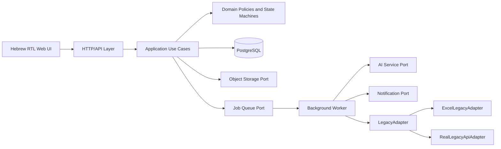

# Technical Architecture - INSHOP Supplier and Inventory Platform

This document is implementation-oriented. Business meaning is defined in `01_PRODUCT_SPEC_HE.md`; screen behavior is defined in `02_UI_UX_SPEC_HE.md`.

---

## 1. Architectural style

Use a modular monolith for the first production version, with explicit ports and adapters. The system should be deployable as one web application plus worker process, while preserving boundaries that allow future extraction.



### Dependency direction

- UI/API depends on application use cases.
- Application depends on domain and port interfaces.
- Infrastructure implements ports.
- Domain never imports framework, database, AI, storage or legacy code.

---

## 2. Reference stack

If the repository is greenfield, use a modern TypeScript web stack with:

- React-based full-stack framework.
- PostgreSQL.
- ORM/migration tool with transactional support.
- Runtime schema validation.
- S3-compatible private object storage.
- Durable background job mechanism.
- Unit, integration and browser E2E testing.

Do not pin versions in business documentation. Pin exact versions in the repository lockfile.

---

## 3. Bounded modules

### 3.1 Identity and access

Responsibilities:

- Admin authentication and sessions.
- RBAC permissions.
- Supplier accountant identity and supplier tenancy.
- Signed action links for supplier/trustee.
- Token hashing, expiry, revocation and scope.

Ports:

- `SessionStore`
- `OtpProvider` optional
- `AccessLinkSigner`

### 3.2 Master data

Entities:

- Supplier
- Branch
- Item
- Trustee
- SupplierItemCode/Alias

Master data is synchronized from legacy but may contain new-system-only enrichment fields such as packaging, target inventory and notification destinations.

### 3.3 Deliveries

Use cases:

- Create delivery report session.
- Upload supplier invoice/goods.
- Submit supplier report.
- Claim receiving.
- Upload trustee evidence.
- Confirm lines and quantities.
- Complete receiving.
- Review and approve inventory.

### 3.4 Inventory

Use cases:

- Apply delivery receipt.
- Apply legacy delta.
- Start count.
- Save count line.
- Complete count.
- Reverse/correct movement.
- Rebuild balance.

### 3.5 Order rules

Use cases:

- Upsert supplier/branch rule.
- Manage delivery weekdays and lead time.
- Manage target stock and packaging.
- Manage supplier item aliases.
- Manage notification destinations.

### 3.6 Credits

Use cases:

- Create credit request.
- Send to supplier.
- Upload credit document.
- Approve/reject document.
- Close request.

### 3.7 Payments and supplier ledger

Use cases:

- Create payment draft from selected liabilities.
- Upload/recognize payment document.
- Calculate expected amount.
- Allocate payment.
- Post payment.
- Reverse payment.
- Calculate supplier balance.

### 3.8 Trustee rewards

Use cases:

- Calculate reward.
- Approve reward with delivery approval.
- Push to legacy.
- Retry failed push.

### 3.9 AI

Use cases:

- Queue OCR.
- Match item.
- Compare invoices.
- Recognize payment.
- Generate discrepancy warnings.
- Record user approval/override.

### 3.10 Integration

- LegacyAdapter.
- Excel mock import.
- Real API adapter.
- sync logs.
- retry jobs.
- notification adapter.

---

## 4. Application service pattern

Every command is an explicit use case with:

```ts
interface UseCase<I, O> {
  execute(input: I, context: ActorContext): Promise<O>;
}
```

Recommended command flow:

1. Validate input schema.
2. Authorize actor.
3. Load aggregate with optimistic version.
4. Evaluate domain guard.
5. Start transaction.
6. Write domain records and audit.
7. Commit.
8. Enqueue outbox jobs.
9. Return DTO.

External calls must not happen inside a long database transaction. Use an outbox/job pattern for notifications, AI and legacy writes.

---

## 5. Transactional outbox

Create `outbox_events` or reuse `integration_jobs` with durable semantics.

Examples:

- `delivery.supplier_reported`
- `delivery.trustee_receiving_completed`
- `delivery.inventory_approved`
- `credit.request_sent`
- `credit.document_uploaded`
- `payment.posted`
- `trustee_reward.approved`

A worker claims events with locking, calls the provider, records success/failure and retries safely.

---

## 6. LegacyAdapter contract

```ts
export interface LegacyAdapter {
  getSuppliers(): Promise<LegacySupplier[]>;
  getBranches(): Promise<LegacyBranch[]>;
  getItems(params: { assortmentActiveOnly: boolean }): Promise<LegacyItem[]>;
  getTrustees(): Promise<LegacyTrustee[]>;
  getInventoryDeltas(params: {
    fromDate: string;
    toDate?: string;
    cursor?: string;
  }): Promise<{ items: InventoryDelta[]; nextCursor?: string }>;
  requestCloseOpenInvoices(branchCode: string): Promise<CloseInvoicesResult>;
  pushTrusteeReward(payload: TrusteeRewardPayload): Promise<PushResult>;
  sendTrusteeWhatsApp(payload: TrusteeWhatsAppPayload): Promise<PushResult>;
}
```

### 6.1 Adapter rules

- Normalize all legacy payloads into internal DTOs at the adapter boundary.
- Legacy field names must not leak into domain entities.
- Validate every response.
- Timeouts and retries are configured per method.
- Read retries may be automatic.
- Write retries require the same idempotency key.
- Store raw request/response safely in `legacy_sync_logs`, with secrets redacted.

### 6.2 ExcelLegacyAdapter

The Excel adapter reads validated CSV/XLSX datasets from a configured import version. It must not read arbitrary paths supplied by the browser.

Flow:

1. Admin uploads file to private storage.
2. Import service validates schema and creates an import version.
3. Rows are normalized into staging tables or typed in-memory repository.
4. Admin activates an import version.
5. Adapter reads only the active version.

For initial local development, CSV files in `mock-data/` may be used through the same adapter interface.

### 6.3 RealLegacyApiAdapter

- Authentication configured by secret manager.
- Request correlation id propagated.
- API-specific pagination hidden from caller.
- Error mapping standardized.
- Contract tests must run against a sandbox or recorded fixtures.

---

## 7. AI service port

```ts
export interface AiService {
  analyzeInvoice(input: AnalyzeInvoiceInput): Promise<AiJobRef>;
  compareInvoices(input: CompareInvoicesInput): Promise<AiJobRef>;
  matchInvoiceLines(input: MatchLinesInput): Promise<AiJobRef>;
  recognizePayment(input: RecognizePaymentInput): Promise<AiJobRef>;
}
```

Use async jobs even if the first mock implementation returns instantly.

### 7.1 AI result persistence

Persist:

- input document ids and checksums.
- capability.
- provider/model/version.
- raw structured result.
- normalized result.
- confidence.
- warnings.
- duration and token/cost metadata if available.
- user approval/override.

Do not persist secrets or hidden chain-of-thought. Store only provider output needed for product behavior.

### 7.2 Deterministic mock

Before real AI:

- `MockAiService` reads sample invoice metadata/lines.
- It can simulate success, low confidence, mismatch and failure.
- The UI and business flow must be complete with the mock.

---

## 8. Object storage

### 8.1 File categories

- supplier invoice.
- trustee invoice.
- supplier goods.
- trustee goods.
- pantry before/after.
- credit document.
- payment document.
- item images mirrored from legacy or external URL.

### 8.2 Upload flow

1. Client asks server for upload intent.
2. Server authorizes and creates a media record in `pending_upload`.
3. Client uploads directly to private storage with a short-lived signed URL.
4. Client calls finalize with checksum and metadata.
5. Worker validates/normalizes image and creates preview.
6. Media status becomes `ready` or `rejected`.

### 8.3 Security

- Private buckets only.
- Signed GET URLs with short expiry.
- MIME sniffing, not extension only.
- Size limits by media type.
- Malware scanning for PDF/office documents.
- Strip unsafe metadata from normalized previews while retaining original privately.

---

## 9. Inventory architecture

### 9.1 Balance and movement

`inventory_movements` is authoritative. `inventory_balances` is a transactionally maintained projection.

Pseudo-transaction:

```ts
await db.transaction(async tx => {
  const existing = await tx.inventoryMovement.findByIdempotencyKey(key);
  if (existing) return existing;

  const balance = await tx.inventoryBalance.lock(branchId, itemId);
  const next = balance.quantity + delta;

  const movement = await tx.inventoryMovement.insert({
    branchId,
    itemId,
    delta,
    balanceAfter: next,
    sourceType,
    sourceId,
    idempotencyKey: key
  });

  await tx.inventoryBalance.update({ quantity: next });
  return movement;
});
```

### 9.2 Delivery approval

Use one idempotency key per delivery approval and one child key per line. Store approval snapshot so later edits cannot change historical meaning.

### 9.3 Count completion

Lock all affected balances in stable item order to reduce deadlocks. Calculate count adjustment against the balance at completion time; also retain balance snapshot from count start for analysis.

### 9.4 Rebuild

Provide an admin/maintenance command to recalculate balances from movements and report mismatches without automatically overwriting production balances unless explicitly approved.

---

## 10. Financial architecture

### 10.1 Supplier ledger

Use signed immutable entries:

- `invoice_liability`: positive.
- `approved_credit`: negative.
- `payment`: negative.
- `reversal`: opposite of referenced entry.
- `manual_adjustment`: signed with reason and elevated permission.
- `opening_balance`: signed migration entry.

Balance query:

```sql
SELECT COALESCE(SUM(amount_signed), 0)
FROM supplier_ledger_entries
WHERE supplier_id = $1 AND voided_at IS NULL;
```

### 10.2 Payment allocations

A posted payment may allocate to open positive ledger entries. Allocation does not change total balance by itself; the payment ledger entry does. Allocations explain settlement state.

Delivery payment state is derived:

- unpaid: allocated 0.
- partially_paid: 0 < allocated < liability after applicable credits.
- paid: fully covered.
- overpaid: supplier total balance is negative after posting.
- credit_pending: open credit request exists and payment calculation excludes it.

### 10.3 Credit approval

Credit documents can be approved partially. Each approval creates a ledger entry tied to the request and version. Re-approval requires reversal or remaining amount only.

---

## 11. Concurrency and locking

- Use optimistic version columns on mutable aggregates.
- Use row locks for inventory balance update and payment posting.
- One active inventory count enforced by partial unique index.
- Delivery approval enforced by unique `approval_key`/movement source constraint.
- Supplier report submit and trustee complete accept idempotency keys.
- UI handles HTTP 409 with a “data changed” message and reload action.

---

## 12. API conventions

### 12.1 URL and versions

- `/api/v1/...`
- nouns in plural.
- action endpoints only for domain commands that are not CRUD, such as `/approve-inventory`, `/complete`, `/post`.

### 12.2 Error envelope

```json
{
  "error": {
    "code": "DELIVERY_BRANCH_MISMATCH",
    "message": "הסניף שנבחר אינו תואם לחשבונית",
    "fieldErrors": {
      "branchId": "יש לבחור את הסניף שמופיע בחשבונית או לשלוח לבדיקה"
    },
    "correlationId": "req_...",
    "retryable": false
  }
}
```

### 12.3 Idempotency

Side-effecting command endpoints accept:

```http
Idempotency-Key: <uuid>
```

The server stores request hash and response. Reuse with a different payload returns 409.

### 12.4 Pagination

Cursor pagination for large lists; page/limit is acceptable for small admin tables. Filters are server-side.

---

## 13. Authentication and access links

### 13.1 Admin

- secure password/SSO depending deployment.
- MFA recommended.
- server-side sessions.
- inactivity timeout.

### 13.2 Supplier accountant

Default: magic link plus OTP for first device or sensitive action. Session is scoped to supplier.

### 13.3 Trustee

Signed single-purpose link:

```text
subject: trustee_id
resource: delivery_id
scope: trustee_receiving
expires_at
nonce
```

Store token hash, not raw token. Allow resumable use until completion or expiry. Revoke after reassignment.

### 13.4 Supplier driver

A generic report URL can create a short-lived anonymous session. If a supplier-specific link is used, pre-bind supplier id but still validate the invoice.

---

## 14. Audit model

Each audit event contains:

- actor type/id.
- action code.
- entity type/id.
- before/after JSON patches or structured fields.
- reason.
- request correlation id.
- IP/user agent where legally appropriate.
- timestamp.

Sensitive values are masked in general logs but retained in secured audit if required.

---

## 15. Observability

### Logs

Structured JSON logs with:

- timestamp.
- level.
- service/module.
- correlation id.
- actor id/type.
- entity ids.
- error code.

### Metrics

- HTTP latency/error rate.
- upload failures.
- job lag/failures/retries.
- legacy adapter latency/error by method.
- AI latency/failure/confidence buckets.
- inventory approval count.
- payment posting failures.

### Tracing

Propagate correlation id through HTTP, jobs, AI, notification and legacy calls.

---

## 16. Background jobs

Recommended jobs:

- `process_media`
- `analyze_invoice`
- `compare_invoices`
- `recognize_payment`
- `send_notification`
- `push_trustee_reward`
- `sync_master_data`
- `sync_inventory_deltas`
- `retry_legacy_operation`
- `expire_access_links`
- `recalculate_projection_check`

Each job requires:

- unique key/idempotency.
- attempt count.
- next run time.
- last error.
- dead-letter/manual retry state.

---

## 17. Configuration

Use environment/config management for:

- Israel timezone.
- currency.
- reward percent.
- AI confidence thresholds.
- upload limits.
- link expiry durations.
- notification provider.
- legacy adapter type.
- legacy endpoints/credentials.
- object storage.
- retry policies.

Business defaults should be visible in an admin configuration view only when changing them is safe; otherwise deploy-time configuration.

---

## 18. Data retention and privacy

Recommended default:

- Keep original business documents according to accounting/legal policy configured by organization.
- Keep normalized preview as long as original.
- Access logs and audit per security policy.
- Expired public tokens deleted or irreversibly revoked.
- Data export/delete requests must respect legal retention obligations.

No automatic deletion period is hard-coded until approved.

---

## 19. Testing architecture

### Unit

- pure domain rules.
- state transitions.
- calculations.
- adapter normalization.

### Integration

- database transactions and constraints.
- idempotency.
- outbox/jobs.
- storage finalize.
- Excel adapter.

### Contract

- `LegacyAdapter` fixtures.
- AI normalized schema.
- notification templates.
- OpenAPI response shapes.

### E2E

- browser mobile supplier/trustee/count.
- desktop admin/order rules/payment.
- responsive supplier portal.

---

## 20. Deployment topology

Minimum production topology:

- web/API instances.
- worker instances.
- PostgreSQL.
- private object storage.
- queue/outbox mechanism.
- reverse proxy/CDN.
- secrets manager.
- monitoring/logging.

Workers and web can initially share the same codebase and deployment artifact.

---

## 21. Migration strategy

1. Deploy schema and mock adapters.
2. Import master data.
3. Run shadow sync and compare counts.
4. Pilot one branch.
5. Enable supplier/trustee flows.
6. Enable inventory approval.
7. Enable inventory deltas.
8. Enable counts.
9. Enable credits and payments.
10. Replace Excel adapter with real adapter behind configuration/feature flag.
11. Run dual-read comparison before cutover.

Never perform a one-way cutover without reconciliation reports and rollback plan.
