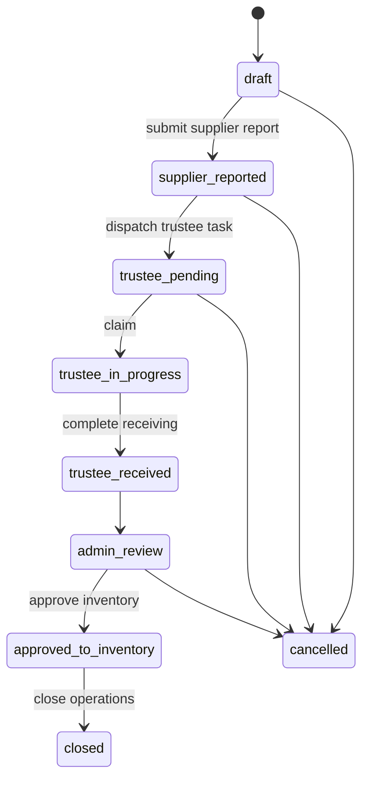
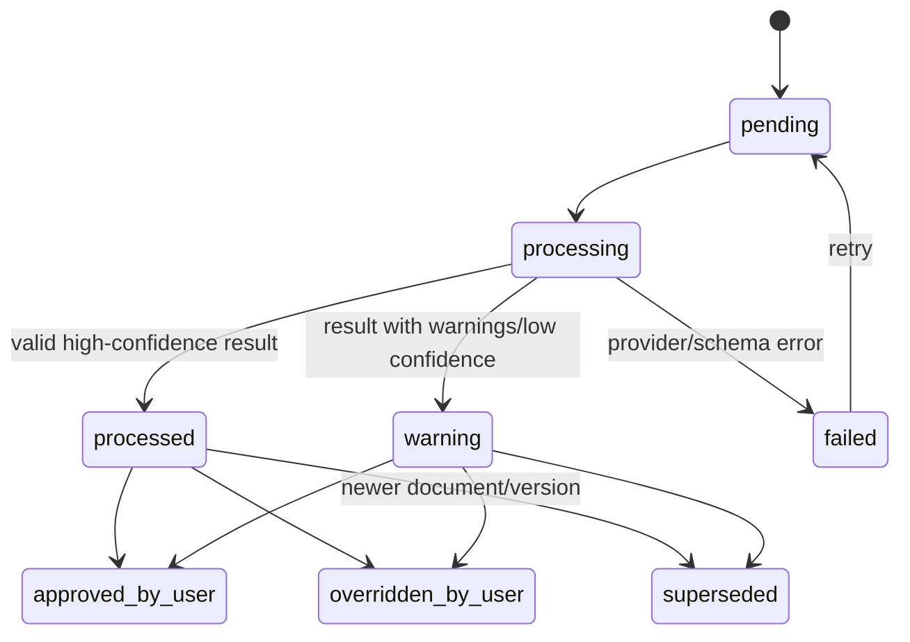

# מכונות מצבים, Guards ותופעות לוואי

מסמך זה הוא מקור האמת למעברי סטטוס. אין לשנות סטטוס ישירות ב-controller או ברכיב UI.

---

## 1. עקרונות

- כל transition מבוצע דרך use case ייעודי.
- השרת בודק guard גם אם הכפתור disabled ב-client.
- כל transition נרשם ב-Audit.
- side effects חיצוניים נשלחים דרך outbox/job לאחר commit.
- transition חוזר עם אותו idempotency key מחזיר את התוצאה הקודמת.
- סטטוס אשראי ותשלום נפרדים מסטטוס אספקה.

---

# 2. Delivery

## 2.1 סטטוסים קנוניים

| סטטוס | משמעות |
|---|---|
| `draft` | session נוצר אך טרם נשלח |
| `supplier_reported` | הספק השלים ושלח |
| `trustee_pending` | נוצרה/נשלחה משימת נאמן |
| `trustee_in_progress` | נאמן תבע את המשימה והתחיל |
| `trustee_received` | הנאמן השלים קליטה |
| `admin_review` | ממתין או נמצא בבדיקת אדמין |
| `approved_to_inventory` | הכמות אושרה ותנועות מלאי נוצרו |
| `closed` | אין פעולות תפעוליות פתוחות באספקה; זיכוי/תשלום יכולים להמשיך בישויות נפרדות |
| `cancelled` | בוטלה לפני עדכון מלאי |

`credit_required` מהאפיון המקורי מיוצג ב-`delivery.credit_state`, כדי לא לערבב את סטטוס הקליטה עם מחזור חיי הזיכוי.

## 2.2 מעברים

| From | Command | To | Guards | Side effects |
|---|---|---|---|---|
| none | `CreateSupplierReport` | `draft` | rate limit, valid session | create delivery/session |
| `draft` | `SubmitSupplierReport` | `supplier_reported` | invoice, goods, branch, contact, no blocking mismatch | freeze supplier snapshot, audit |
| `supplier_reported` | `DispatchTrusteeTask` | `trustee_pending` | active trustee or explicit admin queue | access link + notification job |
| `trustee_pending` | `ClaimTrusteeReceiving` | `trustee_in_progress` | valid link, not claimed by another | assign trustee |
| `trustee_in_progress` | `CompleteTrusteeReceiving` | `trustee_received` | required images and line quantities | create reward draft, reconciliation snapshot |
| `trustee_received` | system | `admin_review` | always | admin task/outbox |
| `admin_review` | `ApproveDeliveryToInventory` | `approved_to_inventory` | all lines valid, exceptions approved, not already applied | inventory movements, ledger liability, reward approve job |
| `approved_to_inventory` | `CloseDeliveryOperations` | `closed` | no unresolved operational exception | audit |
| `draft`/`supplier_reported`/`trustee_pending`/`admin_review` | `CancelDelivery` | `cancelled` | inventory not approved; permission/reason | revoke links, cancel jobs |

## 2.3 אסורים

- `approved_to_inventory -> admin_review` אינו edit רגיל. נדרש reversal/correction use case.
- `closed -> cancelled` אסור.
- `cancelled -> active` אסור; יוצרים אספקה חדשה או restore מורשה עם Audit מיוחד.

## 2.4 תרשים



---

# 3. Delivery credit state

| סטטוס | משמעות |
|---|---|
| `none` | לא זוהה חוסר לזיכוי |
| `identified` | חוסר זוהה/אושר אך טרם נוצרה בקשה |
| `request_created` | נוצר draft |
| `awaiting_supplier` | נשלחה דרישה וממתינים למסמך |
| `credit_uploaded` | הספק העלה מסמך |
| `partially_approved` | אושר סכום חלקי |
| `approved` | הסכום הנדרש כוסה |
| `closed` | אין יתרה/פעולה פתוחה |
| `cancelled` | הדרישה בוטלה עם סיבה |

`delivery.credit_state` הוא projection. מקור האמת הוא סכום וסטטוס `CreditRequest`/מסמכים.

---

# 4. CreditRequest

## 4.1 סטטוסים

- `draft`
- `sent_to_supplier`
- `waiting_for_credit_invoice`
- `credit_uploaded`
- `waiting_admin_approval`
- `partially_approved`
- `approved`
- `rejected_document`
- `closed`
- `cancelled`

## 4.2 מעברים

| From | Command | To | Guards | Side effects |
|---|---|---|---|---|
| none | `CreateCreditRequest` | `draft` | delivery exists; amount > 0; lines valid | create lines |
| `draft` | `SendCreditRequest` | `sent_to_supplier` | supplier destination/access link exists | notification job |
| `sent_to_supplier` | system | `waiting_for_credit_invoice` | message queued/sent | update timestamp |
| `waiting_for_credit_invoice` | `UploadCreditDocument` | `credit_uploaded` | valid token and file | media + AI job |
| `credit_uploaded` | system | `waiting_admin_approval` | upload finalized | admin task |
| `waiting_admin_approval` | `ApproveCreditDocument` | `approved` or `partially_approved` | approved amount > 0 and <= remaining | negative ledger entry |
| `waiting_admin_approval` | `RejectCreditDocument` | `rejected_document` | reason required | notify supplier |
| `rejected_document` | `UploadCreditDocument` | `credit_uploaded` | new version | media + AI job |
| `partially_approved` | `UploadCreditDocument` | `credit_uploaded` | remaining > 0 | next version |
| `approved` | `CloseCreditRequest` | `closed` | remaining = 0 | update delivery projection |
| `draft`/`waiting_for_credit_invoice` | `CancelCreditRequest` | `cancelled` | permission + reason; no approved ledger entry | audit |

## 4.3 חישוב יתרה

```text
requested_amount = sum(request lines)
approved_amount = sum(non-reversed approved credit ledger entries)
remaining_amount = max(requested_amount - approved_amount, 0)
```

---

# 5. InventoryCount

## 5.1 סטטוסים

- `waiting_for_legacy_close`
- `ready_to_count`
- `in_progress`
- `completed`
- `locked`
- `cancelled`
- `failed`

## 5.2 מעברים

| From | Command | To | Guards | Side effects |
|---|---|---|---|---|
| none | `StartInventoryCount` | `waiting_for_legacy_close` | no active count, actor authorized | create count, call legacy job |
| `waiting_for_legacy_close` | `ApplyLegacyCloseResult` | `ready_to_count` | `can_start_count=true` and `still_open=0` | snapshot assortment/count lines |
| `waiting_for_legacy_close` | `ApplyLegacyCloseFailure` | `failed` or remain | retry policy | log error |
| `ready_to_count` | `BeginCounting` | `in_progress` | actor authorized | started_at |
| `in_progress` | `CompleteInventoryCount` | `completed` | all lines saved | count adjustments transaction |
| `completed` | system | `locked` | movements committed | locked_at |
| `waiting_for_legacy_close`/`ready_to_count`/`in_progress` | `CancelCount` | `cancelled` | no committed completion; reason | release active uniqueness |

## 5.3 שורת ספירה

מצב שורה:

- `unsaved`
- `saved`
- `changed_after_save`

Completion guard משתמש בגרסה האחרונה של כל שורה ודורש `saved_at` אחרי `last_changed_at`.

## 5.4 concurrency

- partial unique index: one count in active statuses per branch.
- completion locks count and relevant balances.
- line updates require `version` to prevent overwrite.

---

# 6. AIAnalysis

## 6.1 סטטוסים

- `pending`
- `processing`
- `processed`
- `warning`
- `failed`
- `approved_by_user`
- `overridden_by_user`
- `superseded`

## 6.2 מעברים



AI state never directly changes inventory/payment/credit state.

---

# 7. TrusteeReward

## 7.1 סטטוסים

- `calculated_pending_approval`
- `approved`
- `push_pending`
- `pushed`
- `push_failed`
- `cancelled`
- `reversed`

## 7.2 מעברים

| From | Command | To | Guard | Side effects |
|---|---|---|---|---|
| none | `CalculateTrusteeReward` | `calculated_pending_approval` | trustee receiving complete | calculate 2% |
| `calculated_pending_approval` | `ApproveDeliveryToInventory` | `approved` | delivery approved | freeze amount |
| `approved` | system | `push_pending` | outbox created | push job |
| `push_pending` | `PushSucceeded` | `pushed` | valid legacy response | sync log |
| `push_pending` | `PushFailed` | `push_failed` | failure | retry task |
| `push_failed` | `RetryPush` | `push_pending` | permission/system retry | same idempotency key |
| pre-push | `CancelReward` | `cancelled` | delivery cancelled/rejected | audit |
| `pushed` | `ReverseReward` | `reversed` | explicit legacy support and elevated permission | reverse job |

---

# 8. Payment

## 8.1 סטטוסים קנוניים

- `draft`
- `awaiting_document`
- `under_review`
- `ready_to_post`
- `posted`
- `partially_reversed`
- `reversed`
- `cancelled`

הסטטוסים `unpaid`, `partially_paid`, `paid`, `overpaid`, `credit_pending` הם מצבי settlement מחושבים ברמת אספקה/ספק ולא סטטוס command של Payment.

## 8.2 מעברים

| From | Command | To | Guards | Side effects |
|---|---|---|---|---|
| none | `CreatePaymentDraft` | `draft` | supplier and eligible liabilities | snapshot selections |
| `draft` | `RequirePaymentDocument` | `awaiting_document` | payment method requires document | none |
| `draft`/`awaiting_document` | `UploadPaymentDocument` | `under_review` | valid media | AI job |
| `draft`/`under_review` | `ConfirmPaymentDetails` | `ready_to_post` | amount/date/reference valid, mismatch resolved | store approval snapshot |
| `ready_to_post` | `PostPayment` | `posted` | balances revalidated, permission, idempotency | ledger entry + allocations |
| `posted` | `ReversePayment` | `reversed` or `partially_reversed` | permission + reason + amount | reversal ledger entry |
| `draft`/`awaiting_document`/`under_review` | `CancelPayment` | `cancelled` | not posted | audit |

## 8.3 Post guard

Recalculate inside transaction:

- selected liabilities are still open.
- approved credit entries still valid.
- payment amount equals confirmed amount.
- allocation sum <= payment amount.
- no duplicate external reference if policy requires uniqueness.

---

# 9. Media

סטטוסים:

- `pending_upload`
- `uploaded`
- `processing`
- `ready`
- `rejected`
- `deleted_logically`

Business use case may reference only `ready` media, except a draft can hold `uploaded/processing` and wait.

---

# 10. Notification

סטטוסים:

- `queued`
- `sending`
- `sent`
- `delivered` if provider supports
- `failed_retryable`
- `failed_permanent`
- `cancelled`

Uniqueness key example:

```text
notification:{template}:{entityId}:{recipient}:{version}
```

---

# 11. IntegrationJob / LegacySyncLog

Job statuses:

- `pending`
- `running`
- `succeeded`
- `retry_scheduled`
- `failed_permanent`
- `cancelled`

Legacy sync log status:

- `success`
- `warning`
- `failure`

A retry creates a new attempt linked to the same logical operation, not a duplicate business operation.

---

# 12. OrderRule

Status:

- `draft`
- `active`
- `inactive`
- `archived`

Rules:

- Only one active rule per `branch + supplier` unless effective dates are introduced.
- Activating a new version archives/deactivates the previous version transactionally.
- Historical deliveries retain the rule snapshot used at the time, where relevant.

---

# 13. AccessLink

Status:

- `active`
- `expired`
- `revoked`
- `completed`

Rules:

- Token hash unique.
- scope must match endpoint.
- resource id and subject id validated server-side.
- completed link can show a read-only receipt but cannot mutate.

---

# 14. Common error codes

| Code | HTTP | Meaning |
|---|---:|---|
| `INVALID_STATE_TRANSITION` | 409 | פעולה אינה מותרת בסטטוס הנוכחי |
| `VERSION_CONFLICT` | 409 | הנתון השתנה מאז הטעינה |
| `IDEMPOTENCY_KEY_REUSED_WITH_DIFFERENT_PAYLOAD` | 409 | מפתח שימש לבקשה אחרת |
| `DELIVERY_BRANCH_MISMATCH` | 422 | דיסוננס סניף חוסם |
| `DELIVERY_DUPLICATE_INVOICE` | 409 | חשבונית אפשרית כפולה |
| `DELIVERY_LINE_UNMATCHED` | 422 | שורה אינה מותאמת לפריט |
| `INVENTORY_COUNT_ACTIVE_EXISTS` | 409 | קיימת ספירה פעילה |
| `LEGACY_CLOSE_GATE_BLOCKED` | 422 | לא ניתן להתחיל ספירה |
| `COUNT_LINES_UNSAVED` | 422 | יש שורות לא שמורות |
| `CREDIT_AMOUNT_EXCEEDS_REMAINING` | 422 | סכום אישור גבוה מהיתרה |
| `PAYMENT_AMOUNT_MISMATCH` | 422 | סכום תשלום דורש תיקון/override |
| `PAYMENT_ALREADY_POSTED` | 409 | התשלום כבר פורסם |
| `ACCESS_LINK_EXPIRED` | 410 | הקישור פג |
| `ACCESS_LINK_SCOPE_INVALID` | 403 | הקישור אינו מתאים לפעולה |
